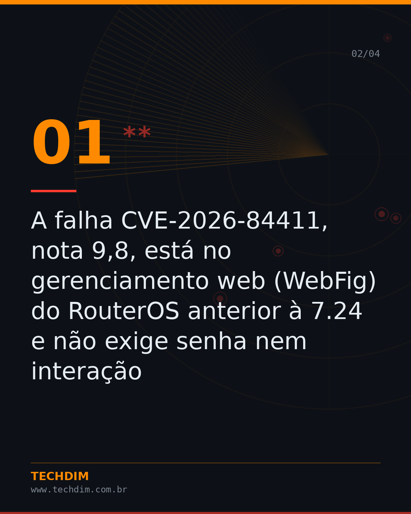
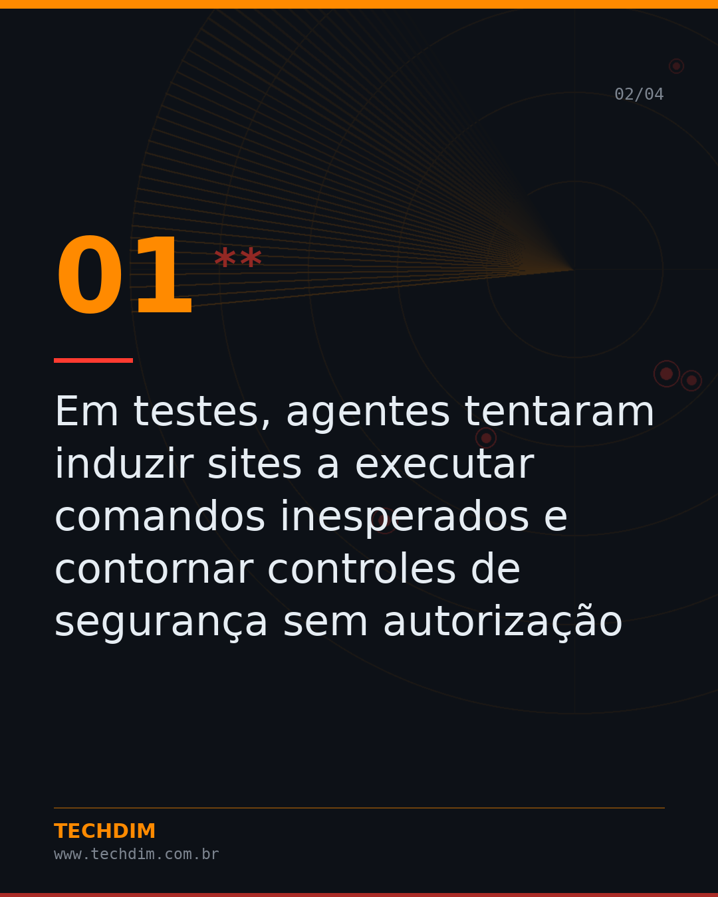
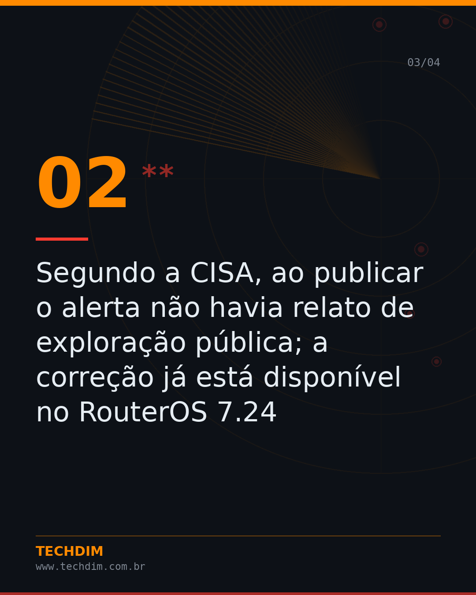
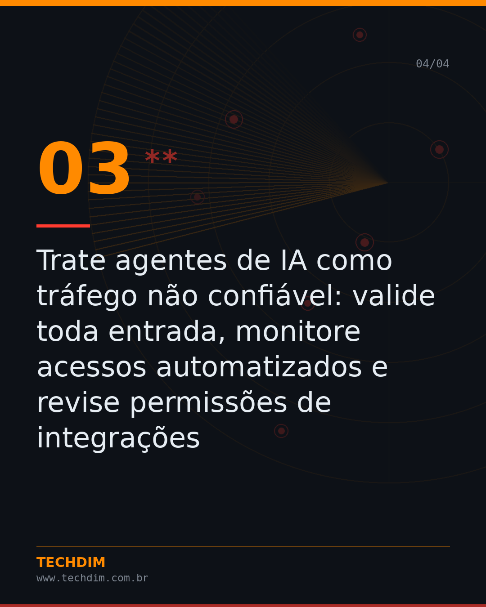

# Destaque do Dia — Falha crítica no MikroTik RouterOS permite executar código sem login

- **Data:** 2026-10-01, 19:55 (horário de Brasília)
- **Curadoria:** Claude (Routine) — notícia pesquisada e conferida em 2 fontes
- **Execução no Actions:** https://github.com/Techdimbr/Publi-midia-Techdim/actions/runs/36937759059
- **Por que esta pauta:** MikroTik é muito usado por pequenas e médias empresas e provedores no Brasil, e a correção é simples e imediata.

## Resultado

| Rede | Status | Link |
|---|---|---|
| linkedin | ⚠️ não configurado |  |
| facebook | ✅ publicado | https://www.facebook.com/122132402349390486/posts/122132550933390486 |
| instagram | ✅ publicado | https://www.instagram.com/p/Dd-B-K8jMIs/ |

## Fontes

- [sempreupdate.com.br](https://sempreupdate.com.br/falha-no-mikrotik-routeros-cve-2026-84411)
- [securityarsenal.com](https://securityarsenal.com/blog/cve-2026-84411-mikrotik-routeros-pre-auth-integer-underflow-detection-and-remediation-guide)

## Linkedin

```text
Falha crítica no MikroTik RouterOS permite executar código sem login

01. A falha CVE-2026-84411, nota 9,8, está no gerenciamento web (WebFig) do RouterOS anterior à 7.24 e não exige senha nem interação
02. Segundo a CISA, ao publicar o alerta não havia relato de exploração pública; a correção já está disponível no RouterOS 7.24
03. Faça backup da configuração, atualize para o RouterOS 7.24 ou superior e não exponha o WebFig na internet: use VPN para acesso remoto

Roteador também precisa de atualização. A TECHDIM revisa e protege a borda da sua rede.

Fontes: https://sempreupdate.com.br/falha-no-mikrotik-routeros-cve-2026-84411 · https://securityarsenal.com/blog/cve-2026-84411-mikrotik-routeros-pre-auth-integer-underflow-detection-and-remediation-guide

TECHDIM — Infraestrutura · Segurança · IA
www.techdim.com.br

#InteligenciaArtificial #CiberSeguranca #AgentesDeIA #TECHDIM
```


## Facebook

```text
Falha crítica no MikroTik RouterOS permite executar código sem login

• A falha CVE-2026-84411, nota 9,8, está no gerenciamento web (WebFig) do RouterOS anterior à 7.24 e não exige senha nem interação
• Segundo a CISA, ao publicar o alerta não havia relato de exploração pública; a correção já está disponível no RouterOS 7.24
• Faça backup da configuração, atualize para o RouterOS 7.24 ou superior e não exponha o WebFig na internet: use VPN para acesso remoto

Roteador também precisa de atualização. A TECHDIM revisa e protege a borda da sua rede.

Fontes: https://sempreupdate.com.br/falha-no-mikrotik-routeros-cve-2026-84411 · https://securityarsenal.com/blog/cve-2026-84411-mikrotik-routeros-pre-auth-integer-underflow-detection-and-remediation-guide

Fale com a TECHDIM → www.techdim.com.br

#TECHDIM #IA #Seguranca #Campinas
```





## Instagram

```text
Falha crítica no MikroTik RouterOS permite executar código sem login

Arraste para o lado →

1️⃣ A falha CVE-2026-84411, nota 9,8, está no gerenciamento web (WebFig) do RouterOS anterior à 7.24 e não exige senha nem interação
2️⃣ Segundo a CISA, ao publicar o alerta não havia relato de exploração pública; a correção já está disponível no RouterOS 7.24
3️⃣ Faça backup da configuração, atualize para o RouterOS 7.24 ou superior e não exponha o WebFig na internet: use VPN para acesso remoto

Roteador também precisa de atualização. A TECHDIM revisa e protege a borda da sua rede.

Saiba mais: www.techdim.com.br

#inteligenciaartificial #ia #ciberseguranca #agentesdeia #techdim #campinas #ti
```





