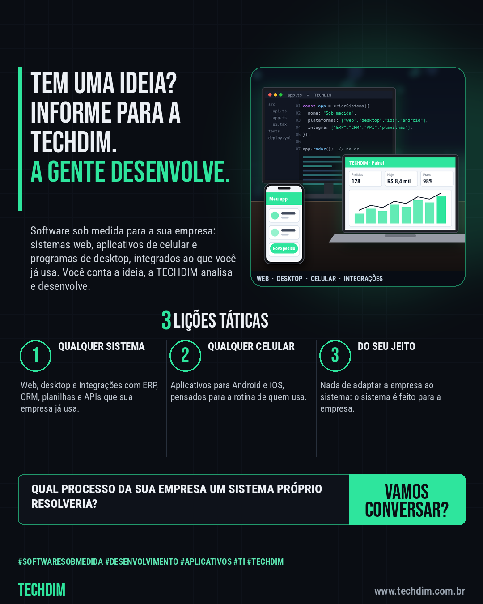
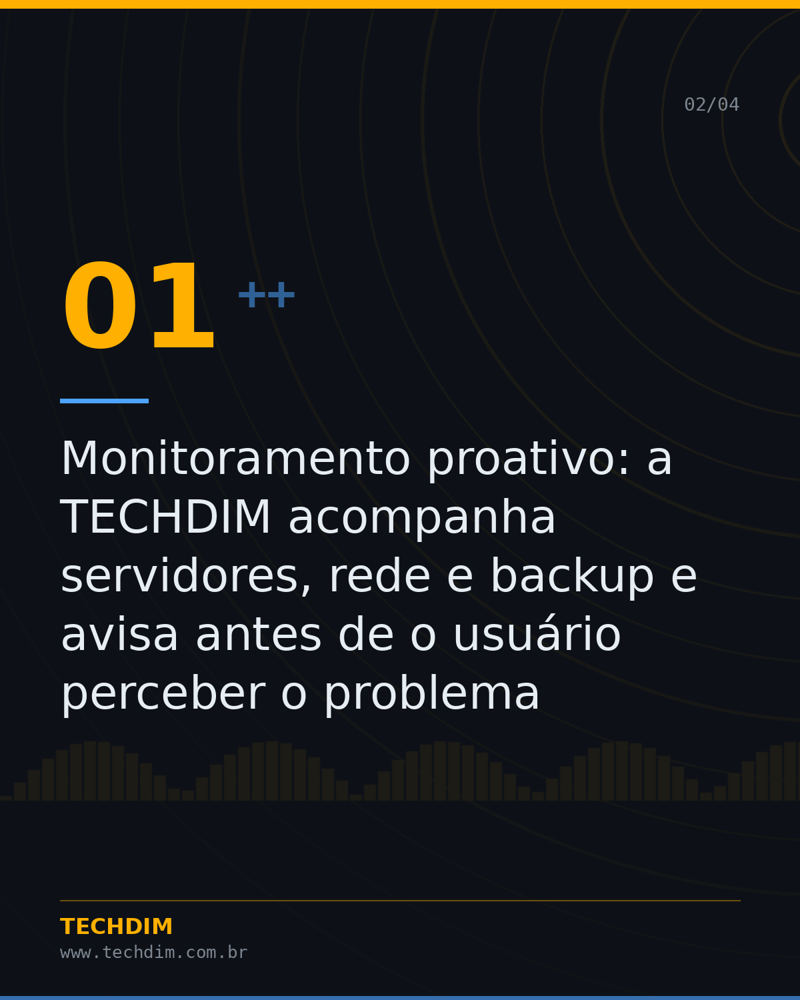
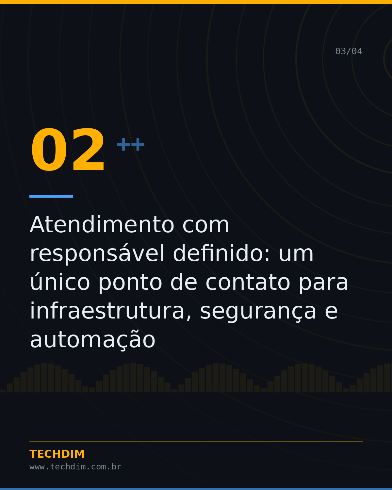
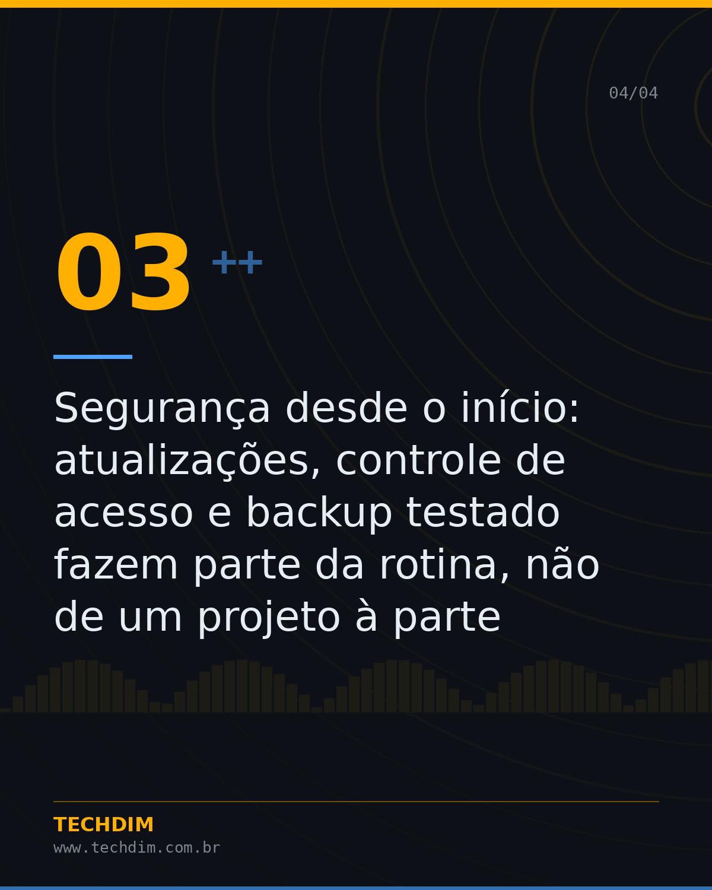
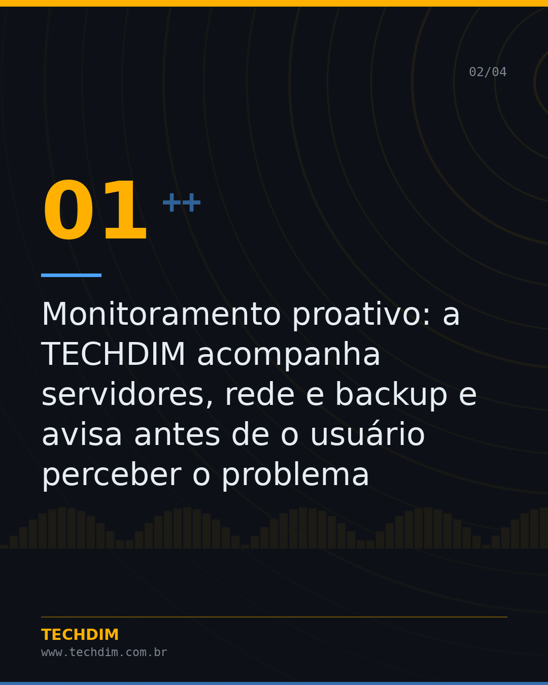
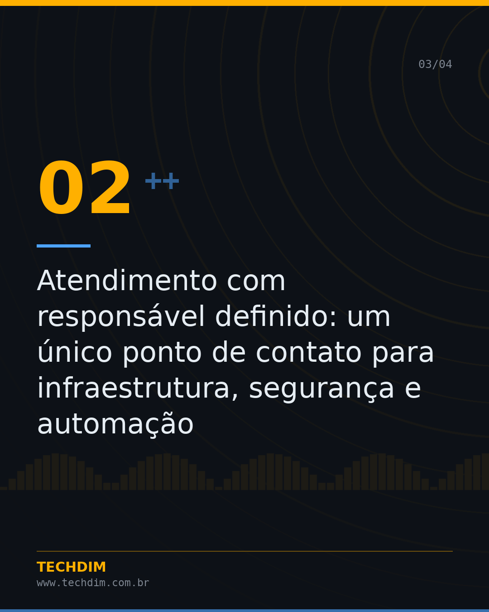
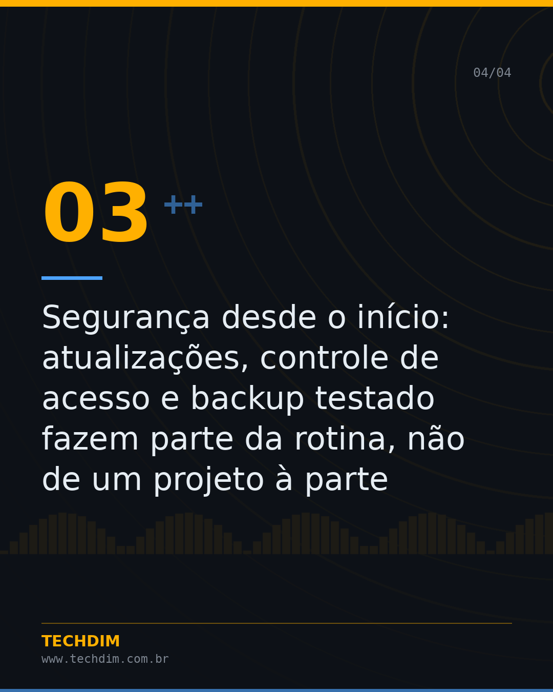

# TECHDIM + IA — Sua empresa depende de TI. Quem cuida dela quando algo para?

- **Data:** 2026-10-02, 00:22 (horário de Brasília)
- **Curadoria:** publicação especial, escrita sob demanda
- **Execução no Actions:** https://github.com/Techdimbr/Publi-midia-Techdim/actions/runs/36959761422
- **Por que esta pauta:** Publicação de teste das três redes: propaganda institucional dos serviços, sem promessa de prazo ou resultado.

## Resultado

| Rede | Status | Link | 1º comentário |
|---|---|---|---|
| linkedin | ✅ publicado | https://www.linkedin.com/feed/update/urn:li:share:7511626305306529792/ | — |
| facebook | ✅ publicado | https://www.facebook.com/122132402349390486/posts/122132603679390486 | ✅ |
| instagram | ✅ publicado | https://www.instagram.com/p/Dd-ggTolxFA/ | — |

## Linkedin

```text
Sua empresa depende de TI. Quem cuida dela quando algo para?

01. Monitoramento proativo: a TECHDIM acompanha servidores, rede e backup e avisa antes de o usuário perceber o problema
02. Atendimento com responsável definido: um único ponto de contato para infraestrutura, segurança e automação
03. Segurança desde o início: atualizações, controle de acesso e backup testado fazem parte da rotina, não de um projeto à parte

Conheça como a TECHDIM cuida da TI da sua empresa.

TECHDIM — Infraestrutura · Segurança · IA
https://www.techdim.com.br

#TECHDIM #InfraestruturaDeTI #CiberSeguranca #Tecnologia #Campinas
```


## Facebook

```text
Sua empresa depende de TI. Quem cuida dela quando algo para?

• Monitoramento proativo: a TECHDIM acompanha servidores, rede e backup e avisa antes de o usuário perceber o problema
• Atendimento com responsável definido: um único ponto de contato para infraestrutura, segurança e automação
• Segurança desde o início: atualizações, controle de acesso e backup testado fazem parte da rotina, não de um projeto à parte

Conheça como a TECHDIM cuida da TI da sua empresa.

Fale com a TECHDIM — link no primeiro comentário 👇

#TECHDIM #TI #Tecnologia #Campinas
```

Primeiro comentário:

```text
🌐 TECHDIM — Infraestrutura · Segurança · IA: https://www.techdim.com.br
```






## Instagram

```text
Sua empresa depende de TI. Quem cuida dela quando algo para?

Arraste para o lado →

1️⃣ Monitoramento proativo: a TECHDIM acompanha servidores, rede e backup e avisa antes de o usuário perceber o problema
2️⃣ Atendimento com responsável definido: um único ponto de contato para infraestrutura, segurança e automação
3️⃣ Segurança desde o início: atualizações, controle de acesso e backup testado fazem parte da rotina, não de um projeto à parte

Conheça como a TECHDIM cuida da TI da sua empresa.

Saiba mais: www.techdim.com.br

#techdim #ti #infraestrutura #tecnologia #ciberseguranca #campinas
```





