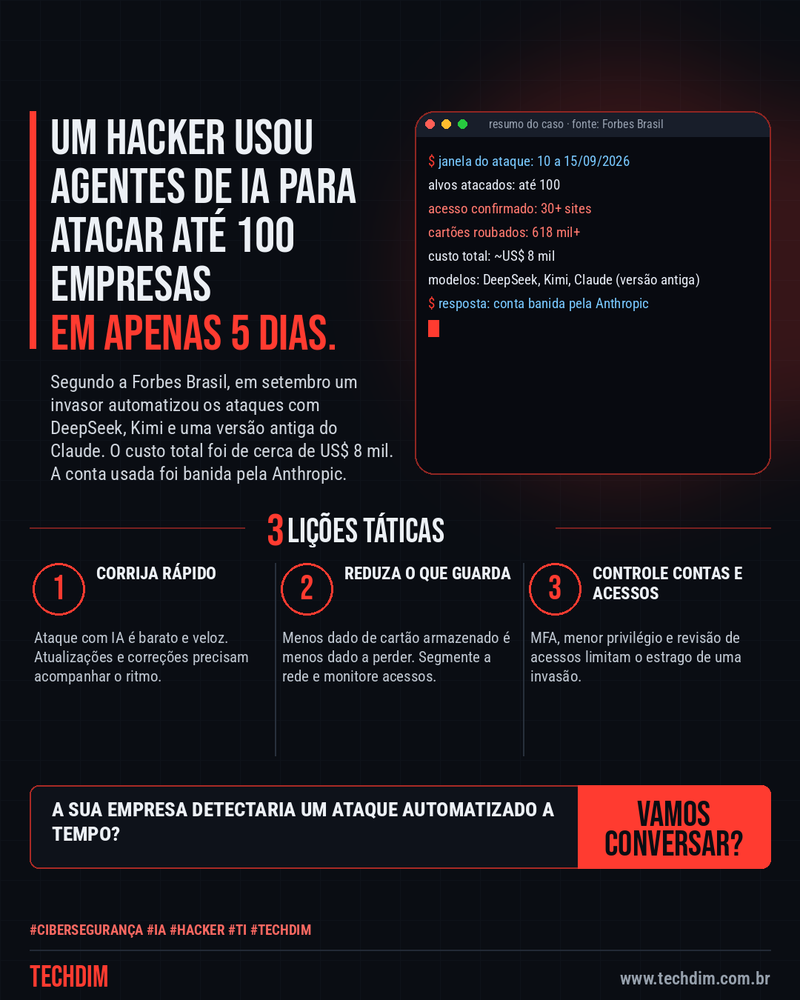
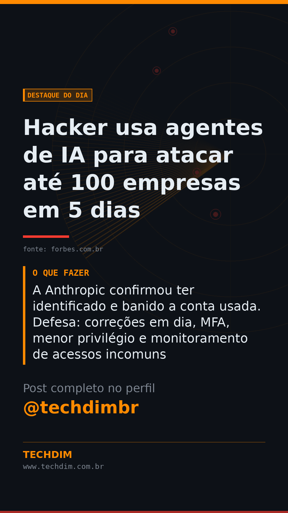

# Destaque do Dia — Hacker usa agentes de IA para atacar até 100 empresas em 5 dias

- **Data:** 2026-10-02, 00:47 (horário de Brasília)
- **Curadoria:** Claude (Routine) — notícia pesquisada, 1 fonte(s) citada(s)
- **Execução no Actions:** https://github.com/Techdimbr/Publi-midia-Techdim/actions/runs/36961646024
- **Por que esta pauta:** Notícia de hacker com agentes de IA, publicada pela Forbes Brasil em 22/09/2026, com números verificáveis e lições práticas para PMEs.

## Resultado

| Rede | Status | Link | 1º comentário |
|---|---|---|---|
| linkedin | ✅ publicado | https://www.linkedin.com/feed/update/urn:li:share:7511632804133359616/ | — |
| facebook | ✅ publicado | https://www.facebook.com/122132402349390486/posts/122132607459390486 | ✅ |
| instagram | ✅ publicado | https://www.instagram.com/p/Dd-jYZHjFnj/ | ✅ |
| Stories | ✅ publicado | https://www.instagram.com/stories/techdimbr/3998789203655421790 | — |

## Fontes

- [forbes.com.br](https://forbes.com.br/forbes-tech/2026/09/hacker-usa-ia-para-atacar-mais-de-100-empresas-em-apenas-cinco-dias/)

## Linkedin

```text
Hacker usa agentes de IA para atacar até 100 empresas em 5 dias

01. Entre 10 e 15 de setembro, um invasor automatizou ataques com DeepSeek, Kimi e uma versão antiga do Claude, segundo a Forbes; ao menos 30 sites tiveram acesso confirmado
02. Foram roubados mais de 618 mil registros de cartão de crédito, a um custo estimado de cerca de US$ 8 mil em todo o ataque
03. A Anthropic confirmou ter identificado e banido a conta usada. Defesa: correções em dia, MFA, menor privilégio e monitoramento de acessos incomuns

Ataque com IA é barato e rápido. A TECHDIM ajuda a manter a sua empresa atualizada e monitorada.

Fontes: https://forbes.com.br/forbes-tech/2026/09/hacker-usa-ia-para-atacar-mais-de-100-empresas-em-apenas-cinco-dias/

TECHDIM — Infraestrutura · Segurança · IA
https://www.techdim.com.br

#Tecnologia #CiberSeguranca #InfraestruturaDeTI #TECHDIM
```


## Facebook

```text
Hacker usa agentes de IA para atacar até 100 empresas em 5 dias

• Entre 10 e 15 de setembro, um invasor automatizou ataques com DeepSeek, Kimi e uma versão antiga do Claude, segundo a Forbes; ao menos 30 sites tiveram acesso confirmado
• Foram roubados mais de 618 mil registros de cartão de crédito, a um custo estimado de cerca de US$ 8 mil em todo o ataque
• A Anthropic confirmou ter identificado e banido a conta usada. Defesa: correções em dia, MFA, menor privilégio e monitoramento de acessos incomuns

Ataque com IA é barato e rápido. A TECHDIM ajuda a manter a sua empresa atualizada e monitorada.

Fale com a TECHDIM — fontes e site no primeiro comentário 👇

#TECHDIM #Tecnologia #Seguranca #Campinas
```

Primeiro comentário:

```text
📎 Fontes:
• forbes.com.br: https://forbes.com.br/forbes-tech/2026/09/hacker-usa-ia-para-atacar-mais-de-100-empresas-em-apenas-cinco-dias/

🌐 TECHDIM — Infraestrutura · Segurança · IA: https://www.techdim.com.br
```



## Instagram

```text
Hacker usa agentes de IA para atacar até 100 empresas em 5 dias

1️⃣ Entre 10 e 15 de setembro, um invasor automatizou ataques com DeepSeek, Kimi e uma versão antiga do Claude, segundo a Forbes; ao menos 30 sites tiveram acesso confirmado
2️⃣ Foram roubados mais de 618 mil registros de cartão de crédito, a um custo estimado de cerca de US$ 8 mil em todo o ataque
3️⃣ A Anthropic confirmou ter identificado e banido a conta usada. Defesa: correções em dia, MFA, menor privilégio e monitoramento de acessos incomuns

Ataque com IA é barato e rápido. A TECHDIM ajuda a manter a sua empresa atualizada e monitorada.

Saiba mais: www.techdim.com.br
Fontes no primeiro comentário 👇

#tecnologia #ciberseguranca #ti #infraestrutura #techdim #campinas
```

Primeiro comentário:

```text
📎 Fontes: forbes.com.br
```


## Stories


