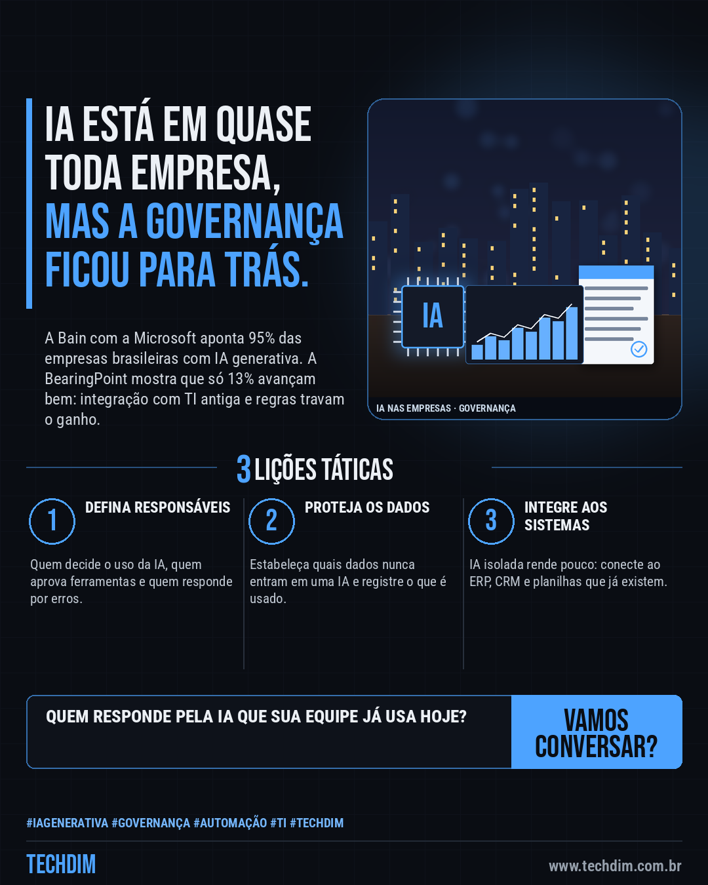
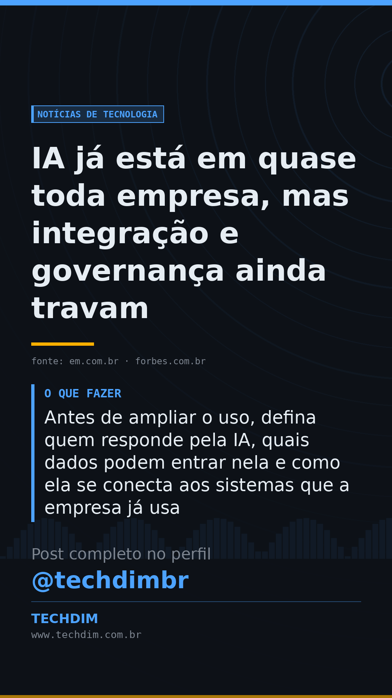

# Notícias de Tecnologia — IA já está em quase toda empresa, mas integração e governança ainda travam

- **Data:** 2026-10-02, 01:11 (horário de Brasília)
- **Curadoria:** Claude (Routine) — pauta do dia
- **Execução no Actions:** https://github.com/Techdimbr/Publi-midia-Techdim/actions/runs/36963385706
- **Por que esta pauta:** Duas pesquisas publicadas em 01/10/2026 apontam o mesmo gargalo: a IA se espalhou, mas integração e governança não acompanharam.

## Resultado

| Rede | Status | Link | 1º comentário |
|---|---|---|---|
| linkedin | ✅ publicado | https://www.linkedin.com/feed/update/urn:li:share:7511638821072211968/ | — |
| facebook | ✅ publicado | https://www.facebook.com/122132402349390486/posts/122132611413390486 | ✅ |
| instagram | ✅ publicado | https://www.instagram.com/p/Dd-mHO1jHdm/ | ✅ |
| Stories | ✅ publicado | https://www.instagram.com/stories/techdimbr/3998801227626057932 | — |

## Fontes

- [em.com.br](https://www.em.com.br/mundo-corporativo/2026/10/7512653-adocao-de-ia-avanca-mas-governanca-ainda-e-ponto-cego.html)
- [forbes.com.br](https://forbes.com.br/forbes-tech/2026/10/apenas-13-das-empresas-avancam-em-ia-diante-de-barreiras-regulatorias-e-sistemas-de-ti-antigos)

## Linkedin

```text
IA já está em quase toda empresa, mas integração e governança ainda travam

01. Segundo a Bain com a Microsoft, 95% das empresas brasileiras já usam IA generativa, mas a maioria ainda não tem estrutura formal de governança
02. Em pesquisa da BearingPoint, só 13% das empresas avançam bem em IA; 34% citam a integração com sistemas de TI antigos como barreira
03. Antes de ampliar o uso, defina quem responde pela IA, quais dados podem entrar nela e como ela se conecta aos sistemas que a empresa já usa

A TECHDIM ajuda a integrar a IA aos seus sistemas com regras claras de uso.

Fontes: https://www.em.com.br/mundo-corporativo/2026/10/7512653-adocao-de-ia-avanca-mas-governanca-ainda-e-ponto-cego.html · https://forbes.com.br/forbes-tech/2026/10/apenas-13-das-empresas-avancam-em-ia-diante-de-barreiras-regulatorias-e-sistemas-de-ti-antigos

TECHDIM — Infraestrutura · Segurança · IA
https://www.techdim.com.br

#Tecnologia #InteligenciaArtificial #InovacaoDigital #TECHDIM
```


## Facebook

```text
IA já está em quase toda empresa, mas integração e governança ainda travam

• Segundo a Bain com a Microsoft, 95% das empresas brasileiras já usam IA generativa, mas a maioria ainda não tem estrutura formal de governança
• Em pesquisa da BearingPoint, só 13% das empresas avançam bem em IA; 34% citam a integração com sistemas de TI antigos como barreira
• Antes de ampliar o uso, defina quem responde pela IA, quais dados podem entrar nela e como ela se conecta aos sistemas que a empresa já usa

A TECHDIM ajuda a integrar a IA aos seus sistemas com regras claras de uso.

Fale com a TECHDIM — fontes e site no primeiro comentário 👇

#TECHDIM #Tecnologia #IA #Campinas
```

Primeiro comentário:

```text
📎 Fontes:
• em.com.br: https://www.em.com.br/mundo-corporativo/2026/10/7512653-adocao-de-ia-avanca-mas-governanca-ainda-e-ponto-cego.html
• forbes.com.br: https://forbes.com.br/forbes-tech/2026/10/apenas-13-das-empresas-avancam-em-ia-diante-de-barreiras-regulatorias-e-sistemas-de-ti-antigos

🌐 TECHDIM — Infraestrutura · Segurança · IA: https://www.techdim.com.br
```



## Instagram

```text
IA já está em quase toda empresa, mas integração e governança ainda travam

1️⃣ Segundo a Bain com a Microsoft, 95% das empresas brasileiras já usam IA generativa, mas a maioria ainda não tem estrutura formal de governança
2️⃣ Em pesquisa da BearingPoint, só 13% das empresas avançam bem em IA; 34% citam a integração com sistemas de TI antigos como barreira
3️⃣ Antes de ampliar o uso, defina quem responde pela IA, quais dados podem entrar nela e como ela se conecta aos sistemas que a empresa já usa

A TECHDIM ajuda a integrar a IA aos seus sistemas com regras claras de uso.

Saiba mais: www.techdim.com.br
Fontes no primeiro comentário 👇

#tecnologia #inteligenciaartificial #ia #inovacao #techdim #campinas #ti
```

Primeiro comentário:

```text
📎 Fontes: em.com.br · forbes.com.br
```


## Stories


