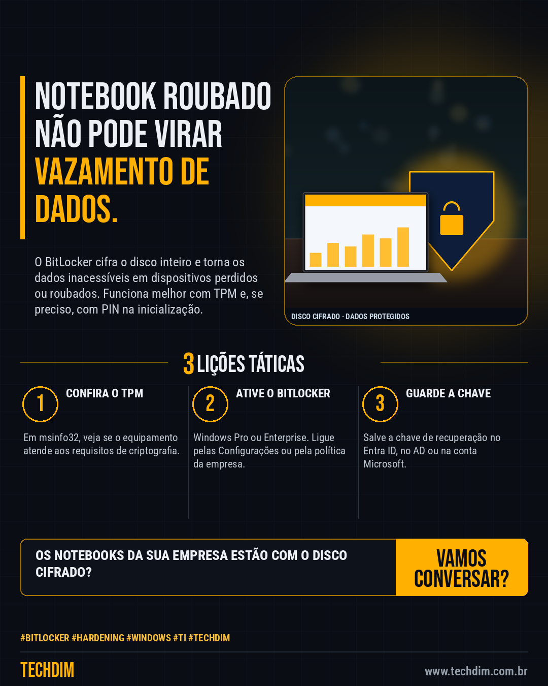

# Conhecimento — Notebook perdido sem BitLocker é dado exposto: como ligar a criptografia

- **Data:** 2026-10-02, 14:23 (horário de Brasília)
- **Curadoria:** Claude (Routine) — pauta do dia
- **Execução no Actions:** https://github.com/Techdimbr/Publi-midia-Techdim/actions/runs/37040259122
- **Por que esta pauta:** Medida simples de hardening, documentada pela Microsoft, que reduz o dano de perda ou roubo de equipamento.

## Resultado

| Rede | Status | Link | 1º comentário |
|---|---|---|---|
| linkedin | ✅ publicado | https://www.linkedin.com/feed/update/urn:li:share:7511838117511974912/ | — |
| facebook | ✅ publicado | https://www.facebook.com/122132402349390486/posts/122132772753390486 | ✅ |
| instagram | ✅ publicado | https://www.instagram.com/p/DeAAwqZmMRm/ | ✅ |

## Fontes

- [learn.microsoft.com](https://learn.microsoft.com/pt-br/windows/security/operating-system-security/data-protection/bitlocker/)

## Linkedin

```text
Notebook perdido sem BitLocker é dado exposto: como ligar a criptografia

01. Veja se o equipamento tem TPM e se atende aos requisitos: em msinfo32, a linha "Suporte à criptografia do dispositivo" deve indicar que atende
02. Ative o BitLocker (Windows Pro/Enterprise) ou a criptografia do dispositivo em Configurações, para proteger o disco contra acesso não autorizado
03. Guarde a chave de recuperação em local seguro: no Microsoft Entra ID, no AD ou na conta Microsoft, e teste a recuperação

A TECHDIM padroniza criptografia e chaves de recuperação nos computadores da sua empresa.

Fontes: https://learn.microsoft.com/pt-br/windows/security/operating-system-security/data-protection/bitlocker/

TECHDIM — Infraestrutura · Segurança · IA
https://www.techdim.com.br

#Bitlocker #Hardening #Windows #TI #TECHDIM
```



## Facebook

```text
Notebook perdido sem BitLocker é dado exposto: como ligar a criptografia

• Veja se o equipamento tem TPM e se atende aos requisitos: em msinfo32, a linha "Suporte à criptografia do dispositivo" deve indicar que atende
• Ative o BitLocker (Windows Pro/Enterprise) ou a criptografia do dispositivo em Configurações, para proteger o disco contra acesso não autorizado
• Guarde a chave de recuperação em local seguro: no Microsoft Entra ID, no AD ou na conta Microsoft, e teste a recuperação

A TECHDIM padroniza criptografia e chaves de recuperação nos computadores da sua empresa.

Fale com a TECHDIM — fontes e site no primeiro comentário 👇

#Bitlocker #Hardening #Windows #TECHDIM
```

Primeiro comentário:

```text
📎 Fontes:
• learn.microsoft.com: https://learn.microsoft.com/pt-br/windows/security/operating-system-security/data-protection/bitlocker/

🌐 TECHDIM — Infraestrutura · Segurança · IA: https://www.techdim.com.br
```


## Instagram

```text
Notebook perdido sem BitLocker é dado exposto: como ligar a criptografia

1️⃣ Veja se o equipamento tem TPM e se atende aos requisitos: em msinfo32, a linha "Suporte à criptografia do dispositivo" deve indicar que atende
2️⃣ Ative o BitLocker (Windows Pro/Enterprise) ou a criptografia do dispositivo em Configurações, para proteger o disco contra acesso não autorizado
3️⃣ Guarde a chave de recuperação em local seguro: no Microsoft Entra ID, no AD ou na conta Microsoft, e teste a recuperação

A TECHDIM padroniza criptografia e chaves de recuperação nos computadores da sua empresa.

Saiba mais: www.techdim.com.br
Fontes no primeiro comentário 👇

#bitlocker #hardening #windows #ti #techdim #conhecimento #aprendati #tecnologia
```

Primeiro comentário:

```text
📎 Fontes: learn.microsoft.com
```


