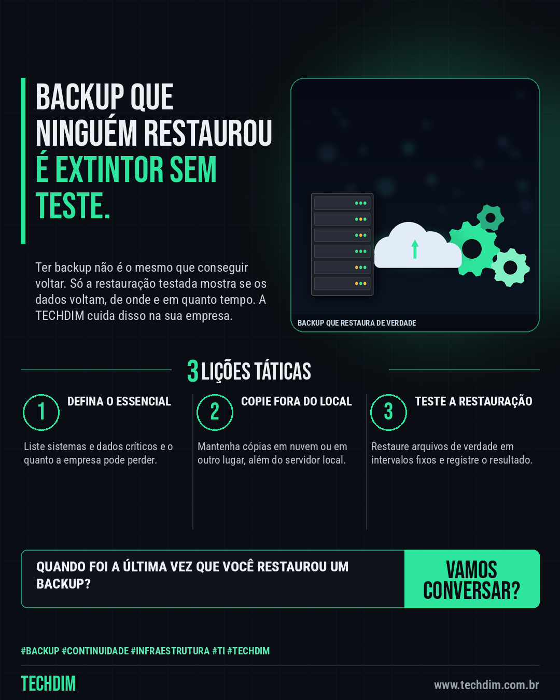

# TECHDIM · Serviços — Backup que nunca foi restaurado é como extintor que ninguém testou

- **Data:** 2026-10-02, 17:23 (horário de Brasília)
- **Curadoria:** Claude (Routine) — pauta do dia
- **Execução no Actions:** https://github.com/Techdimbr/Publi-midia-Techdim/actions/runs/37060195115
- **Por que esta pauta:** Serviço de backup e recuperação testada, com analogia do cotidiano e sem promessa de prazo.

## Resultado

| Rede | Status | Link | 1º comentário |
|---|---|---|---|
| linkedin | ✅ publicado | https://www.linkedin.com/feed/update/urn:li:share:7511883502234198016/ | — |
| facebook | ✅ publicado | https://www.facebook.com/122132402349390486/posts/122132813823390486 | ✅ |
| instagram | ✅ publicado | https://www.instagram.com/p/DeAVYudmDCu/ | — |

## Linkedin

```text
Backup que nunca foi restaurado é como extintor que ninguém testou

01. O problema: muita empresa tem rotina de backup, mas nunca restaurou um arquivo para provar que ele volta
02. A TECHDIM define o que proteger, mantém cópias fora do local e faz testes periódicos de restauração, com registro
03. O resultado esperado: se algo parar, a empresa sabe o que volta, de onde e em quanto tempo

Fale com a TECHDIM e teste a restauração dos seus backups.

TECHDIM — Infraestrutura · Segurança · IA
https://www.techdim.com.br

#Backup #Continuidade #Infraestrutura #TI #TECHDIM
```



## Facebook

```text
Backup que nunca foi restaurado é como extintor que ninguém testou

• O problema: muita empresa tem rotina de backup, mas nunca restaurou um arquivo para provar que ele volta
• A TECHDIM define o que proteger, mantém cópias fora do local e faz testes periódicos de restauração, com registro
• O resultado esperado: se algo parar, a empresa sabe o que volta, de onde e em quanto tempo

Fale com a TECHDIM e teste a restauração dos seus backups.

Fale com a TECHDIM — link no primeiro comentário 👇

#Backup #Continuidade #Infraestrutura #TECHDIM
```

Primeiro comentário:

```text
🌐 TECHDIM — Infraestrutura · Segurança · IA: https://www.techdim.com.br
```


## Instagram

```text
Backup que nunca foi restaurado é como extintor que ninguém testou

1️⃣ O problema: muita empresa tem rotina de backup, mas nunca restaurou um arquivo para provar que ele volta
2️⃣ A TECHDIM define o que proteger, mantém cópias fora do local e faz testes periódicos de restauração, com registro
3️⃣ O resultado esperado: se algo parar, a empresa sabe o que volta, de onde e em quanto tempo

Fale com a TECHDIM e teste a restauração dos seus backups.

Saiba mais: www.techdim.com.br

#backup #continuidade #infraestrutura #ti #techdim #suportetecnico #ciberseguranca #automacao
```


