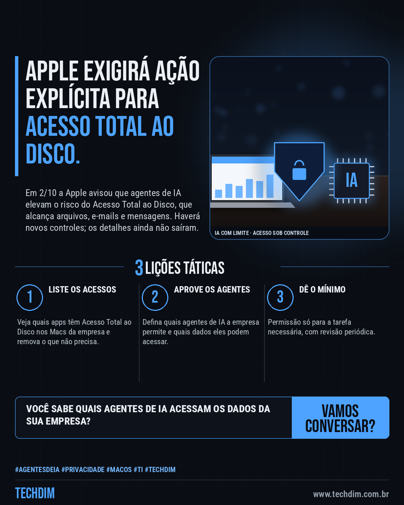
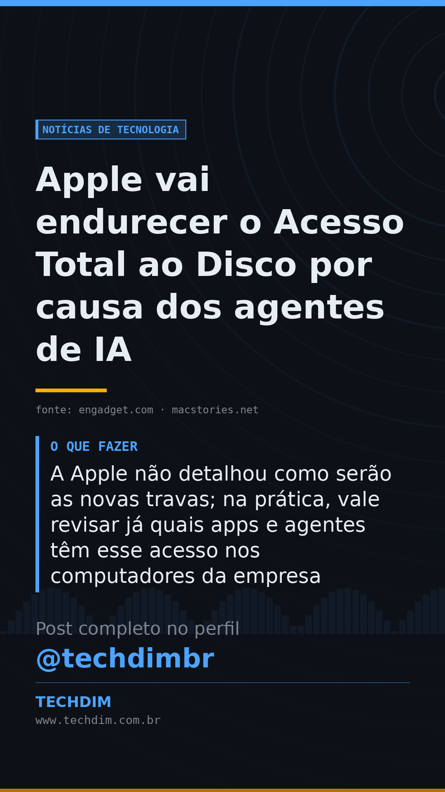

# Notícias de Tecnologia — Apple vai endurecer o Acesso Total ao Disco por causa dos agentes de IA

- **Data:** 2026-10-03, 07:59 (horário de Brasília)
- **Curadoria:** Claude (Routine) — pauta do dia
- **Execução no Actions:** https://github.com/Techdimbr/Publi-midia-Techdim/actions/runs/37118157320
- **Por que esta pauta:** Mostra que o acesso amplo de agentes de IA virou risco reconhecido pelo fabricante do sistema; a lição vale para qualquer computador da empresa.

## Resultado

| Rede | Status | Link | 1º comentário |
|---|---|---|---|
| linkedin | ✅ publicado | https://www.linkedin.com/feed/update/urn:li:share:7512103965996761088/ | — |
| facebook | ✅ publicado | https://www.facebook.com/122132402349390486/posts/122132990877390486 | ✅ |
| instagram | ✅ publicado | https://www.instagram.com/p/DeB5pADlNbh/ | ✅ |
| Stories | ✅ publicado | https://www.instagram.com/stories/techdimbr/3999731572647698550 | — |

## Fontes

- [engadget.com](https://www.engadget.com/2276186/apple-sounds-the-alarm-on-ai-agents-and-full-disk-access/)
- [macstories.net](https://www.macstories.net/linked/apple-announces-plan-to-impose-new-full-disk-access-controls-on-mac-developers/)

## Linkedin

```text
Apple vai endurecer o Acesso Total ao Disco por causa dos agentes de IA

01. Em 2/10 a Apple anunciou novos controles para o Acesso Total ao Disco do macOS: o app só obterá essa permissão com "ação explícita do usuário"
02. O motivo são os agentes de IA: com esse acesso, um app lê arquivos, e-mails, mensagens e histórico de navegação sem que o usuário perceba o alcance
03. A Apple não detalhou como serão as novas travas; na prática, vale revisar já quais apps e agentes têm esse acesso nos computadores da empresa

Agente de IA é ótimo, mas precisa de limite. A TECHDIM define permissões e políticas para usar IA com segurança.

Fontes: https://www.engadget.com/2276186/apple-sounds-the-alarm-on-ai-agents-and-full-disk-access/ · https://www.macstories.net/linked/apple-announces-plan-to-impose-new-full-disk-access-controls-on-mac-developers/

TECHDIM — Infraestrutura · Segurança · IA
https://www.techdim.com.br

#AgentesDeIA #Privacidade #MacOS #TI #TECHDIM
```



## Facebook

```text
Apple vai endurecer o Acesso Total ao Disco por causa dos agentes de IA

• Em 2/10 a Apple anunciou novos controles para o Acesso Total ao Disco do macOS: o app só obterá essa permissão com "ação explícita do usuário"
• O motivo são os agentes de IA: com esse acesso, um app lê arquivos, e-mails, mensagens e histórico de navegação sem que o usuário perceba o alcance
• A Apple não detalhou como serão as novas travas; na prática, vale revisar já quais apps e agentes têm esse acesso nos computadores da empresa

Agente de IA é ótimo, mas precisa de limite. A TECHDIM define permissões e políticas para usar IA com segurança.

Fale com a TECHDIM — fontes e site no primeiro comentário 👇

#AgentesDeIA #Privacidade #MacOS #TECHDIM
```

Primeiro comentário:

```text
📎 Fontes:
• engadget.com: https://www.engadget.com/2276186/apple-sounds-the-alarm-on-ai-agents-and-full-disk-access/
• macstories.net: https://www.macstories.net/linked/apple-announces-plan-to-impose-new-full-disk-access-controls-on-mac-developers/

🌐 TECHDIM — Infraestrutura · Segurança · IA: https://www.techdim.com.br
```


## Instagram

```text
Apple vai endurecer o Acesso Total ao Disco por causa dos agentes de IA

1️⃣ Em 2/10 a Apple anunciou novos controles para o Acesso Total ao Disco do macOS: o app só obterá essa permissão com "ação explícita do usuário"
2️⃣ O motivo são os agentes de IA: com esse acesso, um app lê arquivos, e-mails, mensagens e histórico de navegação sem que o usuário perceba o alcance
3️⃣ A Apple não detalhou como serão as novas travas; na prática, vale revisar já quais apps e agentes têm esse acesso nos computadores da empresa

Agente de IA é ótimo, mas precisa de limite. A TECHDIM define permissões e políticas para usar IA com segurança.

Saiba mais: www.techdim.com.br
Fontes no primeiro comentário 👇

#agentesdeia #privacidade #macos #ti #techdim #tecnologia #inteligenciaartificial #ia
```

Primeiro comentário:

```text
📎 Fontes: engadget.com · macstories.net
```


## Stories


