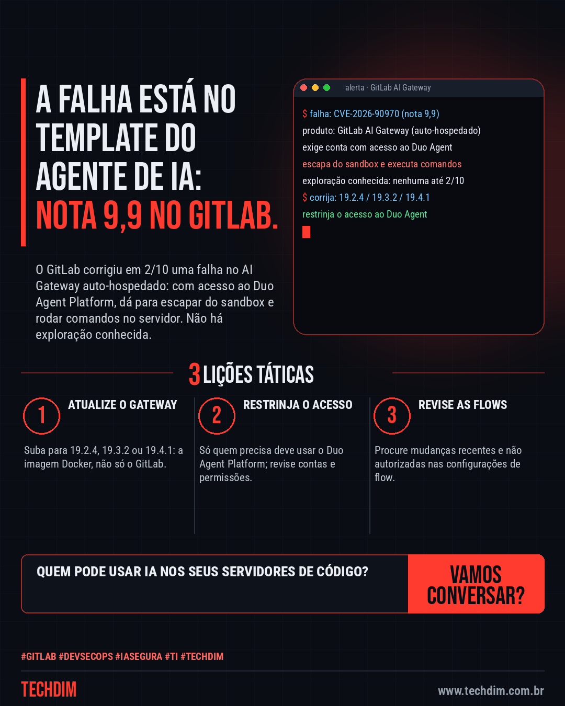
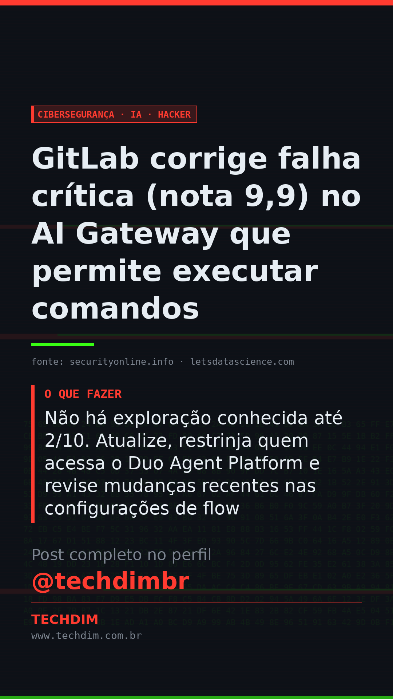

# Cibersegurança · IA · Hacker — GitLab corrige falha crítica (nota 9,9) no AI Gateway que permite executar comandos

- **Data:** 2026-10-03, 11:08 (horário de Brasília)
- **Curadoria:** Claude (Routine) — pauta do dia
- **Execução no Actions:** https://github.com/Techdimbr/Publi-midia-Techdim/actions/runs/37128517870
- **Por que esta pauta:** Falha crítica em ferramenta de IA integrada ao servidor de código; vale para empresas que hospedam o próprio GitLab.

## Resultado

| Rede | Status | Link | 1º comentário |
|---|---|---|---|
| linkedin | ✅ publicado | https://www.linkedin.com/feed/update/urn:li:share:7512151349942321153/ | — |
| facebook | ✅ publicado | https://www.facebook.com/122132402349390486/posts/122133029103390486 | ✅ |
| instagram | ✅ publicado | https://www.instagram.com/p/DeCPMOYFYc5/ | ✅ |
| Stories | ✅ publicado | https://www.instagram.com/stories/techdimbr/3999826373279870384 | — |

## Fontes

- [securityonline.info](https://securityonline.info/gitlab-ai-gateway-vulnerability/)
- [letsdatascience.com](https://letsdatascience.com/news/gitlab-patches-critical-ai-gateway-command-execution-flaw-3c0f4f57)

## Linkedin

```text
GitLab corrige falha crítica (nota 9,9) no AI Gateway que permite executar comandos

01. A CVE-2026-90970 (nota 9,9) atinge o AI Gateway auto-hospedado do GitLab: quem tem acesso ao Duo Agent Platform escapa do sandbox de templates e executa comandos
02. Afetadas: da 18.1.6 até antes da 19.2.4, da 19.3 até antes da 19.3.2 e a 19.4.0; correções 19.2.4, 19.3.2 e 19.4.1. Atualize a imagem Docker do gateway
03. Não há exploração conhecida até 2/10. Atualize, restrinja quem acessa o Duo Agent Platform e revise mudanças recentes nas configurações de flow

Ferramenta de IA no servidor de código também precisa de patch e de acesso mínimo. A TECHDIM cuida disso.

Fontes: https://securityonline.info/gitlab-ai-gateway-vulnerability/ · https://letsdatascience.com/news/gitlab-patches-critical-ai-gateway-command-execution-flaw-3c0f4f57

TECHDIM — Infraestrutura · Segurança · IA
https://www.techdim.com.br

#GitLab #DevSecOps #IASegura #TI #TECHDIM
```



## Facebook

```text
GitLab corrige falha crítica (nota 9,9) no AI Gateway que permite executar comandos

• A CVE-2026-90970 (nota 9,9) atinge o AI Gateway auto-hospedado do GitLab: quem tem acesso ao Duo Agent Platform escapa do sandbox de templates e executa comandos
• Afetadas: da 18.1.6 até antes da 19.2.4, da 19.3 até antes da 19.3.2 e a 19.4.0; correções 19.2.4, 19.3.2 e 19.4.1. Atualize a imagem Docker do gateway
• Não há exploração conhecida até 2/10. Atualize, restrinja quem acessa o Duo Agent Platform e revise mudanças recentes nas configurações de flow

Ferramenta de IA no servidor de código também precisa de patch e de acesso mínimo. A TECHDIM cuida disso.

Fale com a TECHDIM — fontes e site no primeiro comentário 👇

#GitLab #DevSecOps #IASegura #TECHDIM
```

Primeiro comentário:

```text
📎 Fontes:
• securityonline.info: https://securityonline.info/gitlab-ai-gateway-vulnerability/
• letsdatascience.com: https://letsdatascience.com/news/gitlab-patches-critical-ai-gateway-command-execution-flaw-3c0f4f57

🌐 TECHDIM — Infraestrutura · Segurança · IA: https://www.techdim.com.br
```


## Instagram

```text
GitLab corrige falha crítica (nota 9,9) no AI Gateway que permite executar comandos

1️⃣ A CVE-2026-90970 (nota 9,9) atinge o AI Gateway auto-hospedado do GitLab: quem tem acesso ao Duo Agent Platform escapa do sandbox de templates e executa comandos
2️⃣ Afetadas: da 18.1.6 até antes da 19.2.4, da 19.3 até antes da 19.3.2 e a 19.4.0; correções 19.2.4, 19.3.2 e 19.4.1. Atualize a imagem Docker do gateway
3️⃣ Não há exploração conhecida até 2/10. Atualize, restrinja quem acessa o Duo Agent Platform e revise mudanças recentes nas configurações de flow

Ferramenta de IA no servidor de código também precisa de patch e de acesso mínimo. A TECHDIM cuida disso.

Saiba mais: www.techdim.com.br
Fontes no primeiro comentário 👇

#gitlab #devsecops #iasegura #ti #techdim #ciberseguranca #seguranca #hacker
```

Primeiro comentário:

```text
📎 Fontes: securityonline.info · letsdatascience.com
```


## Stories


