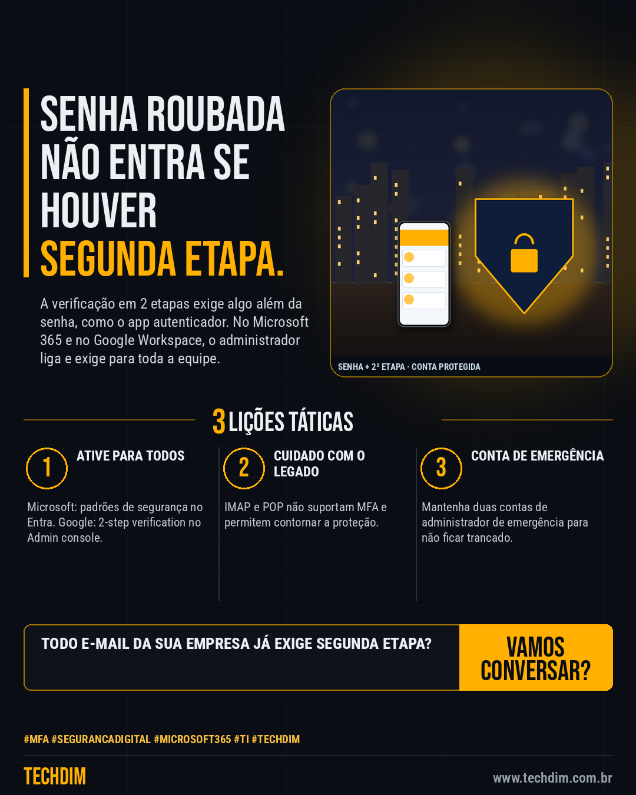

# Conhecimento — Ligue a verificação em 2 etapas no e-mail da empresa: passo a passo

- **Data:** 2026-10-03, 14:23 (horário de Brasília)
- **Curadoria:** Claude (Routine) — pauta do dia
- **Execução no Actions:** https://github.com/Techdimbr/Publi-midia-Techdim/actions/runs/37140270075
- **Por que esta pauta:** Medida de baixo custo, documentada pela Microsoft e pelo Google, que reduz o risco de invasão por senha roubada.

## Resultado

| Rede | Status | Link | 1º comentário |
|---|---|---|---|
| linkedin | ✅ publicado | https://www.linkedin.com/feed/update/urn:li:share:7512200528932528129/ | — |
| facebook | ✅ publicado | https://www.facebook.com/122132402349390486/posts/122133077127390486 | ✅ |
| instagram | ✅ publicado | https://www.instagram.com/p/DeCljV8Dx7d/ | ✅ |

## Fontes

- [learn.microsoft.com](https://learn.microsoft.com/en-us/entra/fundamentals/security-defaults)
- [knowledge.workspace.google.com](https://knowledge.workspace.google.com/admin/security/deploy-2-step-verification)

## Linkedin

```text
Ligue a verificação em 2 etapas no e-mail da empresa: passo a passo

01. Microsoft 365: no Entra admin center, vá em Entra ID > Overview > Properties > Manage security defaults, marque Enabled e salve (exige Conditional Access Administrator)
02. Google Workspace: no Admin console, abra Security > Authentication > 2-step verification, permita o uso e ative a obrigatoriedade, na hora ou numa data
03. Antes, veja se algum sistema usa login legado (IMAP, POP, SMTP básico): ele não aceita MFA. Avise a equipe e mantenha 2 contas de administrador de emergência

A TECHDIM configura a verificação em 2 etapas e os acessos de toda a equipe, sem travar o trabalho.

Fontes: https://learn.microsoft.com/en-us/entra/fundamentals/security-defaults · https://knowledge.workspace.google.com/admin/security/deploy-2-step-verification

TECHDIM — Infraestrutura · Segurança · IA
https://www.techdim.com.br

#MFA #SegurancaDigital #Microsoft365 #TI #TECHDIM
```



## Facebook

```text
Ligue a verificação em 2 etapas no e-mail da empresa: passo a passo

• Microsoft 365: no Entra admin center, vá em Entra ID > Overview > Properties > Manage security defaults, marque Enabled e salve (exige Conditional Access Administrator)
• Google Workspace: no Admin console, abra Security > Authentication > 2-step verification, permita o uso e ative a obrigatoriedade, na hora ou numa data
• Antes, veja se algum sistema usa login legado (IMAP, POP, SMTP básico): ele não aceita MFA. Avise a equipe e mantenha 2 contas de administrador de emergência

A TECHDIM configura a verificação em 2 etapas e os acessos de toda a equipe, sem travar o trabalho.

Fale com a TECHDIM — fontes e site no primeiro comentário 👇

#MFA #SegurancaDigital #Microsoft365 #TECHDIM
```

Primeiro comentário:

```text
📎 Fontes:
• learn.microsoft.com: https://learn.microsoft.com/en-us/entra/fundamentals/security-defaults
• knowledge.workspace.google.com: https://knowledge.workspace.google.com/admin/security/deploy-2-step-verification

🌐 TECHDIM — Infraestrutura · Segurança · IA: https://www.techdim.com.br
```


## Instagram

```text
Ligue a verificação em 2 etapas no e-mail da empresa: passo a passo

1️⃣ Microsoft 365: no Entra admin center, vá em Entra ID > Overview > Properties > Manage security defaults, marque Enabled e salve (exige Conditional Access Administrator)
2️⃣ Google Workspace: no Admin console, abra Security > Authentication > 2-step verification, permita o uso e ative a obrigatoriedade, na hora ou numa data
3️⃣ Antes, veja se algum sistema usa login legado (IMAP, POP, SMTP básico): ele não aceita MFA. Avise a equipe e mantenha 2 contas de administrador de emergência

A TECHDIM configura a verificação em 2 etapas e os acessos de toda a equipe, sem travar o trabalho.

Saiba mais: www.techdim.com.br
Fontes no primeiro comentário 👇

#mfa #segurancadigital #microsoft365 #ti #techdim #conhecimento #aprendati #tecnologia
```

Primeiro comentário:

```text
📎 Fontes: learn.microsoft.com · knowledge.workspace.google.com
```


