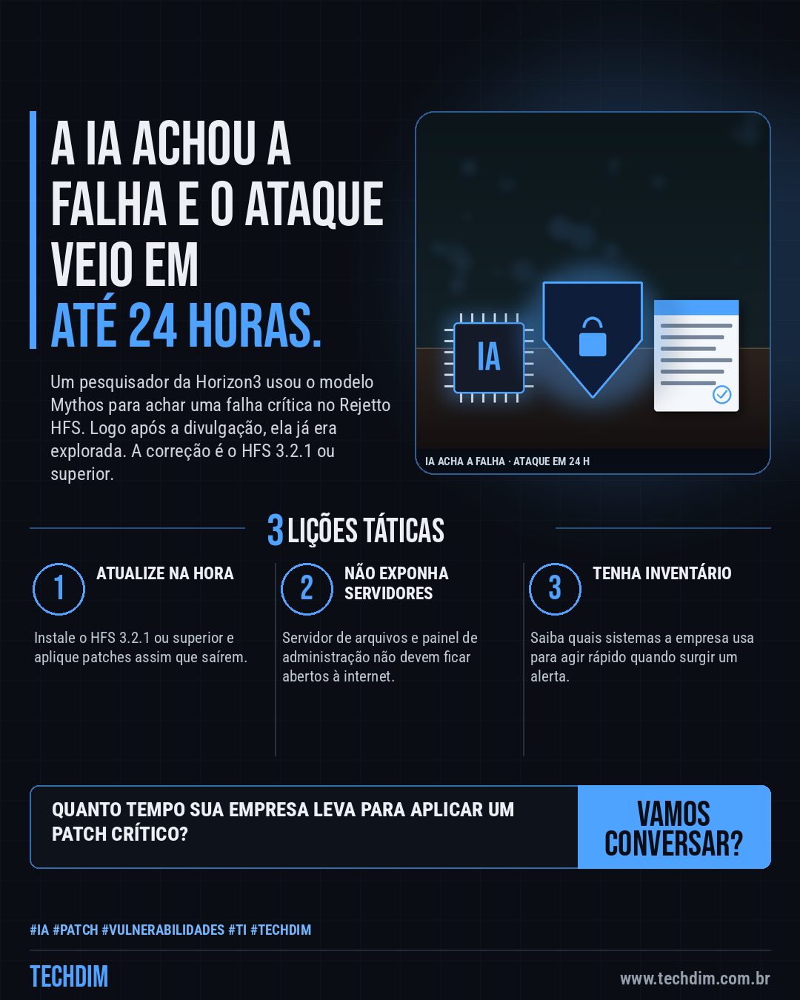
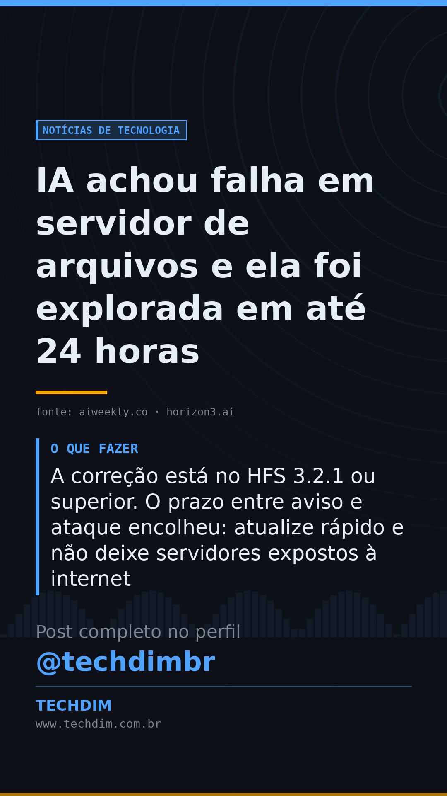

# Notícias de Tecnologia — IA achou falha em servidor de arquivos e ela foi explorada em até 24 horas

- **Data:** 2026-10-04, 08:00 (horário de Brasília)
- **Curadoria:** Claude (Routine) — pauta do dia
- **Execução no Actions:** https://github.com/Techdimbr/Publi-midia-Techdim/actions/runs/37197161798
- **Por que esta pauta:** Mostra na prática que o tempo entre a divulgação e o ataque está curto e que servidores expostos precisam de atualização rápida.

## Resultado

| Rede | Status | Link | 1º comentário |
|---|---|---|---|
| linkedin | ✅ publicado | https://www.linkedin.com/feed/update/urn:li:share:7512466429510721536/ | — |
| facebook | ✅ publicado | https://www.facebook.com/122132402349390486/posts/122133250845390486 | ✅ |
| instagram | ✅ publicado | https://www.instagram.com/p/DeEee9ojlqw/ | ✅ |
| Stories | ✅ publicado | https://www.instagram.com/stories/techdimbr/4000456618407679566 | — |

## Fontes

- [aiweekly.co](https://aiweekly.co/alerts/anthropics-mythos-finds-rejetto-hfs-flaw-exploited-in-a-day)
- [horizon3.ai](https://horizon3.ai/attack-research/disclosures/anthropic-mythos-rejetto-hfs-rce/)

## Linkedin

```text
IA achou falha em servidor de arquivos e ela foi explorada em até 24 horas

01. O modelo Mythos, da Anthropic, ajudou um pesquisador da Horizon3 a achar a CVE-2026-61500, falha crítica no Rejetto HFS que dá acesso de administrador
02. A causa é uma chave de sessão gerada com Math.random(), que é previsível; segundo o relato, a falha foi explorada em até 24 horas após a divulgação
03. A correção está no HFS 3.2.1 ou superior. O prazo entre aviso e ataque encolheu: atualize rápido e não deixe servidores expostos à internet

Quando a IA acelera quem procura falhas, o prazo para atualizar encolhe. A TECHDIM mantém seus sistemas em dia.

Fontes: https://aiweekly.co/alerts/anthropics-mythos-finds-rejetto-hfs-flaw-exploited-in-a-day · https://horizon3.ai/attack-research/disclosures/anthropic-mythos-rejetto-hfs-rce/

TECHDIM — Infraestrutura · Segurança · IA
https://www.techdim.com.br

#IA #Patch #Vulnerabilidades #TI #TECHDIM
```



## Facebook

```text
IA achou falha em servidor de arquivos e ela foi explorada em até 24 horas

• O modelo Mythos, da Anthropic, ajudou um pesquisador da Horizon3 a achar a CVE-2026-61500, falha crítica no Rejetto HFS que dá acesso de administrador
• A causa é uma chave de sessão gerada com Math.random(), que é previsível; segundo o relato, a falha foi explorada em até 24 horas após a divulgação
• A correção está no HFS 3.2.1 ou superior. O prazo entre aviso e ataque encolheu: atualize rápido e não deixe servidores expostos à internet

Quando a IA acelera quem procura falhas, o prazo para atualizar encolhe. A TECHDIM mantém seus sistemas em dia.

Fale com a TECHDIM — fontes e site no primeiro comentário 👇

#IA #Patch #Vulnerabilidades #TECHDIM
```

Primeiro comentário:

```text
📎 Fontes:
• aiweekly.co: https://aiweekly.co/alerts/anthropics-mythos-finds-rejetto-hfs-flaw-exploited-in-a-day
• horizon3.ai: https://horizon3.ai/attack-research/disclosures/anthropic-mythos-rejetto-hfs-rce/

🌐 TECHDIM — Infraestrutura · Segurança · IA: https://www.techdim.com.br
```


## Instagram

```text
IA achou falha em servidor de arquivos e ela foi explorada em até 24 horas

1️⃣ O modelo Mythos, da Anthropic, ajudou um pesquisador da Horizon3 a achar a CVE-2026-61500, falha crítica no Rejetto HFS que dá acesso de administrador
2️⃣ A causa é uma chave de sessão gerada com Math.random(), que é previsível; segundo o relato, a falha foi explorada em até 24 horas após a divulgação
3️⃣ A correção está no HFS 3.2.1 ou superior. O prazo entre aviso e ataque encolheu: atualize rápido e não deixe servidores expostos à internet

Quando a IA acelera quem procura falhas, o prazo para atualizar encolhe. A TECHDIM mantém seus sistemas em dia.

Saiba mais: www.techdim.com.br
Fontes no primeiro comentário 👇

#ia #patch #vulnerabilidades #ti #techdim #tecnologia #inteligenciaartificial #inovacao
```

Primeiro comentário:

```text
📎 Fontes: aiweekly.co · horizon3.ai
```


## Stories


