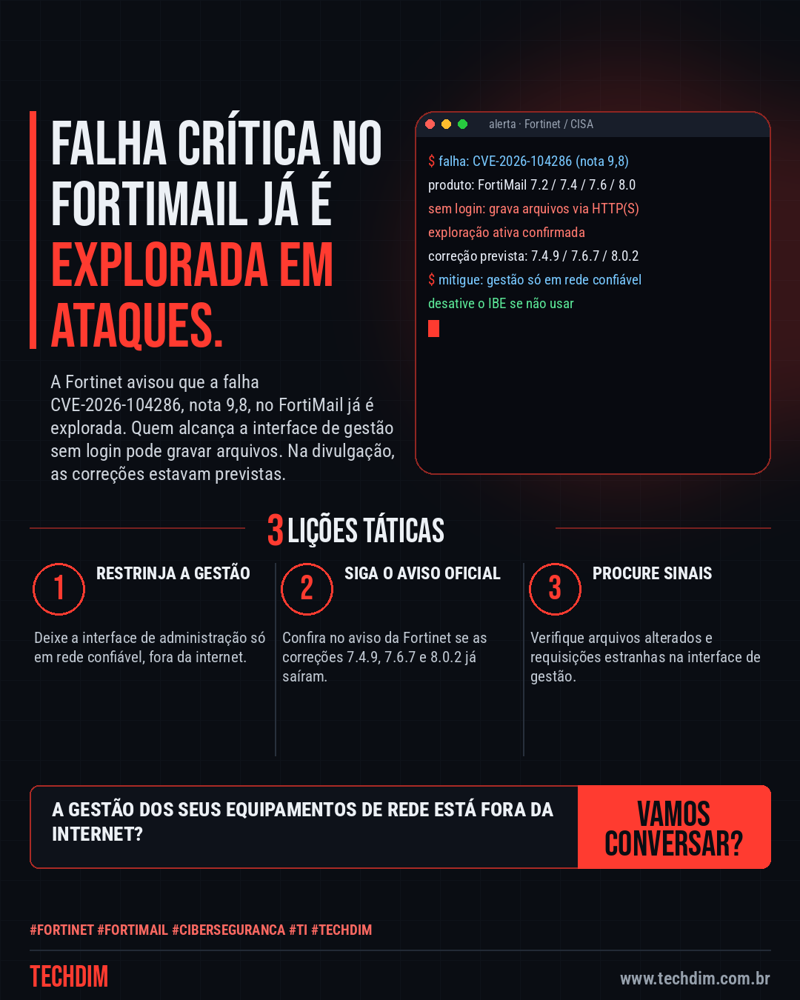
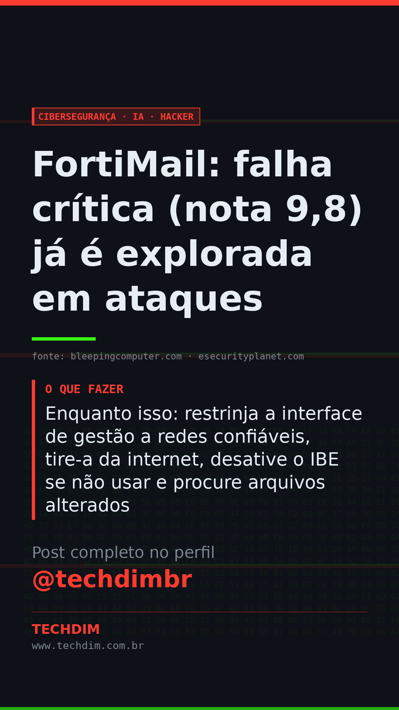

# Cibersegurança · IA · Hacker — FortiMail: falha crítica (nota 9,8) já é explorada em ataques

- **Data:** 2026-10-04, 11:08 (horário de Brasília)
- **Curadoria:** Claude (Routine) — pauta do dia
- **Execução no Actions:** https://github.com/Techdimbr/Publi-midia-Techdim/actions/runs/37208070807
- **Por que esta pauta:** Falha crítica com exploração ativa; as medidas de contenção valem para qualquer equipamento de borda exposto.

## Resultado

| Rede | Status | Link | 1º comentário |
|---|---|---|---|
| linkedin | ✅ publicado | https://www.linkedin.com/feed/update/urn:li:share:7512513738831482880/ | — |
| facebook | ✅ publicado | https://www.facebook.com/122132402349390486/posts/122133292935390486 | ✅ |
| instagram | ✅ publicado | https://www.instagram.com/p/DeEz-z1DBUO/ | ✅ |
| Stories | ✅ publicado | https://www.instagram.com/stories/techdimbr/4000551123618136077 | — |

## Fontes

- [bleepingcomputer.com](https://www.bleepingcomputer.com/news/security/fortinet-warns-of-critical-fortimail-flaw-exploited-in-zero-day-attacks/)
- [esecurityplanet.com](https://www.esecurityplanet.com/threats/news-fortimail-zero-day-cve-2026-104286-active-exploitation/)

## Linkedin

```text
FortiMail: falha crítica (nota 9,8) já é explorada em ataques

01. A CVE-2026-104286 (nota 9,8) deixa um atacante sem login gravar arquivos no FortiMail por requisições HTTP/HTTPS; a Fortinet confirma exploração
02. Afetadas as versões 7.2, 7.4, 7.6 e 8.0; na divulgação, as correções 7.4.9, 7.6.7 e 8.0.2 estavam previstas. Quem usa a 7.2 deve migrar para a 7.4 ou superior
03. Enquanto isso: restrinja a interface de gestão a redes confiáveis, tire-a da internet, desative o IBE se não usar e procure arquivos alterados

Gateway de e-mail precisa de acesso restrito e monitoramento. A TECHDIM revisa a exposição dos seus sistemas.

Fontes: https://www.bleepingcomputer.com/news/security/fortinet-warns-of-critical-fortimail-flaw-exploited-in-zero-day-attacks/ · https://www.esecurityplanet.com/threats/news-fortimail-zero-day-cve-2026-104286-active-exploitation/

TECHDIM — Infraestrutura · Segurança · IA
https://www.techdim.com.br

#Fortinet #FortiMail #Ciberseguranca #TI #TECHDIM
```



## Facebook

```text
FortiMail: falha crítica (nota 9,8) já é explorada em ataques

• A CVE-2026-104286 (nota 9,8) deixa um atacante sem login gravar arquivos no FortiMail por requisições HTTP/HTTPS; a Fortinet confirma exploração
• Afetadas as versões 7.2, 7.4, 7.6 e 8.0; na divulgação, as correções 7.4.9, 7.6.7 e 8.0.2 estavam previstas. Quem usa a 7.2 deve migrar para a 7.4 ou superior
• Enquanto isso: restrinja a interface de gestão a redes confiáveis, tire-a da internet, desative o IBE se não usar e procure arquivos alterados

Gateway de e-mail precisa de acesso restrito e monitoramento. A TECHDIM revisa a exposição dos seus sistemas.

Fale com a TECHDIM — fontes e site no primeiro comentário 👇

#Fortinet #FortiMail #Ciberseguranca #TECHDIM
```

Primeiro comentário:

```text
📎 Fontes:
• bleepingcomputer.com: https://www.bleepingcomputer.com/news/security/fortinet-warns-of-critical-fortimail-flaw-exploited-in-zero-day-attacks/
• esecurityplanet.com: https://www.esecurityplanet.com/threats/news-fortimail-zero-day-cve-2026-104286-active-exploitation/

🌐 TECHDIM — Infraestrutura · Segurança · IA: https://www.techdim.com.br
```


## Instagram

```text
FortiMail: falha crítica (nota 9,8) já é explorada em ataques

1️⃣ A CVE-2026-104286 (nota 9,8) deixa um atacante sem login gravar arquivos no FortiMail por requisições HTTP/HTTPS; a Fortinet confirma exploração
2️⃣ Afetadas as versões 7.2, 7.4, 7.6 e 8.0; na divulgação, as correções 7.4.9, 7.6.7 e 8.0.2 estavam previstas. Quem usa a 7.2 deve migrar para a 7.4 ou superior
3️⃣ Enquanto isso: restrinja a interface de gestão a redes confiáveis, tire-a da internet, desative o IBE se não usar e procure arquivos alterados

Gateway de e-mail precisa de acesso restrito e monitoramento. A TECHDIM revisa a exposição dos seus sistemas.

Saiba mais: www.techdim.com.br
Fontes no primeiro comentário 👇

#fortinet #fortimail #ciberseguranca #ti #techdim #seguranca #hacker #infraestrutura
```

Primeiro comentário:

```text
📎 Fontes: bleepingcomputer.com · esecurityplanet.com
```


## Stories


