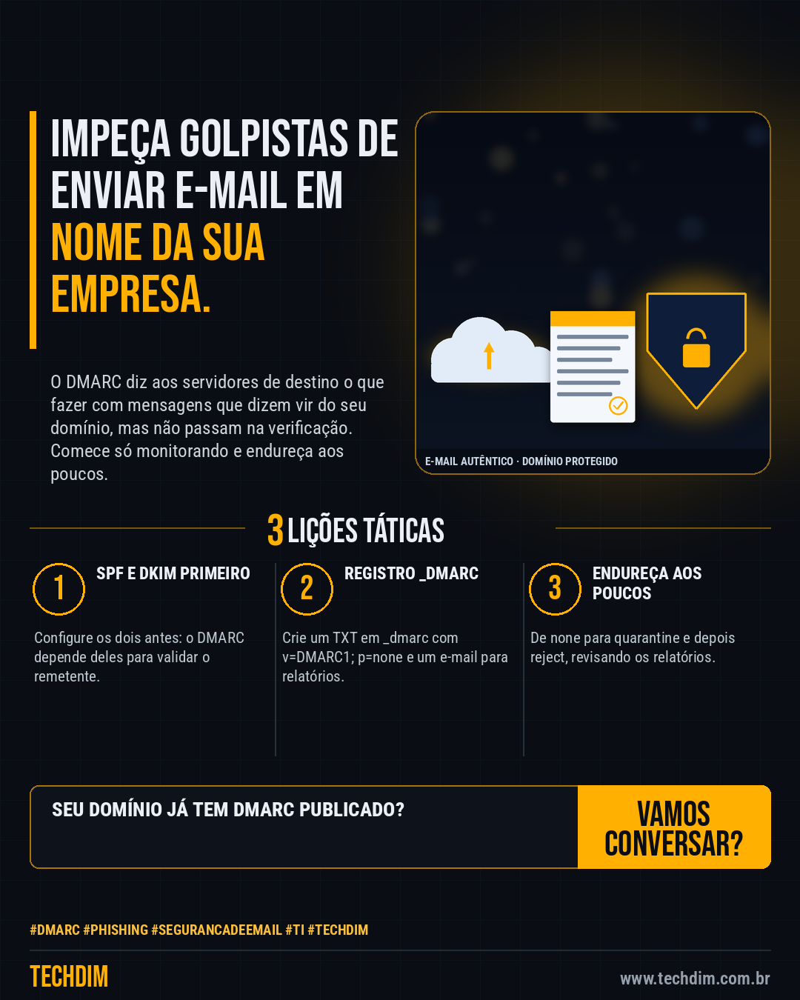

# Conhecimento — Proteja o domínio da empresa contra e-mail falso: configure o DMARC passo a passo

- **Data:** 2026-10-04, 14:24 (horário de Brasília)
- **Curadoria:** Claude (Routine) — pauta do dia
- **Execução no Actions:** https://github.com/Techdimbr/Publi-midia-Techdim/actions/runs/37220319162
- **Por que esta pauta:** Medida documentada pela Microsoft e pelo Google que dificulta a falsificação do e-mail da empresa em golpes e fraudes.

## Resultado

| Rede | Status | Link | 1º comentário |
|---|---|---|---|
| linkedin | ✅ publicado | https://www.linkedin.com/feed/update/urn:li:share:7512563114689605633/ | — |
| facebook | ✅ publicado | https://www.facebook.com/122132402349390486/posts/122133326997390486 | ✅ |
| instagram | ✅ publicado | https://www.instagram.com/p/DeFKb4Kj2Yk/ | ✅ |

## Fontes

- [learn.microsoft.com](https://learn.microsoft.com/en-us/defender-office-365/email-authentication-dmarc-configure)
- [knowledge.workspace.google.com](https://knowledge.workspace.google.com/admin/security/set-up-dmarc)

## Linkedin

```text
Proteja o domínio da empresa contra e-mail falso: configure o DMARC passo a passo

01. Antes, configure SPF e DKIM no domínio: o DMARC só funciona se um dos dois alinha com o endereço do remetente (From)
02. No DNS, crie um registro TXT com nome _dmarc e valor v=DMARC1; p=none; rua=mailto:seu-email, para só monitorar e receber relatórios
03. Analise os relatórios e endureça aos poucos: p=none, depois p=quarantine (com pct de 10 a 100) e, por fim, p=reject, corrigindo envios legítimos

A TECHDIM configura SPF, DKIM e DMARC no seu domínio e acompanha os relatórios.

Fontes: https://learn.microsoft.com/en-us/defender-office-365/email-authentication-dmarc-configure · https://knowledge.workspace.google.com/admin/security/set-up-dmarc

TECHDIM — Infraestrutura · Segurança · IA
https://www.techdim.com.br

#Dmarc #Phishing #SegurancaDeEmail #TI #TECHDIM
```



## Facebook

```text
Proteja o domínio da empresa contra e-mail falso: configure o DMARC passo a passo

• Antes, configure SPF e DKIM no domínio: o DMARC só funciona se um dos dois alinha com o endereço do remetente (From)
• No DNS, crie um registro TXT com nome _dmarc e valor v=DMARC1; p=none; rua=mailto:seu-email, para só monitorar e receber relatórios
• Analise os relatórios e endureça aos poucos: p=none, depois p=quarantine (com pct de 10 a 100) e, por fim, p=reject, corrigindo envios legítimos

A TECHDIM configura SPF, DKIM e DMARC no seu domínio e acompanha os relatórios.

Fale com a TECHDIM — fontes e site no primeiro comentário 👇

#Dmarc #Phishing #SegurancaDeEmail #TECHDIM
```

Primeiro comentário:

```text
📎 Fontes:
• learn.microsoft.com: https://learn.microsoft.com/en-us/defender-office-365/email-authentication-dmarc-configure
• knowledge.workspace.google.com: https://knowledge.workspace.google.com/admin/security/set-up-dmarc

🌐 TECHDIM — Infraestrutura · Segurança · IA: https://www.techdim.com.br
```


## Instagram

```text
Proteja o domínio da empresa contra e-mail falso: configure o DMARC passo a passo

1️⃣ Antes, configure SPF e DKIM no domínio: o DMARC só funciona se um dos dois alinha com o endereço do remetente (From)
2️⃣ No DNS, crie um registro TXT com nome _dmarc e valor v=DMARC1; p=none; rua=mailto:seu-email, para só monitorar e receber relatórios
3️⃣ Analise os relatórios e endureça aos poucos: p=none, depois p=quarantine (com pct de 10 a 100) e, por fim, p=reject, corrigindo envios legítimos

A TECHDIM configura SPF, DKIM e DMARC no seu domínio e acompanha os relatórios.

Saiba mais: www.techdim.com.br
Fontes no primeiro comentário 👇

#dmarc #phishing #segurancadeemail #ti #techdim #conhecimento #aprendati #tecnologia
```

Primeiro comentário:

```text
📎 Fontes: learn.microsoft.com · knowledge.workspace.google.com
```


