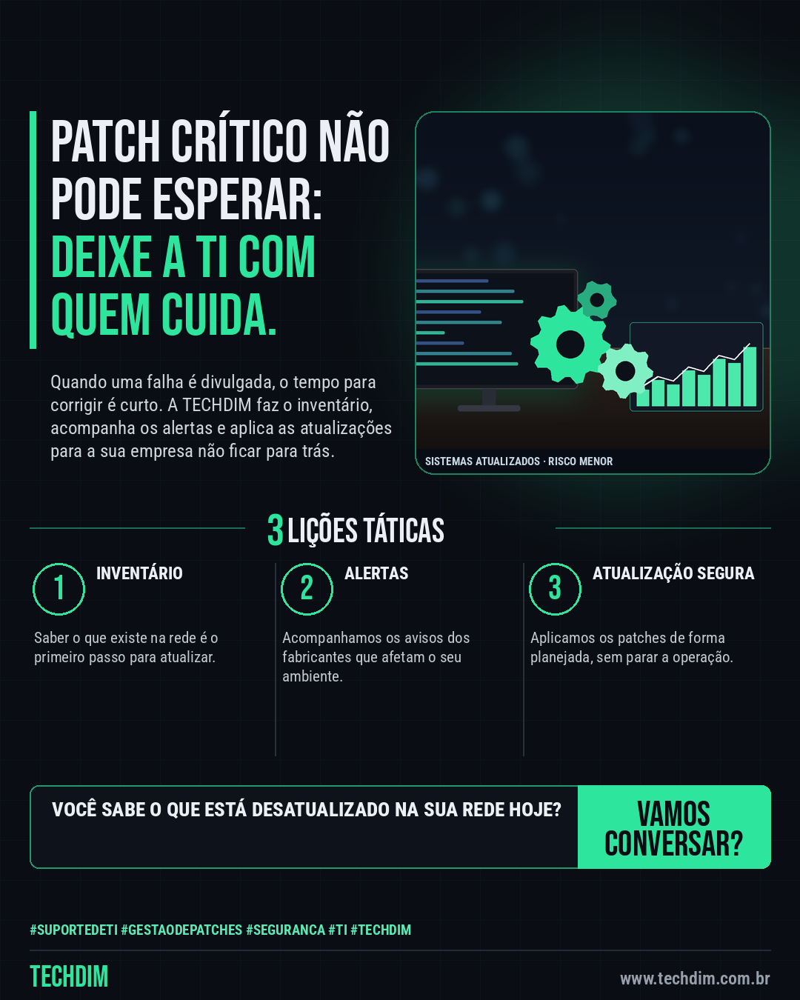

# TECHDIM · Serviços — Atualização em dia é defesa: gestão de patches e suporte de TI para sua empresa

- **Data:** 2026-10-04, 17:24 (horário de Brasília)
- **Curadoria:** Claude (Routine) — pauta do dia
- **Execução no Actions:** https://github.com/Techdimbr/Publi-midia-Techdim/actions/runs/37231918975
- **Por que esta pauta:** Propaganda do serviço de suporte de TI com gestão de atualizações, conectada às falhas críticas noticiadas.

## Resultado

| Rede | Status | Link | 1º comentário |
|---|---|---|---|
| linkedin | ✅ publicado | https://www.linkedin.com/feed/update/urn:li:share:7512608482039361536/ | — |
| facebook | ✅ publicado | https://www.facebook.com/122132402349390486/posts/122133356289390486 | ✅ |
| instagram | ✅ publicado | https://www.instagram.com/p/DeFfEnCDKoT/ | — |

## Linkedin

```text
Atualização em dia é defesa: gestão de patches e suporte de TI para sua empresa

01. Falhas críticas em servidores, gateways e sistemas são divulgadas com frequência, e o tempo entre o aviso e o ataque pode ser curto
02. A TECHDIM cuida do inventário, das atualizações e do acompanhamento de alertas dos seus sistemas, com suporte de TI para a sua equipe
03. Quer saber o que está desatualizado na sua empresa? Fale com a TECHDIM em www.techdim.com.br e vamos conversar sobre o seu ambiente

Atualizar em dia reduz o risco. Conte com a TECHDIM: www.techdim.com.br.

TECHDIM — Infraestrutura · Segurança · IA
https://www.techdim.com.br

#SuporteDeTI #GestaoDePatches #Seguranca #TI #TECHDIM
```



## Facebook

```text
Atualização em dia é defesa: gestão de patches e suporte de TI para sua empresa

• Falhas críticas em servidores, gateways e sistemas são divulgadas com frequência, e o tempo entre o aviso e o ataque pode ser curto
• A TECHDIM cuida do inventário, das atualizações e do acompanhamento de alertas dos seus sistemas, com suporte de TI para a sua equipe
• Quer saber o que está desatualizado na sua empresa? Fale com a TECHDIM em www.techdim.com.br e vamos conversar sobre o seu ambiente

Atualizar em dia reduz o risco. Conte com a TECHDIM: www.techdim.com.br.

Fale com a TECHDIM — link no primeiro comentário 👇

#SuporteDeTI #GestaoDePatches #Seguranca #TECHDIM
```

Primeiro comentário:

```text
🌐 TECHDIM — Infraestrutura · Segurança · IA: https://www.techdim.com.br
```


## Instagram

```text
Atualização em dia é defesa: gestão de patches e suporte de TI para sua empresa

1️⃣ Falhas críticas em servidores, gateways e sistemas são divulgadas com frequência, e o tempo entre o aviso e o ataque pode ser curto
2️⃣ A TECHDIM cuida do inventário, das atualizações e do acompanhamento de alertas dos seus sistemas, com suporte de TI para a sua equipe
3️⃣ Quer saber o que está desatualizado na sua empresa? Fale com a TECHDIM em www.techdim.com.br e vamos conversar sobre o seu ambiente

Atualizar em dia reduz o risco. Conte com a TECHDIM: www.techdim.com.br.

Saiba mais: www.techdim.com.br

#suportedeti #gestaodepatches #seguranca #ti #techdim #suportetecnico #ciberseguranca #automacao
```


