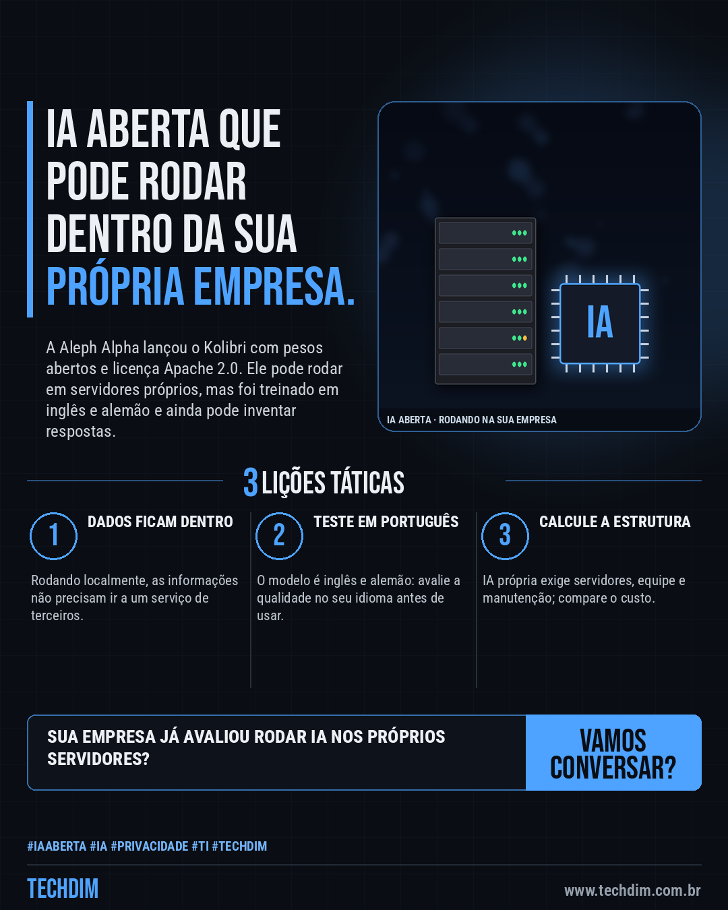
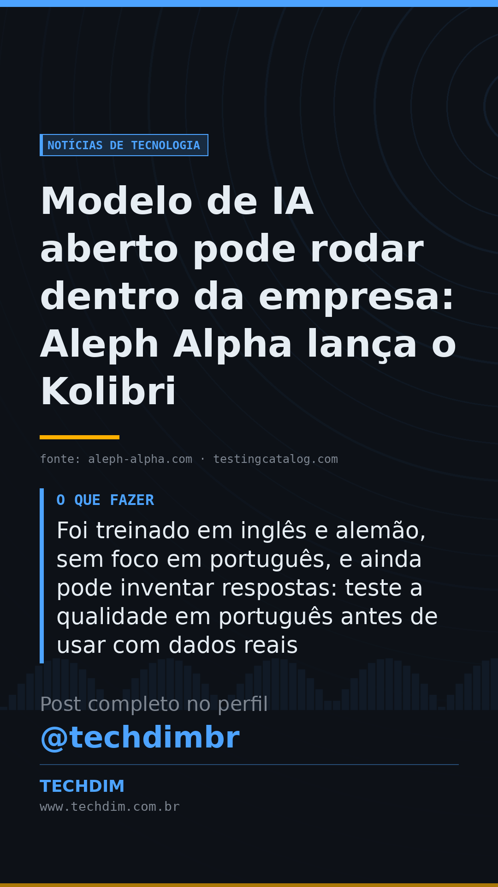

# Notícias de Tecnologia — Modelo de IA aberto pode rodar dentro da empresa: Aleph Alpha lança o Kolibri

- **Data:** 2026-10-05, 07:59 (horário de Brasília)
- **Curadoria:** Claude (Routine) — pauta do dia
- **Execução no Actions:** https://github.com/Techdimbr/Publi-midia-Techdim/actions/runs/37299961561
- **Por que esta pauta:** Modelos abertos que rodam internamente interessam a empresas com dados sensíveis; vale avaliar custo e qualidade antes de adotar.

## Resultado

| Rede | Status | Link | 1º comentário |
|---|---|---|---|
| linkedin | ✅ publicado | https://www.linkedin.com/feed/update/urn:li:share:7512828662879006720/ | — |
| facebook | ✅ publicado | https://www.facebook.com/122132402349390486/posts/122133488175390486 | ✅ |
| instagram | ✅ publicado | https://www.instagram.com/p/DeHDMcJFyV7/ | ✅ |
| Stories | ✅ publicado | https://www.instagram.com/stories/techdimbr/4001180943033203638 | — |

## Fontes

- [aleph-alpha.com](https://aleph-alpha.com/en/blog/kolibri-has-landed-a-sovereign-open-weight-model/)
- [testingcatalog.com](https://www.testingcatalog.com/aleph-alpha-releases-open-weight-kolibri-with-1m-context/)

## Linkedin

```text
Modelo de IA aberto pode rodar dentro da empresa: Aleph Alpha lança o Kolibri

01. Em 3/10 a alemã Aleph Alpha lançou o Kolibri, modelo de IA com pesos abertos e licença Apache 2.0: 78 bilhões de parâmetros, cerca de 3 bilhões ativos por vez
02. Pode rodar nos servidores da própria empresa, sem enviar dados a terceiros, e aceita contexto de até 1 milhão de tokens (a recomendação padrão é 262.144)
03. Foi treinado em inglês e alemão, sem foco em português, e ainda pode inventar respostas: teste a qualidade em português antes de usar com dados reais

IA aberta reduz a dependência de terceiros, mas exige estrutura e testes. A TECHDIM ajuda a avaliar com segurança.

Fontes: https://aleph-alpha.com/en/blog/kolibri-has-landed-a-sovereign-open-weight-model/ · https://www.testingcatalog.com/aleph-alpha-releases-open-weight-kolibri-with-1m-context/

TECHDIM — Infraestrutura · Segurança · IA
https://www.techdim.com.br

#IAAberta #IA #Privacidade #TI #TECHDIM
```



## Facebook

```text
Modelo de IA aberto pode rodar dentro da empresa: Aleph Alpha lança o Kolibri

• Em 3/10 a alemã Aleph Alpha lançou o Kolibri, modelo de IA com pesos abertos e licença Apache 2.0: 78 bilhões de parâmetros, cerca de 3 bilhões ativos por vez
• Pode rodar nos servidores da própria empresa, sem enviar dados a terceiros, e aceita contexto de até 1 milhão de tokens (a recomendação padrão é 262.144)
• Foi treinado em inglês e alemão, sem foco em português, e ainda pode inventar respostas: teste a qualidade em português antes de usar com dados reais

IA aberta reduz a dependência de terceiros, mas exige estrutura e testes. A TECHDIM ajuda a avaliar com segurança.

Fale com a TECHDIM — fontes e site no primeiro comentário 👇

#IAAberta #IA #Privacidade #TECHDIM
```

Primeiro comentário:

```text
📎 Fontes:
• aleph-alpha.com: https://aleph-alpha.com/en/blog/kolibri-has-landed-a-sovereign-open-weight-model/
• testingcatalog.com: https://www.testingcatalog.com/aleph-alpha-releases-open-weight-kolibri-with-1m-context/

🌐 TECHDIM — Infraestrutura · Segurança · IA: https://www.techdim.com.br
```


## Instagram

```text
Modelo de IA aberto pode rodar dentro da empresa: Aleph Alpha lança o Kolibri

1️⃣ Em 3/10 a alemã Aleph Alpha lançou o Kolibri, modelo de IA com pesos abertos e licença Apache 2.0: 78 bilhões de parâmetros, cerca de 3 bilhões ativos por vez
2️⃣ Pode rodar nos servidores da própria empresa, sem enviar dados a terceiros, e aceita contexto de até 1 milhão de tokens (a recomendação padrão é 262.144)
3️⃣ Foi treinado em inglês e alemão, sem foco em português, e ainda pode inventar respostas: teste a qualidade em português antes de usar com dados reais

IA aberta reduz a dependência de terceiros, mas exige estrutura e testes. A TECHDIM ajuda a avaliar com segurança.

Saiba mais: www.techdim.com.br
Fontes no primeiro comentário 👇

#iaaberta #ia #privacidade #ti #techdim #tecnologia #inteligenciaartificial #inovacao
```

Primeiro comentário:

```text
📎 Fontes: aleph-alpha.com · testingcatalog.com
```


## Stories


