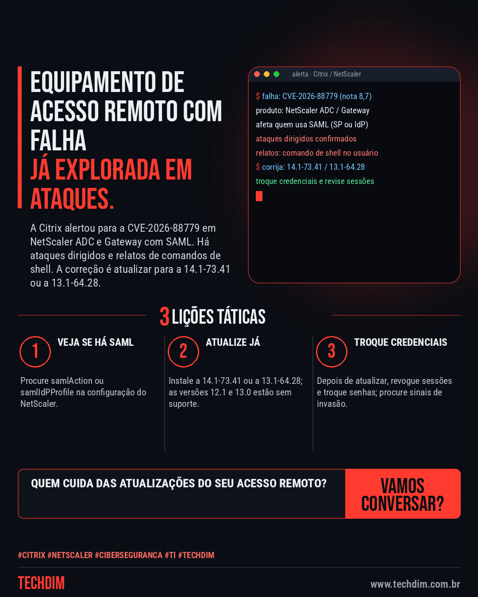
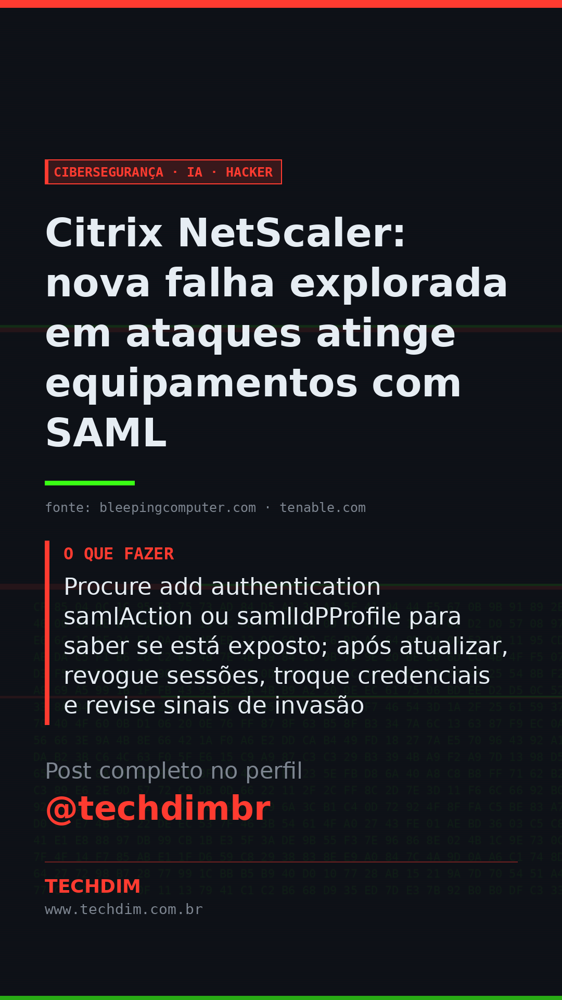

# Cibersegurança · IA · Hacker — Citrix NetScaler: nova falha explorada em ataques atinge equipamentos com SAML

- **Data:** 2026-10-05, 11:08 (horário de Brasília)
- **Curadoria:** Claude (Routine) — pauta do dia
- **Execução no Actions:** https://github.com/Techdimbr/Publi-midia-Techdim/actions/runs/37322203122
- **Por que esta pauta:** Falha explorada em equipamento de acesso remoto; a ação imediata é atualizar, trocar credenciais e revisar sinais de invasão.

## Resultado

| Rede | Status | Link | 1º comentário |
|---|---|---|---|
| linkedin | ✅ publicado | https://www.linkedin.com/feed/update/urn:li:share:7512876297174278145/ | — |
| facebook | ✅ publicado | https://www.facebook.com/122132402349390486/posts/122133522573390486 | ✅ |
| instagram | ✅ publicado | https://www.instagram.com/p/DeHY2yNFkeu/ | ✅ |
| Stories | ✅ publicado | https://www.instagram.com/stories/techdimbr/4001276251134642474 | — |

## Fontes

- [bleepingcomputer.com](https://www.bleepingcomputer.com/news/security/citrix-patches-netscaler-saml-zero-day-exploited-in-attacks/)
- [tenable.com](https://www.tenable.com/blog/frequently-asked-questions-about-reported-citrix-netscaler-zero-day-vulnerabilities)

## Linkedin

```text
Citrix NetScaler: nova falha explorada em ataques atinge equipamentos com SAML

01. A CVE-2026-88779 (nota 8,7) afeta NetScaler ADC e Gateway configurados como provedor (SP) ou identidade (IdP) SAML; a Citrix confirma ataques dirigidos
02. A Citrix a descreve como negação de serviço, mas há relatos de comandos de shell que baixam e executam um arquivo. Instale a 14.1-73.41 ou a 13.1-64.28
03. Procure add authentication samlAction ou samlIdPProfile para saber se está exposto; após atualizar, revogue sessões, troque credenciais e revise sinais de invasão

Equipamento de acesso remoto é porta de entrada. A TECHDIM revisa, atualiza e monitora o seu.

Fontes: https://www.bleepingcomputer.com/news/security/citrix-patches-netscaler-saml-zero-day-exploited-in-attacks/ · https://www.tenable.com/blog/frequently-asked-questions-about-reported-citrix-netscaler-zero-day-vulnerabilities

TECHDIM — Infraestrutura · Segurança · IA
https://www.techdim.com.br

#Citrix #NetScaler #Ciberseguranca #TI #TECHDIM
```



## Facebook

```text
Citrix NetScaler: nova falha explorada em ataques atinge equipamentos com SAML

• A CVE-2026-88779 (nota 8,7) afeta NetScaler ADC e Gateway configurados como provedor (SP) ou identidade (IdP) SAML; a Citrix confirma ataques dirigidos
• A Citrix a descreve como negação de serviço, mas há relatos de comandos de shell que baixam e executam um arquivo. Instale a 14.1-73.41 ou a 13.1-64.28
• Procure add authentication samlAction ou samlIdPProfile para saber se está exposto; após atualizar, revogue sessões, troque credenciais e revise sinais de invasão

Equipamento de acesso remoto é porta de entrada. A TECHDIM revisa, atualiza e monitora o seu.

Fale com a TECHDIM — fontes e site no primeiro comentário 👇

#Citrix #NetScaler #Ciberseguranca #TECHDIM
```

Primeiro comentário:

```text
📎 Fontes:
• bleepingcomputer.com: https://www.bleepingcomputer.com/news/security/citrix-patches-netscaler-saml-zero-day-exploited-in-attacks/
• tenable.com: https://www.tenable.com/blog/frequently-asked-questions-about-reported-citrix-netscaler-zero-day-vulnerabilities

🌐 TECHDIM — Infraestrutura · Segurança · IA: https://www.techdim.com.br
```


## Instagram

```text
Citrix NetScaler: nova falha explorada em ataques atinge equipamentos com SAML

1️⃣ A CVE-2026-88779 (nota 8,7) afeta NetScaler ADC e Gateway configurados como provedor (SP) ou identidade (IdP) SAML; a Citrix confirma ataques dirigidos
2️⃣ A Citrix a descreve como negação de serviço, mas há relatos de comandos de shell que baixam e executam um arquivo. Instale a 14.1-73.41 ou a 13.1-64.28
3️⃣ Procure add authentication samlAction ou samlIdPProfile para saber se está exposto; após atualizar, revogue sessões, troque credenciais e revise sinais de invasão

Equipamento de acesso remoto é porta de entrada. A TECHDIM revisa, atualiza e monitora o seu.

Saiba mais: www.techdim.com.br
Fontes no primeiro comentário 👇

#citrix #netscaler #ciberseguranca #ti #techdim #seguranca #hacker #infraestrutura
```

Primeiro comentário:

```text
📎 Fontes: bleepingcomputer.com · tenable.com
```


## Stories


