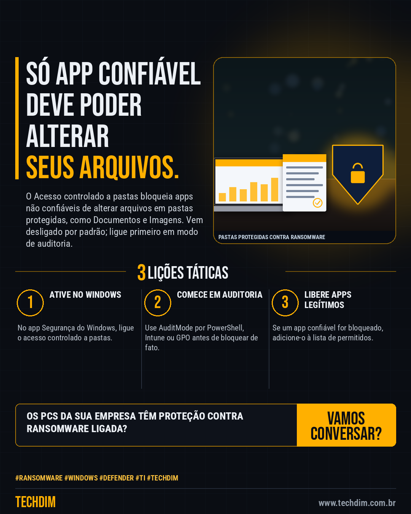

# Conhecimento — Proteja pastas do Windows contra ransomware: ative o Acesso controlado a pastas

- **Data:** 2026-10-05, 14:23 (horário de Brasília)
- **Curadoria:** Claude (Routine) — pauta do dia
- **Execução no Actions:** https://github.com/Techdimbr/Publi-midia-Techdim/actions/runs/37348000340
- **Por que esta pauta:** Recurso nativo do Windows, documentado pela Microsoft, que dificulta a criptografia de arquivos por ransomware.

## Resultado

| Rede | Status | Link | 1º comentário |
|---|---|---|---|
| linkedin | ✅ publicado | https://www.linkedin.com/feed/update/urn:li:share:7512925433865080832/ | — |
| facebook | ✅ publicado | https://www.facebook.com/122132402349390486/posts/122133562203390486 | ✅ |
| instagram | ✅ publicado | https://www.instagram.com/p/DeHvMqIEUun/ | ✅ |

## Fontes

- [learn.microsoft.com](https://learn.microsoft.com/en-us/defender-endpoint/controlled-folder-access-configure)

## Linkedin

```text
Proteja pastas do Windows contra ransomware: ative o Acesso controlado a pastas

01. O Acesso controlado a pastas só deixa apps confiáveis alterarem arquivos em pastas protegidas, como Documentos, Imagens e Vídeos. Vem desligado por padrão
02. Num PC: app Windows Security > Virus & threat protection > Manage settings > Manage controlled folder access e ative a chave. Pode adicionar outras pastas
03. Em empresas, use Intune ou Política de Grupo e comece em AuditMode; depois libere os apps legítimos que forem bloqueados e passe para Enabled

A TECHDIM ativa a proteção contra ransomware nos computadores da sua empresa, com testes antes de bloquear.

Fontes: https://learn.microsoft.com/en-us/defender-endpoint/controlled-folder-access-configure

TECHDIM — Infraestrutura · Segurança · IA
https://www.techdim.com.br

#Ransomware #Windows #Defender #TI #TECHDIM
```



## Facebook

```text
Proteja pastas do Windows contra ransomware: ative o Acesso controlado a pastas

• O Acesso controlado a pastas só deixa apps confiáveis alterarem arquivos em pastas protegidas, como Documentos, Imagens e Vídeos. Vem desligado por padrão
• Num PC: app Windows Security > Virus & threat protection > Manage settings > Manage controlled folder access e ative a chave. Pode adicionar outras pastas
• Em empresas, use Intune ou Política de Grupo e comece em AuditMode; depois libere os apps legítimos que forem bloqueados e passe para Enabled

A TECHDIM ativa a proteção contra ransomware nos computadores da sua empresa, com testes antes de bloquear.

Fale com a TECHDIM — fontes e site no primeiro comentário 👇

#Ransomware #Windows #Defender #TECHDIM
```

Primeiro comentário:

```text
📎 Fontes:
• learn.microsoft.com: https://learn.microsoft.com/en-us/defender-endpoint/controlled-folder-access-configure

🌐 TECHDIM — Infraestrutura · Segurança · IA: https://www.techdim.com.br
```


## Instagram

```text
Proteja pastas do Windows contra ransomware: ative o Acesso controlado a pastas

1️⃣ O Acesso controlado a pastas só deixa apps confiáveis alterarem arquivos em pastas protegidas, como Documentos, Imagens e Vídeos. Vem desligado por padrão
2️⃣ Num PC: app Windows Security > Virus & threat protection > Manage settings > Manage controlled folder access e ative a chave. Pode adicionar outras pastas
3️⃣ Em empresas, use Intune ou Política de Grupo e comece em AuditMode; depois libere os apps legítimos que forem bloqueados e passe para Enabled

A TECHDIM ativa a proteção contra ransomware nos computadores da sua empresa, com testes antes de bloquear.

Saiba mais: www.techdim.com.br
Fontes no primeiro comentário 👇

#ransomware #windows #defender #ti #techdim #conhecimento #aprendati #tecnologia
```

Primeiro comentário:

```text
📎 Fontes: learn.microsoft.com
```


