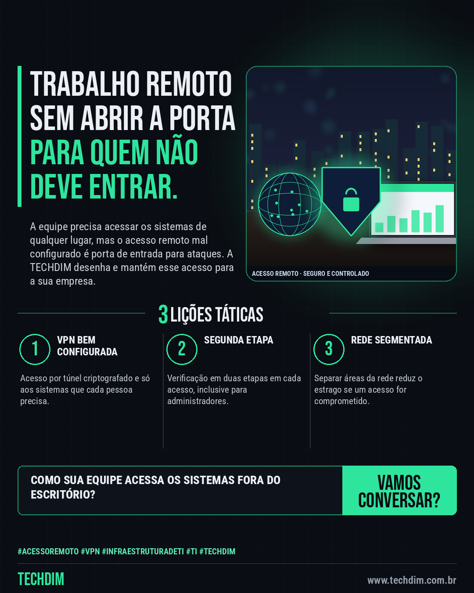

# TECHDIM · Serviços — Acesso remoto sem abrir a porta: VPN, MFA e rede segmentada para sua empresa

- **Data:** 2026-10-05, 18:18 (horário de Brasília)
- **Curadoria:** Claude (Routine) — pauta do dia
- **Execução no Actions:** https://github.com/Techdimbr/Publi-midia-Techdim/actions/runs/37373943177
- **Por que esta pauta:** Propaganda do serviço de infraestrutura e redes (acesso remoto seguro), conectada ao alerta de segurança do dia.

## Resultado

| Rede | Status | Link | 1º comentário |
|---|---|---|---|
| linkedin | ✅ publicado | https://www.linkedin.com/feed/update/urn:li:share:7512984529717043200/ | — |
| facebook | ✅ publicado | https://www.facebook.com/122132402349390486/posts/122133606855390486 | ✅ |
| instagram | ✅ publicado | https://www.instagram.com/p/DeIKFF0jZkt/ | — |

## Linkedin

```text
Acesso remoto sem abrir a porta: VPN, MFA e rede segmentada para sua empresa

01. Equipes que trabalham fora do escritório dependem de acesso remoto, e equipamentos de acesso expostos à internet são alvo constante de ataques
02. A TECHDIM projeta e configura o acesso remoto da sua empresa: VPN, verificação em duas etapas, acesso mínimo por pessoa e rede separada por função
03. Quer revisar como a sua equipe acessa os sistemas? Fale com a TECHDIM em www.techdim.com.br e vamos conversar sobre o seu ambiente

Acesso remoto seguro mantém a equipe produtiva e a empresa protegida. www.techdim.com.br

TECHDIM — Infraestrutura · Segurança · IA
https://www.techdim.com.br

#AcessoRemoto #VPN #InfraestruturaDeTI #TI #TECHDIM
```



## Facebook

```text
Acesso remoto sem abrir a porta: VPN, MFA e rede segmentada para sua empresa

• Equipes que trabalham fora do escritório dependem de acesso remoto, e equipamentos de acesso expostos à internet são alvo constante de ataques
• A TECHDIM projeta e configura o acesso remoto da sua empresa: VPN, verificação em duas etapas, acesso mínimo por pessoa e rede separada por função
• Quer revisar como a sua equipe acessa os sistemas? Fale com a TECHDIM em www.techdim.com.br e vamos conversar sobre o seu ambiente

Acesso remoto seguro mantém a equipe produtiva e a empresa protegida. www.techdim.com.br

Fale com a TECHDIM — link no primeiro comentário 👇

#AcessoRemoto #VPN #InfraestruturaDeTI #TECHDIM
```

Primeiro comentário:

```text
🌐 TECHDIM — Infraestrutura · Segurança · IA: https://www.techdim.com.br
```


## Instagram

```text
Acesso remoto sem abrir a porta: VPN, MFA e rede segmentada para sua empresa

1️⃣ Equipes que trabalham fora do escritório dependem de acesso remoto, e equipamentos de acesso expostos à internet são alvo constante de ataques
2️⃣ A TECHDIM projeta e configura o acesso remoto da sua empresa: VPN, verificação em duas etapas, acesso mínimo por pessoa e rede separada por função
3️⃣ Quer revisar como a sua equipe acessa os sistemas? Fale com a TECHDIM em www.techdim.com.br e vamos conversar sobre o seu ambiente

Acesso remoto seguro mantém a equipe produtiva e a empresa protegida. www.techdim.com.br

Saiba mais: www.techdim.com.br

#acessoremoto #vpn #infraestruturadeti #ti #techdim #suportetecnico #ciberseguranca #automacao
```


