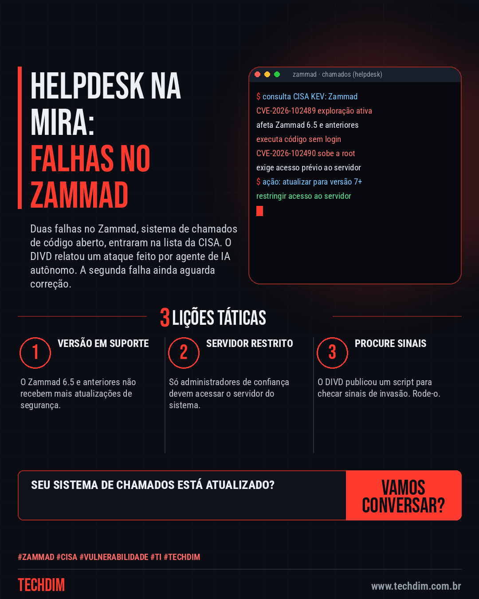
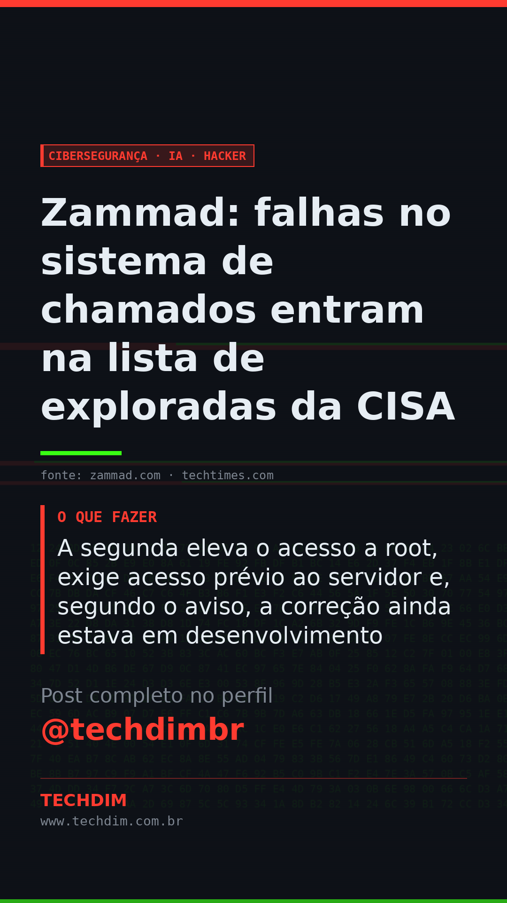

# Cibersegurança · IA · Hacker — Zammad: falhas no sistema de chamados entram na lista de exploradas da CISA

- **Data:** 2026-10-06, 11:08 (horário de Brasília)
- **Curadoria:** Claude (Routine) — pauta do dia
- **Execução no Actions:** https://github.com/Techdimbr/Publi-midia-Techdim/actions/runs/37476380716
- **Por que esta pauta:** Sistemas de chamados guardam dados de clientes e são comuns em empresas que montam o próprio suporte; há exploração ativa e uma falha ainda sem correção.

## Resultado

| Rede | Status | Link | 1º comentário |
|---|---|---|---|
| linkedin | ✅ publicado | https://www.linkedin.com/feed/update/urn:li:share:7513238708758917120/ | — |
| facebook | ✅ publicado | https://www.facebook.com/122132402349390486/posts/122133779193390486 | ✅ |
| instagram | ❌ falhou — POST https://graph.facebook.com/v21.0/17841477929384768/media_publish -> HTTP 400: {"error":{"message":"Media ID is not available","type":"OAuthException","code":9007,"error_subcode":2207027,"is_transient":false,"error_user_title":"N\u00e3o \u00e9 poss\u00edvel publicar","error_user_msg":"A m\u00edd |  | — |
| Stories | ✅ publicado | https://www.instagram.com/stories/techdimbr/4002001018083449833 | — |

## Fontes

- [zammad.com](https://zammad.com/en/advisories/cve-2026-102489-cve-2026-102490)
- [techtimes.com](https://www.techtimes.com/articles/328387/20261001/ai-agent-hacked-cybersecurity-nonprofit-divd-via-zammad-zero-days-root-flaw-unpatched.htm)

## Linkedin

```text
Zammad: falhas no sistema de chamados entram na lista de exploradas da CISA

01. A CISA incluiu duas falhas do Zammad, o CVE-2026-102489 e o CVE-2026-102490, na lista de vulnerabilidades exploradas
02. A primeira permite executar código sem login no Zammad 6.5 e anteriores; a partir da versão 7 não é explorável nas condições atuais
03. A segunda eleva o acesso a root, exige acesso prévio ao servidor e, segundo o aviso, a correção ainda estava em desenvolvimento

Se usa Zammad, atualize para a versão 7 ou superior e limite quem acessa o servidor.

Fontes: https://zammad.com/en/advisories/cve-2026-102489-cve-2026-102490 · https://www.techtimes.com/articles/328387/20261001/ai-agent-hacked-cybersecurity-nonprofit-divd-via-zammad-zero-days-root-flaw-unpatched.htm

TECHDIM — Infraestrutura · Segurança · IA
https://www.techdim.com.br

#Zammad #Cisa #Vulnerabilidade #TI #TECHDIM
```



## Facebook

```text
Zammad: falhas no sistema de chamados entram na lista de exploradas da CISA

• A CISA incluiu duas falhas do Zammad, o CVE-2026-102489 e o CVE-2026-102490, na lista de vulnerabilidades exploradas
• A primeira permite executar código sem login no Zammad 6.5 e anteriores; a partir da versão 7 não é explorável nas condições atuais
• A segunda eleva o acesso a root, exige acesso prévio ao servidor e, segundo o aviso, a correção ainda estava em desenvolvimento

Se usa Zammad, atualize para a versão 7 ou superior e limite quem acessa o servidor.

Fale com a TECHDIM — fontes e site no primeiro comentário 👇

#Zammad #Cisa #Vulnerabilidade #TECHDIM
```

Primeiro comentário:

```text
📎 Fontes:
• zammad.com: https://zammad.com/en/advisories/cve-2026-102489-cve-2026-102490
• techtimes.com: https://www.techtimes.com/articles/328387/20261001/ai-agent-hacked-cybersecurity-nonprofit-divd-via-zammad-zero-days-root-flaw-unpatched.htm

🌐 TECHDIM — Infraestrutura · Segurança · IA: https://www.techdim.com.br
```


## Instagram

```text
Zammad: falhas no sistema de chamados entram na lista de exploradas da CISA

1️⃣ A CISA incluiu duas falhas do Zammad, o CVE-2026-102489 e o CVE-2026-102490, na lista de vulnerabilidades exploradas
2️⃣ A primeira permite executar código sem login no Zammad 6.5 e anteriores; a partir da versão 7 não é explorável nas condições atuais
3️⃣ A segunda eleva o acesso a root, exige acesso prévio ao servidor e, segundo o aviso, a correção ainda estava em desenvolvimento

Se usa Zammad, atualize para a versão 7 ou superior e limite quem acessa o servidor.

Saiba mais: www.techdim.com.br
Fontes no primeiro comentário 👇

#zammad #cisa #vulnerabilidade #ti #techdim #ciberseguranca #seguranca #hacker
```

Primeiro comentário:

```text
📎 Fontes: zammad.com · techtimes.com
```


## Stories


