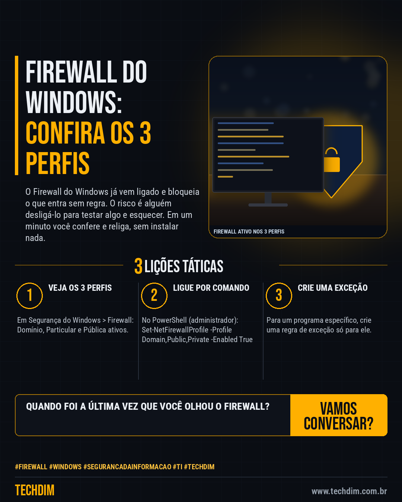

# Conhecimento — Firewall do Windows desligado? Confira os 3 perfis em minutos

- **Data:** 2026-10-06, 14:23 (horário de Brasília)
- **Curadoria:** Claude (Routine) — pauta do dia
- **Execução no Actions:** https://github.com/Techdimbr/Publi-midia-Techdim/actions/runs/37503119534
- **Por que esta pauta:** Firewall desligado de forma improvisada é uma brecha comum em PMEs e é corrigida em minutos com recurso nativo do Windows.

## Resultado

| Rede | Status | Link | 1º comentário |
|---|---|---|---|
| linkedin | ✅ publicado | https://www.linkedin.com/feed/update/urn:li:share:7513287828332662784/ | — |
| facebook | ✅ publicado | https://www.facebook.com/122132402349390486/posts/122133817953390486 | ✅ |
| instagram | ✅ publicado | https://www.instagram.com/p/DeKT_vXlMZs/ | ✅ |

## Fontes

- [learn.microsoft.com](https://learn.microsoft.com/en-us/windows/security/operating-system-security/network-security/windows-firewall/)
- [learn.microsoft.com](https://learn.microsoft.com/en-us/powershell/module/netsecurity/set-netfirewallprofile)

## Linkedin

```text
Firewall do Windows desligado? Confira os 3 perfis em minutos

01. O Firewall do Windows vem ligado por padrão e bloqueia o que entra sem pedido ou regra. Mas alguém pode tê-lo desligado para "resolver um problema"
02. Abra Segurança do Windows > Firewall e proteção de rede e veja os perfis Domínio, Particular e Pública: os três devem estar ativos
03. Prefira o PowerShell como administrador: Set-NetFirewallProfile -Profile Domain,Public,Private -Enabled True liga os três de uma vez

Se um programa exigir o firewall desligado, crie uma regra para ele. Não desligue a proteção inteira.

Fontes: https://learn.microsoft.com/en-us/windows/security/operating-system-security/network-security/windows-firewall/ · https://learn.microsoft.com/en-us/powershell/module/netsecurity/set-netfirewallprofile

TECHDIM — Infraestrutura · Segurança · IA
https://www.techdim.com.br

#Firewall #Windows #SegurancaDaInformacao #TI #TECHDIM
```



## Facebook

```text
Firewall do Windows desligado? Confira os 3 perfis em minutos

• O Firewall do Windows vem ligado por padrão e bloqueia o que entra sem pedido ou regra. Mas alguém pode tê-lo desligado para "resolver um problema"
• Abra Segurança do Windows > Firewall e proteção de rede e veja os perfis Domínio, Particular e Pública: os três devem estar ativos
• Prefira o PowerShell como administrador: Set-NetFirewallProfile -Profile Domain,Public,Private -Enabled True liga os três de uma vez

Se um programa exigir o firewall desligado, crie uma regra para ele. Não desligue a proteção inteira.

Fale com a TECHDIM — fontes e site no primeiro comentário 👇

#Firewall #Windows #SegurancaDaInformacao #TECHDIM
```

Primeiro comentário:

```text
📎 Fontes:
• learn.microsoft.com: https://learn.microsoft.com/en-us/windows/security/operating-system-security/network-security/windows-firewall/
• learn.microsoft.com: https://learn.microsoft.com/en-us/powershell/module/netsecurity/set-netfirewallprofile

🌐 TECHDIM — Infraestrutura · Segurança · IA: https://www.techdim.com.br
```


## Instagram

```text
Firewall do Windows desligado? Confira os 3 perfis em minutos

1️⃣ O Firewall do Windows vem ligado por padrão e bloqueia o que entra sem pedido ou regra. Mas alguém pode tê-lo desligado para "resolver um problema"
2️⃣ Abra Segurança do Windows > Firewall e proteção de rede e veja os perfis Domínio, Particular e Pública: os três devem estar ativos
3️⃣ Prefira o PowerShell como administrador: Set-NetFirewallProfile -Profile Domain,Public,Private -Enabled True liga os três de uma vez

Se um programa exigir o firewall desligado, crie uma regra para ele. Não desligue a proteção inteira.

Saiba mais: www.techdim.com.br
Fontes no primeiro comentário 👇

#firewall #windows #segurancadainformacao #ti #techdim #conhecimento #aprendati #tecnologia
```

Primeiro comentário:

```text
📎 Fontes: learn.microsoft.com · learn.microsoft.com
```


