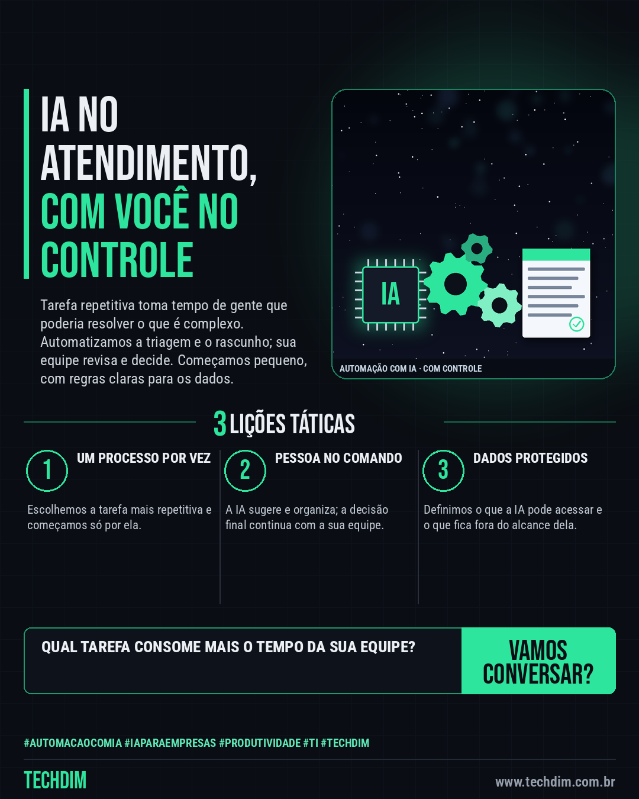

# TECHDIM · Serviços — Automação com IA: seu atendimento responde rápido sem perder o controle

- **Data:** 2026-10-06, 17:23 (horário de Brasília)
- **Curadoria:** Claude (Routine) — pauta do dia
- **Execução no Actions:** https://github.com/Techdimbr/Publi-midia-Techdim/actions/runs/37525992766
- **Por que esta pauta:** Apresenta o serviço de automação com IA com foco em controle e segurança dos dados, sem prometer resultado.

## Resultado

| Rede | Status | Link | 1º comentário |
|---|---|---|---|
| linkedin | ✅ publicado | https://www.linkedin.com/feed/update/urn:li:share:7513333086382755841/ | — |
| facebook | ✅ publicado | https://www.facebook.com/122132402349390486/posts/122133845787390486 | ✅ |
| instagram | ✅ publicado | https://www.instagram.com/p/DeKolxOmMoi/ | — |

## Linkedin

```text
Automação com IA: seu atendimento responde rápido sem perder o controle

01. A TECHDIM cria automações com IA para o dia a dia: triagem de e-mails, classificação de pedidos e rascunhos de resposta para sua equipe revisar
02. Usamos ferramentas como Claude Code, Gemini e Antigravity, com regras claras sobre quais dados a IA pode ver e o que sempre passa por uma pessoa
03. Começamos por um processo só, medimos o que melhora e ampliamos aos poucos, sem trocar o que já funciona na sua empresa

Conte qual tarefa repetitiva mais consome sua equipe: www.techdim.com.br

TECHDIM — Infraestrutura · Segurança · IA
https://www.techdim.com.br

#AutomacaoComIA #IAParaEmpresas #Produtividade #TI #TECHDIM
```



## Facebook

```text
Automação com IA: seu atendimento responde rápido sem perder o controle

• A TECHDIM cria automações com IA para o dia a dia: triagem de e-mails, classificação de pedidos e rascunhos de resposta para sua equipe revisar
• Usamos ferramentas como Claude Code, Gemini e Antigravity, com regras claras sobre quais dados a IA pode ver e o que sempre passa por uma pessoa
• Começamos por um processo só, medimos o que melhora e ampliamos aos poucos, sem trocar o que já funciona na sua empresa

Conte qual tarefa repetitiva mais consome sua equipe: www.techdim.com.br

Fale com a TECHDIM — link no primeiro comentário 👇

#AutomacaoComIA #IAParaEmpresas #Produtividade #TECHDIM
```

Primeiro comentário:

```text
🌐 TECHDIM — Infraestrutura · Segurança · IA: https://www.techdim.com.br
```


## Instagram

```text
Automação com IA: seu atendimento responde rápido sem perder o controle

1️⃣ A TECHDIM cria automações com IA para o dia a dia: triagem de e-mails, classificação de pedidos e rascunhos de resposta para sua equipe revisar
2️⃣ Usamos ferramentas como Claude Code, Gemini e Antigravity, com regras claras sobre quais dados a IA pode ver e o que sempre passa por uma pessoa
3️⃣ Começamos por um processo só, medimos o que melhora e ampliamos aos poucos, sem trocar o que já funciona na sua empresa

Conte qual tarefa repetitiva mais consome sua equipe: www.techdim.com.br

Saiba mais: www.techdim.com.br

#automacaocomia #iaparaempresas #produtividade #ti #techdim #suportetecnico #ciberseguranca #automacao
```


