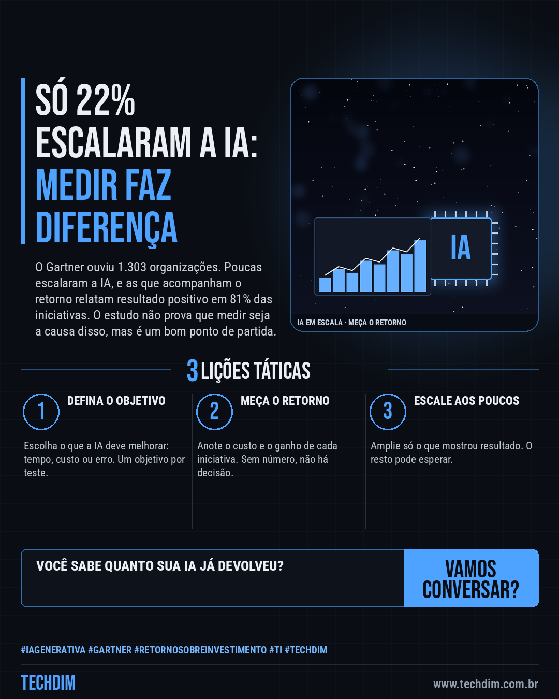
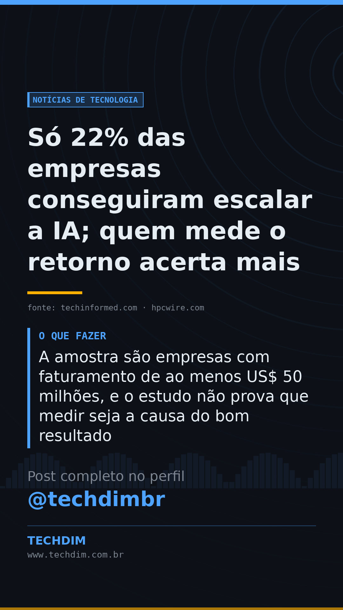

# Notícias de Tecnologia — Só 22% das empresas conseguiram escalar a IA; quem mede o retorno acerta mais

- **Data:** 2026-10-07, 08:01 (horário de Brasília)
- **Curadoria:** Claude (Routine) — pauta do dia
- **Execução no Actions:** https://github.com/Techdimbr/Publi-midia-Techdim/actions/runs/37611195255
- **Por que esta pauta:** Dá uma régua prática para PMEs que estão testando IA: medir o retorno de cada iniciativa antes de ampliar o gasto.

## Resultado

| Rede | Status | Link | 1º comentário |
|---|---|---|---|
| linkedin | ✅ publicado | https://www.linkedin.com/feed/update/urn:li:share:7513554036420321280/ | — |
| facebook | ✅ publicado | https://www.facebook.com/122132402349390486/posts/122133986241390486 | ✅ |
| instagram | ✅ publicado | https://www.instagram.com/p/DeMNDeZmlV9/ | ✅ |
| Stories | ✅ publicado | https://www.instagram.com/stories/techdimbr/4002631696867410260 | — |

## Fontes

- [techinformed.com](https://techinformed.com/gartner-finds-only-22-have-successfully-scaled-ai/)
- [hpcwire.com](https://www.hpcwire.com/aiwire/2026/09/01/gartner-finds-just-22-of-organizations-have-scaled-ai-across-business-units/)

## Linkedin

```text
Só 22% das empresas conseguiram escalar a IA; quem mede o retorno acerta mais

01. Pesquisa do Gartner com 1.303 organizações aponta que só 22% escalaram a IA em várias áreas, mesmo com 85% dos líderes planejando gastar mais em 2026
02. Quem acompanha o retorno relatou resultado positivo em 81% das iniciativas; quem não acompanha não sabia o retorno de 29% dos seus projetos
03. A amostra são empresas com faturamento de ao menos US$ 50 milhões, e o estudo não prova que medir seja a causa do bom resultado

Antes de ampliar a IA, defina quanto custa, o que ela deve melhorar e como você vai medir.

Fontes: https://techinformed.com/gartner-finds-only-22-have-successfully-scaled-ai/ · https://www.hpcwire.com/aiwire/2026/09/01/gartner-finds-just-22-of-organizations-have-scaled-ai-across-business-units/

TECHDIM — Infraestrutura · Segurança · IA
https://www.techdim.com.br

#IAGenerativa #Gartner #RetornoSobreInvestimento #TI #TECHDIM
```



## Facebook

```text
Só 22% das empresas conseguiram escalar a IA; quem mede o retorno acerta mais

• Pesquisa do Gartner com 1.303 organizações aponta que só 22% escalaram a IA em várias áreas, mesmo com 85% dos líderes planejando gastar mais em 2026
• Quem acompanha o retorno relatou resultado positivo em 81% das iniciativas; quem não acompanha não sabia o retorno de 29% dos seus projetos
• A amostra são empresas com faturamento de ao menos US$ 50 milhões, e o estudo não prova que medir seja a causa do bom resultado

Antes de ampliar a IA, defina quanto custa, o que ela deve melhorar e como você vai medir.

Fale com a TECHDIM — fontes e site no primeiro comentário 👇

#IAGenerativa #Gartner #RetornoSobreInvestimento #TECHDIM
```

Primeiro comentário:

```text
📎 Fontes:
• techinformed.com: https://techinformed.com/gartner-finds-only-22-have-successfully-scaled-ai/
• hpcwire.com: https://www.hpcwire.com/aiwire/2026/09/01/gartner-finds-just-22-of-organizations-have-scaled-ai-across-business-units/

🌐 TECHDIM — Infraestrutura · Segurança · IA: https://www.techdim.com.br
```


## Instagram

```text
Só 22% das empresas conseguiram escalar a IA; quem mede o retorno acerta mais

1️⃣ Pesquisa do Gartner com 1.303 organizações aponta que só 22% escalaram a IA em várias áreas, mesmo com 85% dos líderes planejando gastar mais em 2026
2️⃣ Quem acompanha o retorno relatou resultado positivo em 81% das iniciativas; quem não acompanha não sabia o retorno de 29% dos seus projetos
3️⃣ A amostra são empresas com faturamento de ao menos US$ 50 milhões, e o estudo não prova que medir seja a causa do bom resultado

Antes de ampliar a IA, defina quanto custa, o que ela deve melhorar e como você vai medir.

Saiba mais: www.techdim.com.br
Fontes no primeiro comentário 👇

#iagenerativa #gartner #retornosobreinvestimento #ti #techdim #tecnologia #inteligenciaartificial #ia
```

Primeiro comentário:

```text
📎 Fontes: techinformed.com · hpcwire.com
```


## Stories


