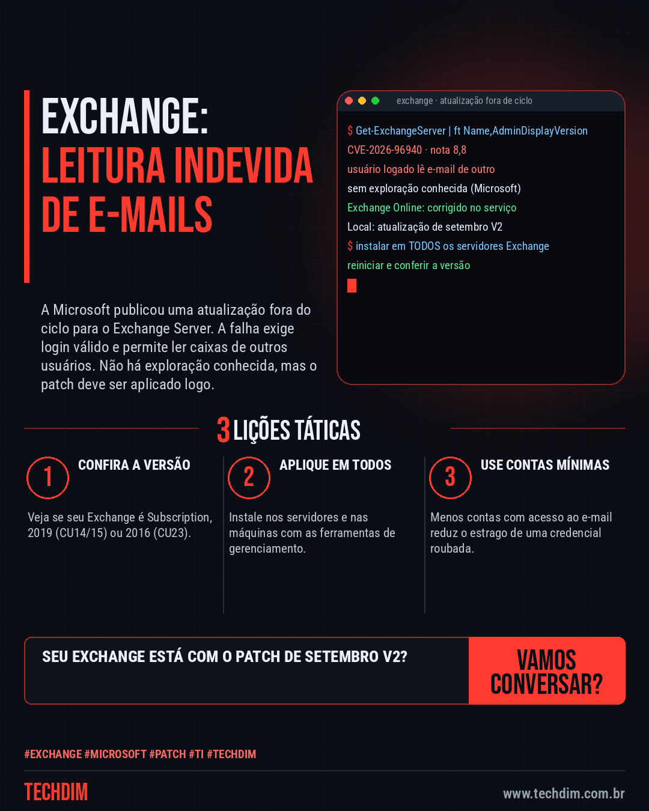
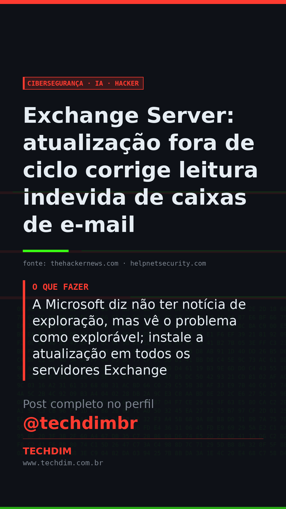

# Cibersegurança · IA · Hacker — Exchange Server: atualização fora de ciclo corrige leitura indevida de caixas de e-mail

- **Data:** 2026-10-07, 11:09 (horário de Brasília)
- **Curadoria:** Claude (Routine) — pauta do dia
- **Execução no Actions:** https://github.com/Techdimbr/Publi-midia-Techdim/actions/runs/37634190655
- **Por que esta pauta:** E-mail concentra dados sensíveis; a falha exige login válido e não há exploração conhecida, mas o patch é recomendado com urgência.

## Resultado

| Rede | Status | Link | 1º comentário |
|---|---|---|---|
| linkedin | ✅ publicado | https://www.linkedin.com/feed/update/urn:li:share:7513601196872462337/ | — |
| facebook | ✅ publicado | https://www.facebook.com/122132402349390486/posts/122134041759390486 | ✅ |
| instagram | ✅ publicado | https://www.instagram.com/p/DeMif93F0ao/ | ✅ |
| Stories | ✅ publicado | https://www.instagram.com/stories/techdimbr/4002726027957068487 | — |

## Fontes

- [thehackernews.com](https://thehackernews.com/2026/10/microsoft-exchange-flaw-lets.html)
- [helpnetsecurity.com](https://www.helpnetsecurity.com/2026/10/05/exchange-server-vulnerability-cve-2026-96940/)

## Linkedin

```text
Exchange Server: atualização fora de ciclo corrige leitura indevida de caixas de e-mail

01. A Microsoft liberou atualização para o CVE-2026-96940 (nota 8,8): usuário autenticado pode ler e-mails e anexos de outros na mesma organização
02. Afeta Exchange Server Subscription RTM, 2019 (CU14 e CU15) e 2016 (CU23); o Exchange Online já recebeu a correção no serviço
03. A Microsoft diz não ter notícia de exploração, mas vê o problema como explorável; instale a atualização em todos os servidores Exchange

Usa Exchange próprio? Aplique a atualização de setembro (V2) em todos os servidores.

Fontes: https://thehackernews.com/2026/10/microsoft-exchange-flaw-lets.html · https://www.helpnetsecurity.com/2026/10/05/exchange-server-vulnerability-cve-2026-96940/

TECHDIM — Infraestrutura · Segurança · IA
https://www.techdim.com.br

#Exchange #Microsoft #Patch #TI #TECHDIM
```



## Facebook

```text
Exchange Server: atualização fora de ciclo corrige leitura indevida de caixas de e-mail

• A Microsoft liberou atualização para o CVE-2026-96940 (nota 8,8): usuário autenticado pode ler e-mails e anexos de outros na mesma organização
• Afeta Exchange Server Subscription RTM, 2019 (CU14 e CU15) e 2016 (CU23); o Exchange Online já recebeu a correção no serviço
• A Microsoft diz não ter notícia de exploração, mas vê o problema como explorável; instale a atualização em todos os servidores Exchange

Usa Exchange próprio? Aplique a atualização de setembro (V2) em todos os servidores.

Fale com a TECHDIM — fontes e site no primeiro comentário 👇

#Exchange #Microsoft #Patch #TECHDIM
```

Primeiro comentário:

```text
📎 Fontes:
• thehackernews.com: https://thehackernews.com/2026/10/microsoft-exchange-flaw-lets.html
• helpnetsecurity.com: https://www.helpnetsecurity.com/2026/10/05/exchange-server-vulnerability-cve-2026-96940/

🌐 TECHDIM — Infraestrutura · Segurança · IA: https://www.techdim.com.br
```


## Instagram

```text
Exchange Server: atualização fora de ciclo corrige leitura indevida de caixas de e-mail

1️⃣ A Microsoft liberou atualização para o CVE-2026-96940 (nota 8,8): usuário autenticado pode ler e-mails e anexos de outros na mesma organização
2️⃣ Afeta Exchange Server Subscription RTM, 2019 (CU14 e CU15) e 2016 (CU23); o Exchange Online já recebeu a correção no serviço
3️⃣ A Microsoft diz não ter notícia de exploração, mas vê o problema como explorável; instale a atualização em todos os servidores Exchange

Usa Exchange próprio? Aplique a atualização de setembro (V2) em todos os servidores.

Saiba mais: www.techdim.com.br
Fontes no primeiro comentário 👇

#exchange #microsoft #patch #ti #techdim #ciberseguranca #seguranca #hacker
```

Primeiro comentário:

```text
📎 Fontes: thehackernews.com · helpnetsecurity.com
```


## Stories


