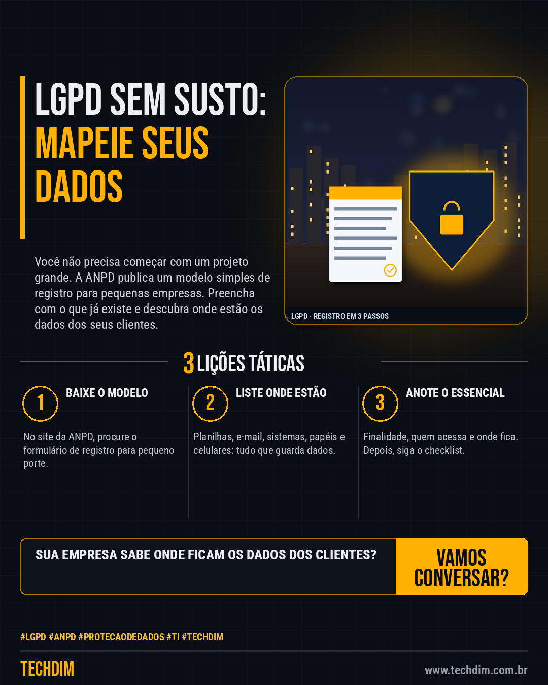

# Conhecimento — LGPD sem susto: comece com o modelo de registro da ANPD para pequenas empresas

- **Data:** 2026-10-07, 14:24 (horário de Brasília)
- **Curadoria:** Claude (Routine) — pauta do dia
- **Execução no Actions:** https://github.com/Techdimbr/Publi-midia-Techdim/actions/runs/37658688152
- **Por que esta pauta:** Dá um primeiro passo concreto e gratuito de LGPD para PMEs, usando material oficial da ANPD.

## Resultado

| Rede | Status | Link | 1º comentário |
|---|---|---|---|
| linkedin | ✅ publicado | https://www.linkedin.com/feed/update/urn:li:share:7513650382271873024/ | — |
| facebook | ✅ publicado | https://www.facebook.com/122132402349390486/posts/122134092537390486 | ✅ |
| instagram | ✅ publicado | https://www.instagram.com/p/DeM43mjGGBl/ | ✅ |

## Fontes

- [gov.br](https://www.gov.br/anpd/pt-br/centrais-de-conteudo/materiais-educativos-e-publicacoes/guia-orientativo-sobre-seguranca-da-informacao-para-agentes-de-tratamento-de-pequeno-porte)

## Linkedin

```text
LGPD sem susto: comece com o modelo de registro da ANPD para pequenas empresas

01. A ANPD oferece, para agentes de tratamento de pequeno porte, um guia de segurança, um checklist e um formulário-modelo de registro (Excel e PDF)
02. Passo 1: baixe o formulário no site da ANPD. Passo 2: liste onde há dados pessoais: planilhas, e-mail, sistemas, papéis e celulares
03. Passo 3: para cada item, anote a finalidade, quem acessa e onde fica guardado. Depois use o checklist para ver o que falta proteger

Um registro simples hoje evita correria quando um cliente pedir informação sobre os dados dele.

Fontes: https://www.gov.br/anpd/pt-br/centrais-de-conteudo/materiais-educativos-e-publicacoes/guia-orientativo-sobre-seguranca-da-informacao-para-agentes-de-tratamento-de-pequeno-porte

TECHDIM — Infraestrutura · Segurança · IA
https://www.techdim.com.br

#Lgpd #Anpd #ProtecaoDeDados #TI #TECHDIM
```



## Facebook

```text
LGPD sem susto: comece com o modelo de registro da ANPD para pequenas empresas

• A ANPD oferece, para agentes de tratamento de pequeno porte, um guia de segurança, um checklist e um formulário-modelo de registro (Excel e PDF)
• Passo 1: baixe o formulário no site da ANPD. Passo 2: liste onde há dados pessoais: planilhas, e-mail, sistemas, papéis e celulares
• Passo 3: para cada item, anote a finalidade, quem acessa e onde fica guardado. Depois use o checklist para ver o que falta proteger

Um registro simples hoje evita correria quando um cliente pedir informação sobre os dados dele.

Fale com a TECHDIM — fontes e site no primeiro comentário 👇

#Lgpd #Anpd #ProtecaoDeDados #TECHDIM
```

Primeiro comentário:

```text
📎 Fontes:
• gov.br: https://www.gov.br/anpd/pt-br/centrais-de-conteudo/materiais-educativos-e-publicacoes/guia-orientativo-sobre-seguranca-da-informacao-para-agentes-de-tratamento-de-pequeno-porte

🌐 TECHDIM — Infraestrutura · Segurança · IA: https://www.techdim.com.br
```


## Instagram

```text
LGPD sem susto: comece com o modelo de registro da ANPD para pequenas empresas

1️⃣ A ANPD oferece, para agentes de tratamento de pequeno porte, um guia de segurança, um checklist e um formulário-modelo de registro (Excel e PDF)
2️⃣ Passo 1: baixe o formulário no site da ANPD. Passo 2: liste onde há dados pessoais: planilhas, e-mail, sistemas, papéis e celulares
3️⃣ Passo 3: para cada item, anote a finalidade, quem acessa e onde fica guardado. Depois use o checklist para ver o que falta proteger

Um registro simples hoje evita correria quando um cliente pedir informação sobre os dados dele.

Saiba mais: www.techdim.com.br
Fontes no primeiro comentário 👇

#lgpd #anpd #protecaodedados #ti #techdim #conhecimento #aprendati #tecnologia
```

Primeiro comentário:

```text
📎 Fontes: gov.br
```


