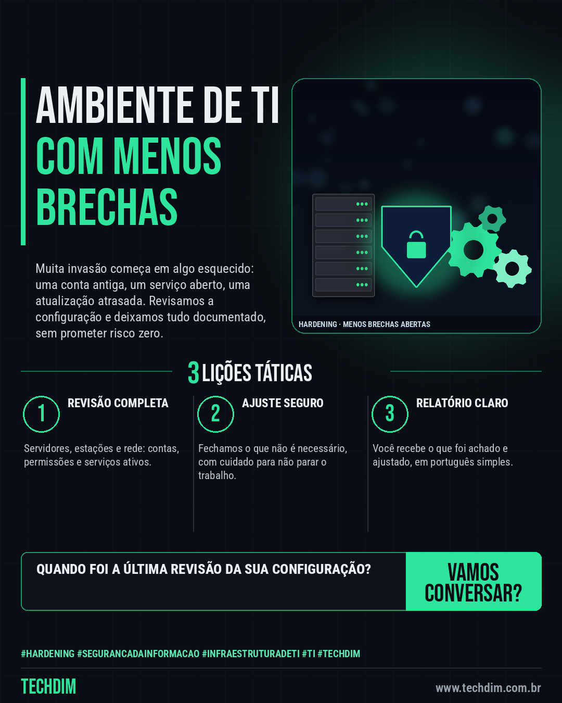

# TECHDIM · Serviços — Hardening: servidores e estações configurados para dar menos brechas aos invasores

- **Data:** 2026-10-07, 17:23 (horário de Brasília)
- **Curadoria:** Claude (Routine) — pauta do dia
- **Execução no Actions:** https://github.com/Techdimbr/Publi-midia-Techdim/actions/runs/37681546552
- **Por que esta pauta:** Apresenta o serviço de segurança e hardening com linguagem acessível e sem promessas de resultado.

## Resultado

| Rede | Status | Link | 1º comentário |
|---|---|---|---|
| linkedin | ✅ publicado | https://www.linkedin.com/feed/update/urn:li:share:7513695464479752192/ | — |
| facebook | ✅ publicado | https://www.facebook.com/122132402349390486/posts/122134125195390486 | ✅ |
| instagram | ✅ publicado | https://www.instagram.com/p/DeNNYcZDF2V/ | — |

## Linkedin

```text
Hardening: servidores e estações configurados para dar menos brechas aos invasores

01. A TECHDIM revisa a configuração de servidores, estações e rede da sua empresa e fecha o que não precisa estar aberto
02. Entram contas e permissões, serviços desnecessários, atualizações, firewall e registros de acesso, com tudo documentado para sua equipe
03. Você recebe um relatório simples, em português, com o que foi encontrado e o que foi ajustado, sem prometer risco zero

Quer saber como está a configuração do seu ambiente? Fale conosco: www.techdim.com.br

TECHDIM — Infraestrutura · Segurança · IA
https://www.techdim.com.br

#Hardening #SegurancaDaInformacao #InfraestruturaDeTI #TI #TECHDIM
```



## Facebook

```text
Hardening: servidores e estações configurados para dar menos brechas aos invasores

• A TECHDIM revisa a configuração de servidores, estações e rede da sua empresa e fecha o que não precisa estar aberto
• Entram contas e permissões, serviços desnecessários, atualizações, firewall e registros de acesso, com tudo documentado para sua equipe
• Você recebe um relatório simples, em português, com o que foi encontrado e o que foi ajustado, sem prometer risco zero

Quer saber como está a configuração do seu ambiente? Fale conosco: www.techdim.com.br

Fale com a TECHDIM — link no primeiro comentário 👇

#Hardening #SegurancaDaInformacao #InfraestruturaDeTI #TECHDIM
```

Primeiro comentário:

```text
🌐 TECHDIM — Infraestrutura · Segurança · IA: https://www.techdim.com.br
```


## Instagram

```text
Hardening: servidores e estações configurados para dar menos brechas aos invasores

1️⃣ A TECHDIM revisa a configuração de servidores, estações e rede da sua empresa e fecha o que não precisa estar aberto
2️⃣ Entram contas e permissões, serviços desnecessários, atualizações, firewall e registros de acesso, com tudo documentado para sua equipe
3️⃣ Você recebe um relatório simples, em português, com o que foi encontrado e o que foi ajustado, sem prometer risco zero

Quer saber como está a configuração do seu ambiente? Fale conosco: www.techdim.com.br

Saiba mais: www.techdim.com.br

#hardening #segurancadainformacao #infraestruturadeti #ti #techdim #suportetecnico #ciberseguranca #automacao
```


