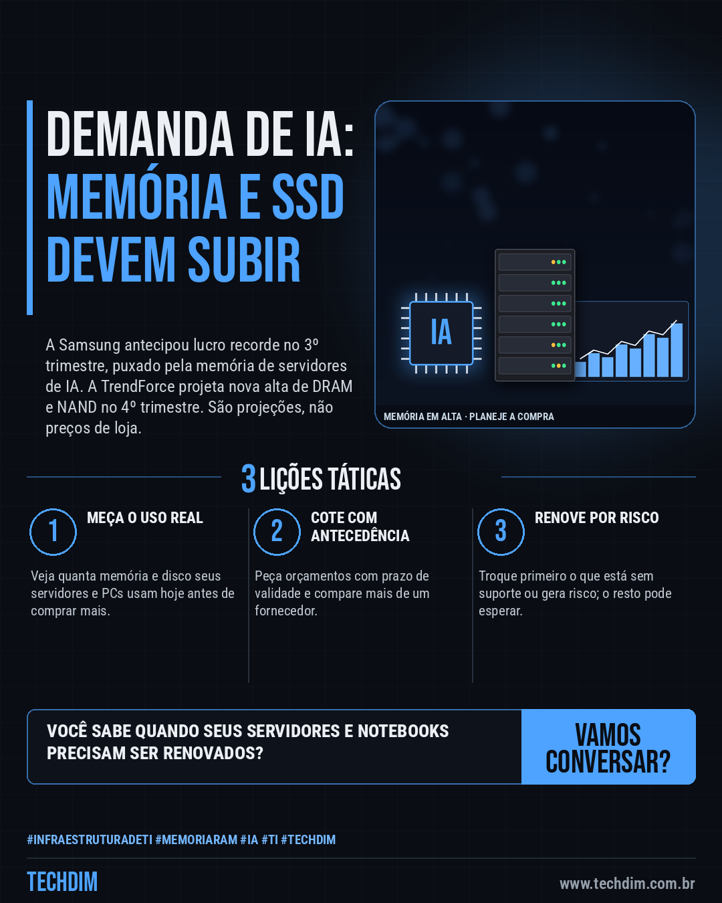
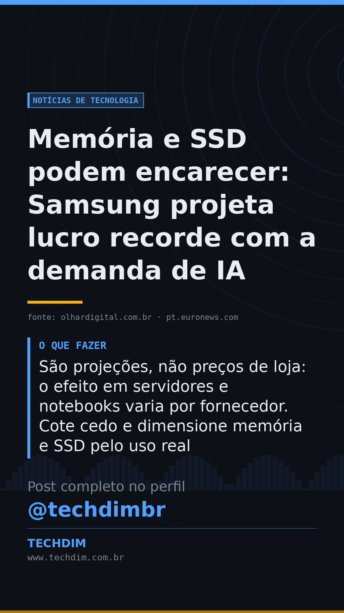

# Notícias de Tecnologia — Memória e SSD podem encarecer: Samsung projeta lucro recorde com a demanda de IA

- **Data:** 2026-10-08, 08:00 (horário de Brasília)
- **Curadoria:** Claude (Routine) — pauta do dia
- **Execução no Actions:** https://github.com/Techdimbr/Publi-midia-Techdim/actions/runs/37767099939
- **Por que esta pauta:** A demanda de IA aperta a oferta de memória e SSD; quem renova equipamentos neste fim de ano precisa planejar o orçamento.

## Resultado

| Rede | Status | Link | 1º comentário |
|---|---|---|---|
| linkedin | ✅ publicado | https://www.linkedin.com/feed/update/urn:li:share:7513916058588594179/ | — |
| facebook | ✅ publicado | https://www.facebook.com/122132402349390486/posts/122134301379390486 | ✅ |
| instagram | ✅ publicado | https://www.instagram.com/p/DeOxryIjPZS/ | ✅ |
| Stories | ✅ publicado | https://www.instagram.com/stories/techdimbr/4003355762151427971 | — |

## Fontes

- [olhardigital.com.br](https://olhardigital.com.br/2026/10/07/pro/samsung-preve-lucro-recorde-de-r-426-bilhoes-com-explosao-da-demanda-por-ia/)
- [pt.euronews.com](https://pt.euronews.com/2026/10/08/samsung-preve-lucros-recorde-de-80-mil-m-com-salto-de-783-boom-da-ia-impulsiona-vendas-da)
- [trendforce.com](https://www.trendforce.com/presscenter/news/20260930-13258.html)

## Linkedin

```text
Memória e SSD podem encarecer: Samsung projeta lucro recorde com a demanda de IA

01. A Samsung estimou lucro operacional de 107,4 trilhões de wons no 3º trimestre, alta de 782% em um ano, puxado pela memória usada em servidores e IA
02. Para o 4º trimestre, a TrendForce projeta alta (sobre o 3º) de 10% a 15% nos contratos da DRAM convencional e de 15% a 20% nos da memória NAND, usada em SSDs
03. São projeções, não preços de loja: o efeito em servidores e notebooks varia por fornecedor. Cote cedo e dimensione memória e SSD pelo uso real

Vai renovar servidores ou notebooks? Meça o uso real de memória e SSD antes de comprar.

Fontes: https://olhardigital.com.br/2026/10/07/pro/samsung-preve-lucro-recorde-de-r-426-bilhoes-com-explosao-da-demanda-por-ia/ · https://pt.euronews.com/2026/10/08/samsung-preve-lucros-recorde-de-80-mil-m-com-salto-de-783-boom-da-ia-impulsiona-vendas-da

TECHDIM — Infraestrutura · Segurança · IA
https://www.techdim.com.br

#InfraestruturaDeTI #MemoriaRAM #IA #TI #TECHDIM
```



## Facebook

```text
Memória e SSD podem encarecer: Samsung projeta lucro recorde com a demanda de IA

• A Samsung estimou lucro operacional de 107,4 trilhões de wons no 3º trimestre, alta de 782% em um ano, puxado pela memória usada em servidores e IA
• Para o 4º trimestre, a TrendForce projeta alta (sobre o 3º) de 10% a 15% nos contratos da DRAM convencional e de 15% a 20% nos da memória NAND, usada em SSDs
• São projeções, não preços de loja: o efeito em servidores e notebooks varia por fornecedor. Cote cedo e dimensione memória e SSD pelo uso real

Vai renovar servidores ou notebooks? Meça o uso real de memória e SSD antes de comprar.

Fale com a TECHDIM — fontes e site no primeiro comentário 👇

#InfraestruturaDeTI #MemoriaRAM #IA #TECHDIM
```

Primeiro comentário:

```text
📎 Fontes:
• olhardigital.com.br: https://olhardigital.com.br/2026/10/07/pro/samsung-preve-lucro-recorde-de-r-426-bilhoes-com-explosao-da-demanda-por-ia/
• pt.euronews.com: https://pt.euronews.com/2026/10/08/samsung-preve-lucros-recorde-de-80-mil-m-com-salto-de-783-boom-da-ia-impulsiona-vendas-da
• trendforce.com: https://www.trendforce.com/presscenter/news/20260930-13258.html

🌐 TECHDIM — Infraestrutura · Segurança · IA: https://www.techdim.com.br
```


## Instagram

```text
Memória e SSD podem encarecer: Samsung projeta lucro recorde com a demanda de IA

1️⃣ A Samsung estimou lucro operacional de 107,4 trilhões de wons no 3º trimestre, alta de 782% em um ano, puxado pela memória usada em servidores e IA
2️⃣ Para o 4º trimestre, a TrendForce projeta alta (sobre o 3º) de 10% a 15% nos contratos da DRAM convencional e de 15% a 20% nos da memória NAND, usada em SSDs
3️⃣ São projeções, não preços de loja: o efeito em servidores e notebooks varia por fornecedor. Cote cedo e dimensione memória e SSD pelo uso real

Vai renovar servidores ou notebooks? Meça o uso real de memória e SSD antes de comprar.

Saiba mais: www.techdim.com.br
Fontes no primeiro comentário 👇

#infraestruturadeti #memoriaram #ia #ti #techdim #tecnologia #inteligenciaartificial #inovacao
```

Primeiro comentário:

```text
📎 Fontes: olhardigital.com.br · pt.euronews.com · trendforce.com
```


## Stories


