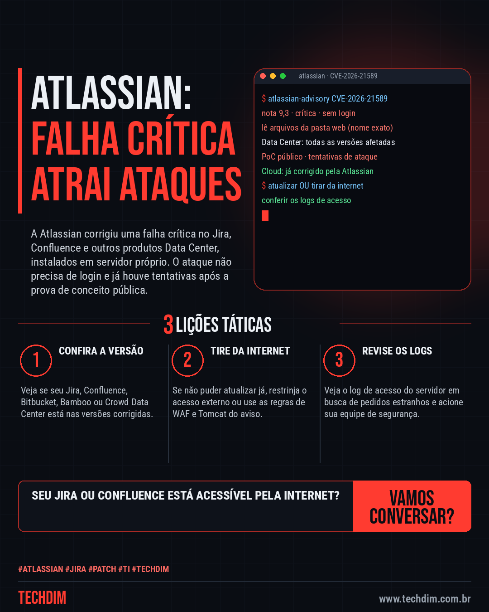
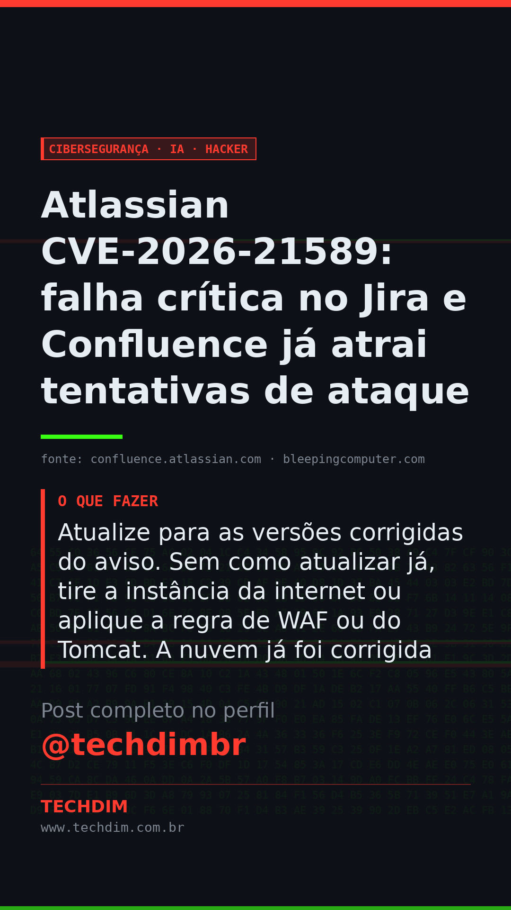

# Cibersegurança · IA · Hacker — Atlassian CVE-2026-21589: falha crítica no Jira e Confluence já atrai tentativas de ataque

- **Data:** 2026-10-08, 11:08 (horário de Brasília)
- **Curadoria:** Claude (Routine) — pauta do dia
- **Execução no Actions:** https://github.com/Techdimbr/Publi-midia-Techdim/actions/runs/37789930385
- **Por que esta pauta:** Falha crítica, sem login, em ferramentas muito usadas por times de TI e desenvolvimento, com prova de conceito público e tentativas de ataque já registradas.

## Resultado

| Rede | Status | Link | 1º comentário |
|---|---|---|---|
| linkedin | ✅ publicado | https://www.linkedin.com/feed/update/urn:li:share:7513963466999898112/ | — |
| facebook | ✅ publicado | https://www.facebook.com/122132402349390486/posts/122134347633390486 | ✅ |
| instagram | ✅ publicado | https://www.instagram.com/p/DePHPhumv4_/ | ✅ |
| Stories | ✅ publicado | https://www.instagram.com/stories/techdimbr/4003450567296921880 | — |

## Fontes

- [confluence.atlassian.com](https://confluence.atlassian.com/security/cve-2026-21589-arbitrary-file-access-vulnerability-impacts-multiple-products-1870495748.html)
- [bleepingcomputer.com](https://www.bleepingcomputer.com/news/security/hackers-exploit-critical-atlassian-flaw-after-public-poc-release/)

## Linkedin

```text
Atlassian CVE-2026-21589: falha crítica no Jira e Confluence já atrai tentativas de ataque

01. CVE-2026-21589 (nota 9,3): sem login, o invasor lê arquivos da pasta web, se souber o nome exato, no Jira, Confluence, Bitbucket e outros produtos Data Center
02. Em até 2 horas após a prova de conceito pública da watchTowr, honeypots da Previdian registraram tentativas de ataque; a Atlassian pede que se confira os logs
03. Atualize para as versões corrigidas do aviso. Sem como atualizar já, tire a instância da internet ou aplique a regra de WAF ou do Tomcat. A nuvem já foi corrigida

Tem Jira, Confluence ou Bitbucket no seu servidor? Atualize hoje e confira os logs de acesso.

Fontes: https://confluence.atlassian.com/security/cve-2026-21589-arbitrary-file-access-vulnerability-impacts-multiple-products-1870495748.html · https://www.bleepingcomputer.com/news/security/hackers-exploit-critical-atlassian-flaw-after-public-poc-release/

TECHDIM — Infraestrutura · Segurança · IA
https://www.techdim.com.br

#Atlassian #Jira #Patch #TI #TECHDIM
```



## Facebook

```text
Atlassian CVE-2026-21589: falha crítica no Jira e Confluence já atrai tentativas de ataque

• CVE-2026-21589 (nota 9,3): sem login, o invasor lê arquivos da pasta web, se souber o nome exato, no Jira, Confluence, Bitbucket e outros produtos Data Center
• Em até 2 horas após a prova de conceito pública da watchTowr, honeypots da Previdian registraram tentativas de ataque; a Atlassian pede que se confira os logs
• Atualize para as versões corrigidas do aviso. Sem como atualizar já, tire a instância da internet ou aplique a regra de WAF ou do Tomcat. A nuvem já foi corrigida

Tem Jira, Confluence ou Bitbucket no seu servidor? Atualize hoje e confira os logs de acesso.

Fale com a TECHDIM — fontes e site no primeiro comentário 👇

#Atlassian #Jira #Patch #TECHDIM
```

Primeiro comentário:

```text
📎 Fontes:
• confluence.atlassian.com: https://confluence.atlassian.com/security/cve-2026-21589-arbitrary-file-access-vulnerability-impacts-multiple-products-1870495748.html
• bleepingcomputer.com: https://www.bleepingcomputer.com/news/security/hackers-exploit-critical-atlassian-flaw-after-public-poc-release/

🌐 TECHDIM — Infraestrutura · Segurança · IA: https://www.techdim.com.br
```


## Instagram

```text
Atlassian CVE-2026-21589: falha crítica no Jira e Confluence já atrai tentativas de ataque

1️⃣ CVE-2026-21589 (nota 9,3): sem login, o invasor lê arquivos da pasta web, se souber o nome exato, no Jira, Confluence, Bitbucket e outros produtos Data Center
2️⃣ Em até 2 horas após a prova de conceito pública da watchTowr, honeypots da Previdian registraram tentativas de ataque; a Atlassian pede que se confira os logs
3️⃣ Atualize para as versões corrigidas do aviso. Sem como atualizar já, tire a instância da internet ou aplique a regra de WAF ou do Tomcat. A nuvem já foi corrigida

Tem Jira, Confluence ou Bitbucket no seu servidor? Atualize hoje e confira os logs de acesso.

Saiba mais: www.techdim.com.br
Fontes no primeiro comentário 👇

#atlassian #jira #patch #ti #techdim #ciberseguranca #seguranca #hacker
```

Primeiro comentário:

```text
📎 Fontes: confluence.atlassian.com · bleepingcomputer.com
```


## Stories


