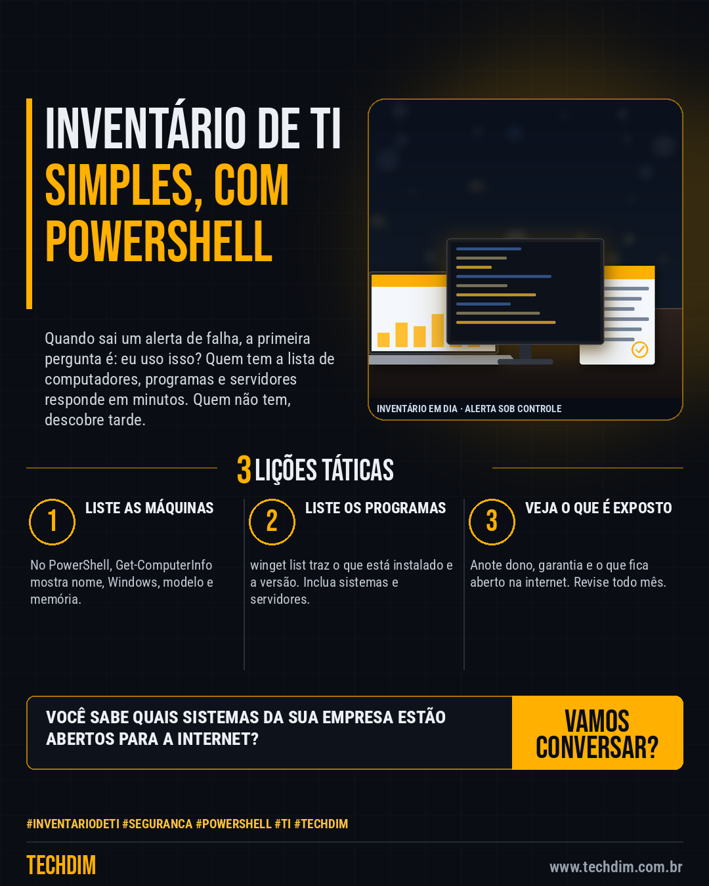

# Conhecimento — Inventário de TI com PowerShell: saiba o que usa antes do próximo alerta de falha

- **Data:** 2026-10-08, 14:24 (horário de Brasília)
- **Curadoria:** Claude (Routine) — pauta do dia
- **Execução no Actions:** https://github.com/Techdimbr/Publi-midia-Techdim/actions/runs/37816187513
- **Por que esta pauta:** Saber o que existe na rede é o primeiro passo dos CIS Controls; sem inventário não dá para checar alertas de falha nem planejar a renovação de equipamentos.

## Resultado

| Rede | Status | Link | 1º comentário |
|---|---|---|---|
| linkedin | ✅ publicado | https://www.linkedin.com/feed/update/urn:li:share:7514012730287099905/ | — |
| facebook | ✅ publicado | https://www.facebook.com/122132402349390486/posts/122134392975390486 | ✅ |
| instagram | ✅ publicado | https://www.instagram.com/p/DePdpBjm6A5/ | ✅ |

## Fontes

- [learn.microsoft.com](https://learn.microsoft.com/en-us/powershell/module/microsoft.powershell.management/get-computerinfo)
- [learn.microsoft.com](https://learn.microsoft.com/en-us/windows/package-manager/winget/list)
- [cisecurity.org](https://www.cisecurity.org/controls/inventory-and-control-of-enterprise-assets)

## Linkedin

```text
Inventário de TI com PowerShell: saiba o que usa antes do próximo alerta de falha

01. No Windows, abra o PowerShell e rode Get-ComputerInfo: ele reúne as propriedades do sistema, como nome, versão do Windows, fabricante, modelo e memória
02. Para os programas, rode winget list: mostra os aplicativos instalados e as versões, mesmo os instalados por outros meios. Com --upgrade-available, só os desatualizados
03. Anote em planilha dono, local, garantia e se o sistema (ERP, VPN, Jira) fica exposto à internet. Revise todo mês e a cada alerta de falha

Com a lista pronta, você responde em minutos se um alerta de falha atinge a sua empresa.

Fontes: https://learn.microsoft.com/en-us/powershell/module/microsoft.powershell.management/get-computerinfo · https://learn.microsoft.com/en-us/windows/package-manager/winget/list

TECHDIM — Infraestrutura · Segurança · IA
https://www.techdim.com.br

#InventarioDeTI #Seguranca #PowerShell #TI #TECHDIM
```



## Facebook

```text
Inventário de TI com PowerShell: saiba o que usa antes do próximo alerta de falha

• No Windows, abra o PowerShell e rode Get-ComputerInfo: ele reúne as propriedades do sistema, como nome, versão do Windows, fabricante, modelo e memória
• Para os programas, rode winget list: mostra os aplicativos instalados e as versões, mesmo os instalados por outros meios. Com --upgrade-available, só os desatualizados
• Anote em planilha dono, local, garantia e se o sistema (ERP, VPN, Jira) fica exposto à internet. Revise todo mês e a cada alerta de falha

Com a lista pronta, você responde em minutos se um alerta de falha atinge a sua empresa.

Fale com a TECHDIM — fontes e site no primeiro comentário 👇

#InventarioDeTI #Seguranca #PowerShell #TECHDIM
```

Primeiro comentário:

```text
📎 Fontes:
• learn.microsoft.com: https://learn.microsoft.com/en-us/powershell/module/microsoft.powershell.management/get-computerinfo
• learn.microsoft.com: https://learn.microsoft.com/en-us/windows/package-manager/winget/list
• cisecurity.org: https://www.cisecurity.org/controls/inventory-and-control-of-enterprise-assets

🌐 TECHDIM — Infraestrutura · Segurança · IA: https://www.techdim.com.br
```


## Instagram

```text
Inventário de TI com PowerShell: saiba o que usa antes do próximo alerta de falha

1️⃣ No Windows, abra o PowerShell e rode Get-ComputerInfo: ele reúne as propriedades do sistema, como nome, versão do Windows, fabricante, modelo e memória
2️⃣ Para os programas, rode winget list: mostra os aplicativos instalados e as versões, mesmo os instalados por outros meios. Com --upgrade-available, só os desatualizados
3️⃣ Anote em planilha dono, local, garantia e se o sistema (ERP, VPN, Jira) fica exposto à internet. Revise todo mês e a cada alerta de falha

Com a lista pronta, você responde em minutos se um alerta de falha atinge a sua empresa.

Saiba mais: www.techdim.com.br
Fontes no primeiro comentário 👇

#inventariodeti #seguranca #powershell #ti #techdim #conhecimento #aprendati #tecnologia
```

Primeiro comentário:

```text
📎 Fontes: learn.microsoft.com · learn.microsoft.com · cisecurity.org
```


