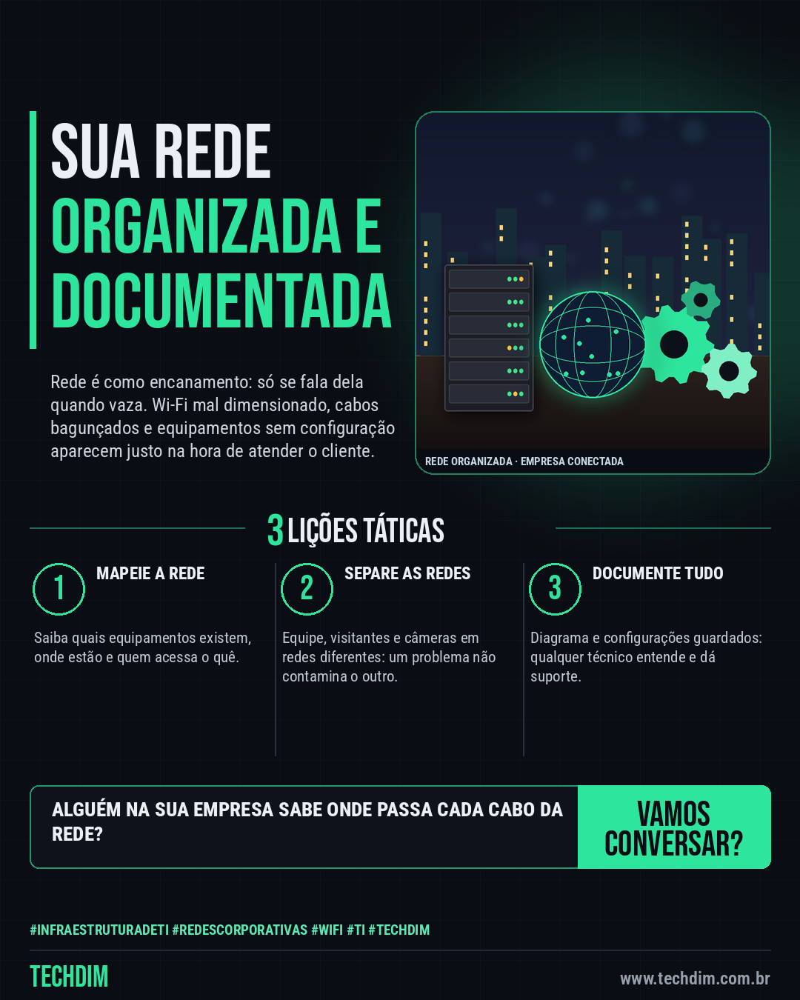

# TECHDIM · Serviços — Infraestrutura de rede: Wi-Fi estável, cabeamento organizado e redes separadas

- **Data:** 2026-10-08, 17:24 (horário de Brasília)
- **Curadoria:** Claude (Routine) — pauta do dia
- **Execução no Actions:** https://github.com/Techdimbr/Publi-midia-Techdim/actions/runs/37839060881
- **Por que esta pauta:** Apresenta o serviço de infraestrutura e redes com uma analogia do dia a dia e sem promessas de resultado.

## Resultado

| Rede | Status | Link | 1º comentário |
|---|---|---|---|
| linkedin | ✅ publicado | https://www.linkedin.com/feed/update/urn:li:share:7514057982016380928/ | — |
| facebook | ✅ publicado | https://www.facebook.com/122132402349390486/posts/122134429467390486 | ✅ |
| instagram | ✅ publicado | https://www.instagram.com/p/DePyOe_jVnV/ | — |

## Linkedin

```text
Infraestrutura de rede: Wi-Fi estável, cabeamento organizado e redes separadas

01. A rede é como o encanamento do prédio: ninguém lembra dela até a videoconferência travar, o sistema ficar lento ou o Wi-Fi cair na hora do atendimento
02. A TECHDIM mapeia sua rede, organiza o cabeamento, configura roteadores, switches e Wi-Fi e separa as redes de equipe, visitantes e câmeras
03. Tudo fica documentado, com acessos sob controle, para sua equipe ou qualquer técnico saber o que existe e onde está cada ponto

Quer uma rede organizada para sua empresa? Fale conosco: www.techdim.com.br

TECHDIM — Infraestrutura · Segurança · IA
https://www.techdim.com.br

#InfraestruturaDeTI #RedesCorporativas #WiFi #TI #TECHDIM
```



## Facebook

```text
Infraestrutura de rede: Wi-Fi estável, cabeamento organizado e redes separadas

• A rede é como o encanamento do prédio: ninguém lembra dela até a videoconferência travar, o sistema ficar lento ou o Wi-Fi cair na hora do atendimento
• A TECHDIM mapeia sua rede, organiza o cabeamento, configura roteadores, switches e Wi-Fi e separa as redes de equipe, visitantes e câmeras
• Tudo fica documentado, com acessos sob controle, para sua equipe ou qualquer técnico saber o que existe e onde está cada ponto

Quer uma rede organizada para sua empresa? Fale conosco: www.techdim.com.br

Fale com a TECHDIM — link no primeiro comentário 👇

#InfraestruturaDeTI #RedesCorporativas #WiFi #TECHDIM
```

Primeiro comentário:

```text
🌐 TECHDIM — Infraestrutura · Segurança · IA: https://www.techdim.com.br
```


## Instagram

```text
Infraestrutura de rede: Wi-Fi estável, cabeamento organizado e redes separadas

1️⃣ A rede é como o encanamento do prédio: ninguém lembra dela até a videoconferência travar, o sistema ficar lento ou o Wi-Fi cair na hora do atendimento
2️⃣ A TECHDIM mapeia sua rede, organiza o cabeamento, configura roteadores, switches e Wi-Fi e separa as redes de equipe, visitantes e câmeras
3️⃣ Tudo fica documentado, com acessos sob controle, para sua equipe ou qualquer técnico saber o que existe e onde está cada ponto

Quer uma rede organizada para sua empresa? Fale conosco: www.techdim.com.br

Saiba mais: www.techdim.com.br

#infraestruturadeti #redescorporativas #wifi #ti #techdim #suportetecnico #ciberseguranca #automacao
```


