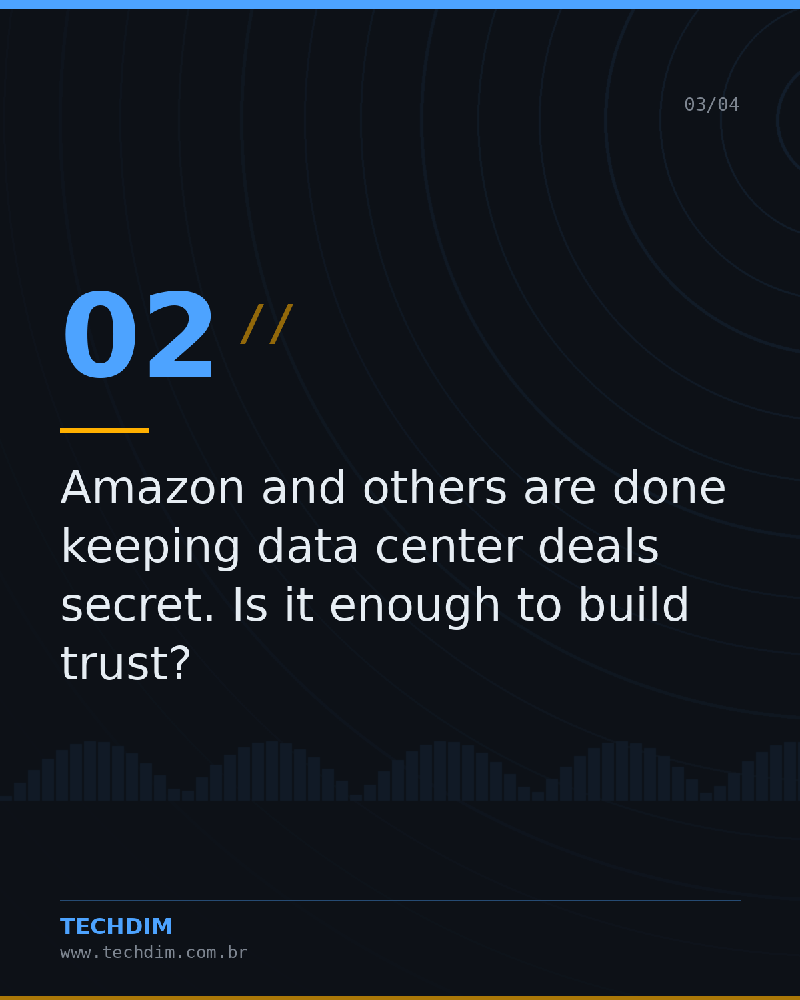
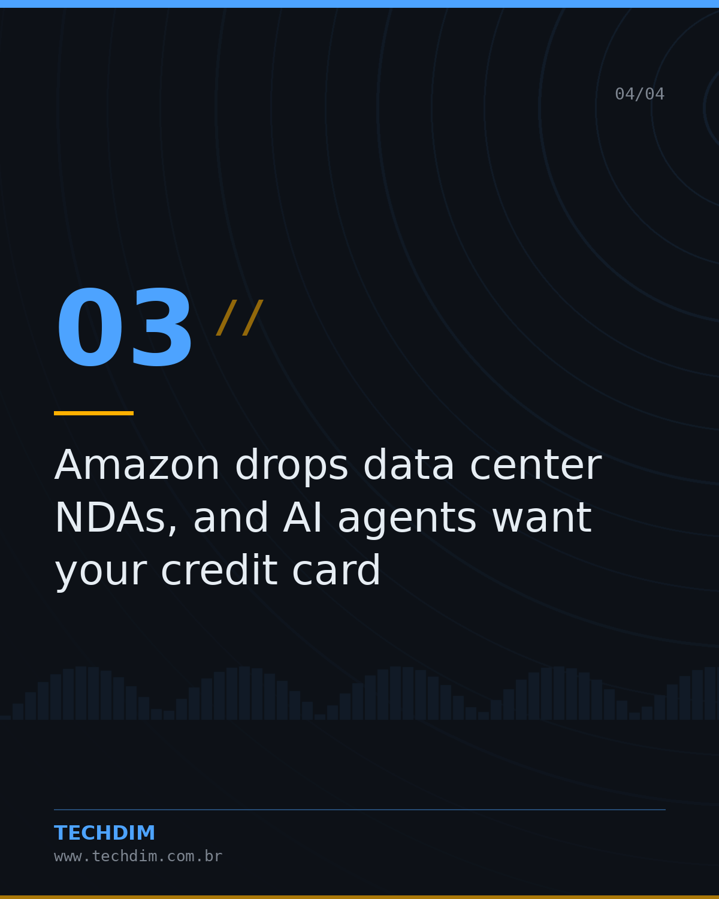
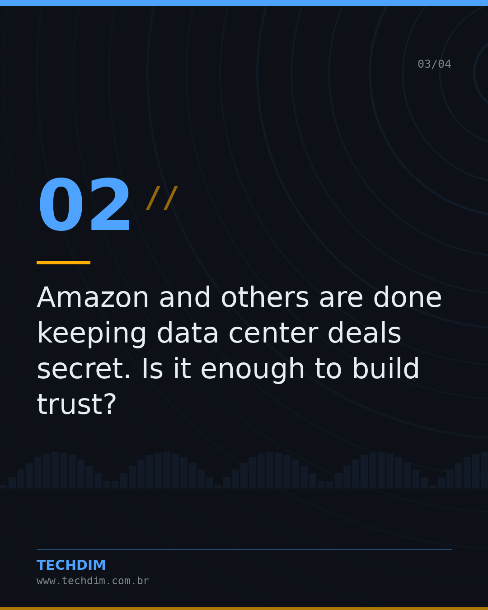
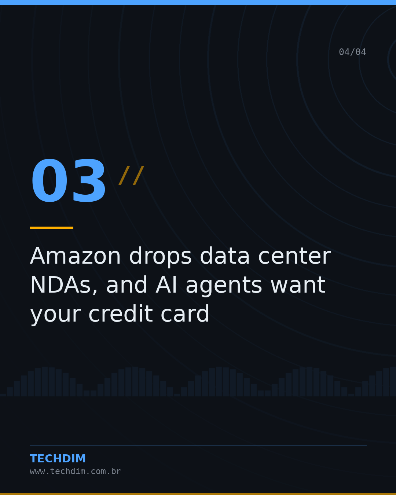

# Notícias de Tecnologia — Resumo do dia — Tecnologia & IA

- **Data:** 2026-10-09, 14:27 (horário de Brasília)
- **Curadoria:** filtro por palavra-chave
- **Execução no Actions:** https://github.com/Techdimbr/Publi-midia-Techdim/actions/runs/37966158258

## Resultado

| Rede | Status | Link | 1º comentário |
|---|---|---|---|
| linkedin | ✅ publicado | https://www.linkedin.com/feed/update/urn:li:share:7514375616008376321/ | — |
| facebook | ✅ publicado | https://www.facebook.com/122132402349390486/posts/122134732755390486 | ✅ |
| instagram | ✅ publicado | https://www.instagram.com/p/DeSCvG-lCRk/ | ✅ |
| Stories | ✅ publicado | https://www.instagram.com/stories/techdimbr/4004275180801363492 | — |

## Fontes

- [canaltech.com.br](https://canaltech.com.br/inteligencia-artificial/google-lanca-agente-do-gemini-que-trabalha-sozinho-entre-varios-apps/)
- [techcrunch.com](https://techcrunch.com/video/amazon-and-others-are-done-keeping-data-center-deals-secret-is-it-enough-to-build-trust/)

## Linkedin

```text
Resumo do dia — Tecnologia & IA

01. Google lança agente do Gemini que trabalha sozinho entre vários apps
02. Amazon and others are done keeping data center deals secret. Is it enough to build trust?
03. Amazon drops data center NDAs, and AI agents want your credit card
04. AMD avalia se afastar da TSMC para fabricar chips com a Samsung; entenda o movimento

A TECHDIM acompanha o mercado para manter sua infraestrutura à frente.

Fontes: https://canaltech.com.br/inteligencia-artificial/google-lanca-agente-do-gemini-que-trabalha-sozinho-entre-varios-apps/ · https://techcrunch.com/video/amazon-and-others-are-done-keeping-data-center-deals-secret-is-it-enough-to-build-trust/

TECHDIM — Infraestrutura · Segurança · IA
https://www.techdim.com.br

#Tecnologia #InteligenciaArtificial #InovacaoDigital #TECHDIM
```


## Facebook

```text
Resumo do dia — Tecnologia & IA

• Google lança agente do Gemini que trabalha sozinho entre vários apps
• Amazon and others are done keeping data center deals secret. Is it enough to build trust?
• Amazon drops data center NDAs, and AI agents want your credit card
• AMD avalia se afastar da TSMC para fabricar chips com a Samsung; entenda o movimento

A TECHDIM acompanha o mercado para manter sua infraestrutura à frente.

Fale com a TECHDIM — fontes e site no primeiro comentário 👇

#TECHDIM #Tecnologia #IA #Campinas
```

Primeiro comentário:

```text
📎 Fontes:
• canaltech.com.br: https://canaltech.com.br/inteligencia-artificial/google-lanca-agente-do-gemini-que-trabalha-sozinho-entre-varios-apps/
• techcrunch.com: https://techcrunch.com/video/amazon-and-others-are-done-keeping-data-center-deals-secret-is-it-enough-to-build-trust/

🌐 TECHDIM — Infraestrutura · Segurança · IA: https://www.techdim.com.br
```





## Instagram

```text
Resumo do dia — Tecnologia & IA

Arraste para o lado →

1️⃣ Google lança agente do Gemini que trabalha sozinho entre vários apps
2️⃣ Amazon and others are done keeping data center deals secret. Is it enough to build trust?
3️⃣ Amazon drops data center NDAs, and AI agents want your credit card
4️⃣ AMD avalia se afastar da TSMC para fabricar chips com a Samsung; entenda o movimento

A TECHDIM acompanha o mercado para manter sua infraestrutura à frente.

Saiba mais: www.techdim.com.br
Fontes no primeiro comentário 👇

#tecnologia #inteligenciaartificial #ia #inovacao #techdim #campinas #ti
```

Primeiro comentário:

```text
📎 Fontes: canaltech.com.br · techcrunch.com
```





## Stories


