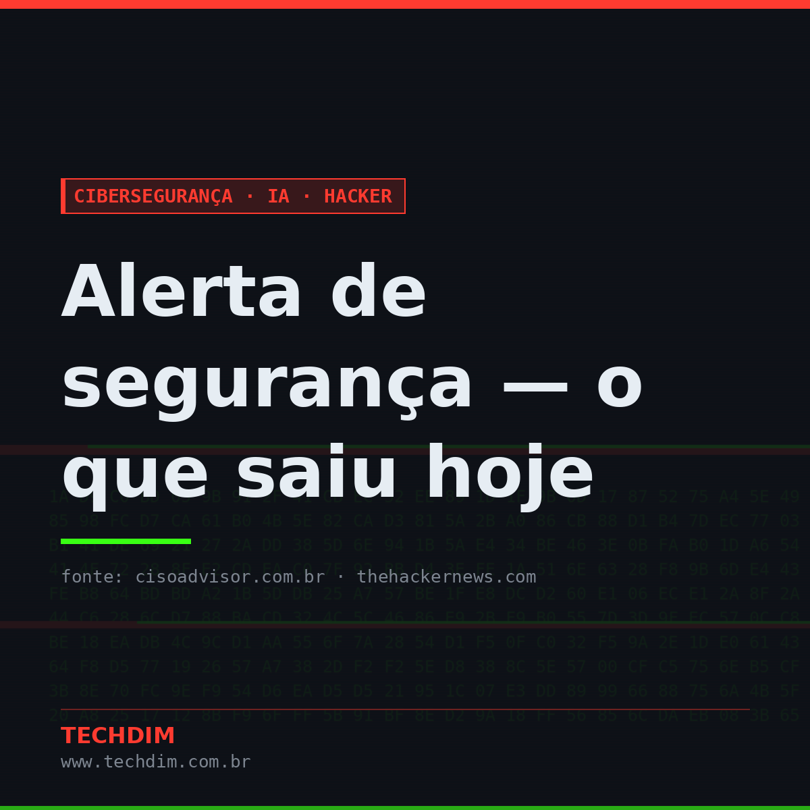
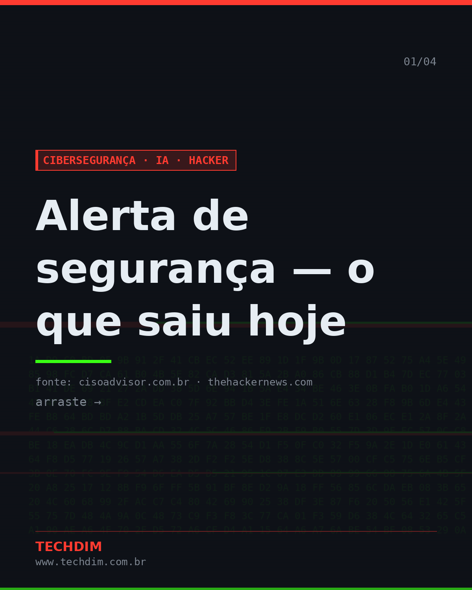
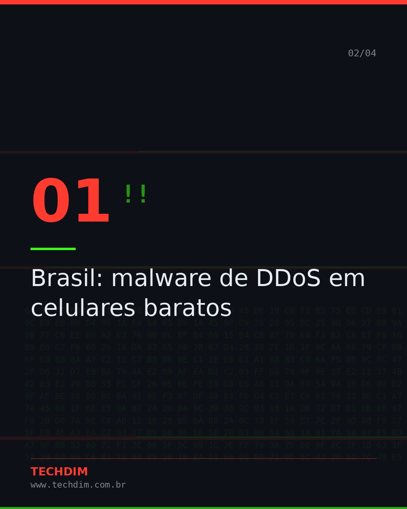
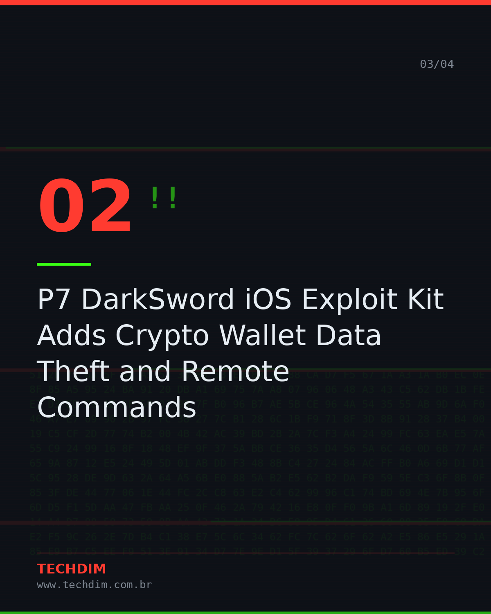
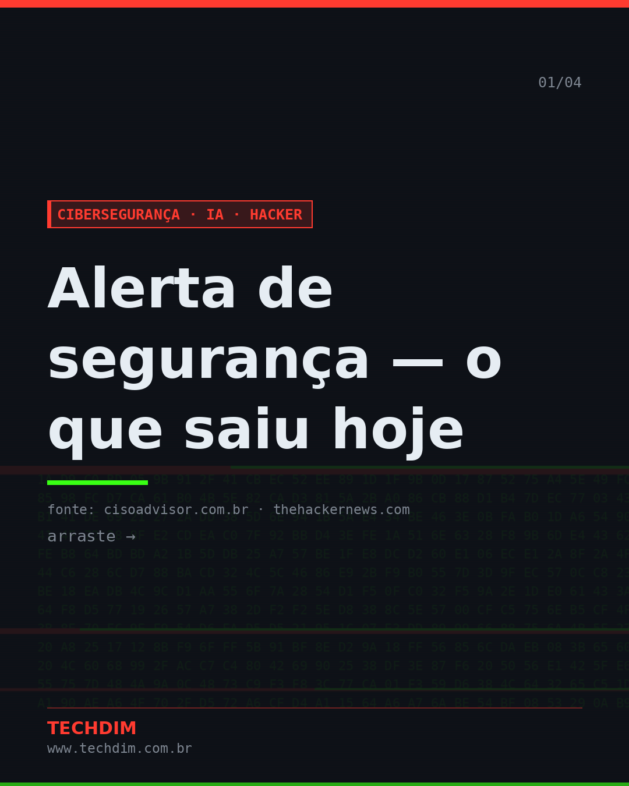
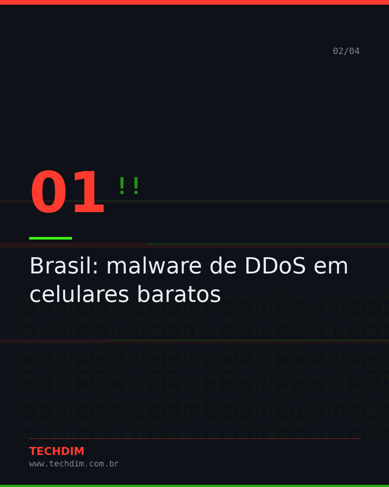
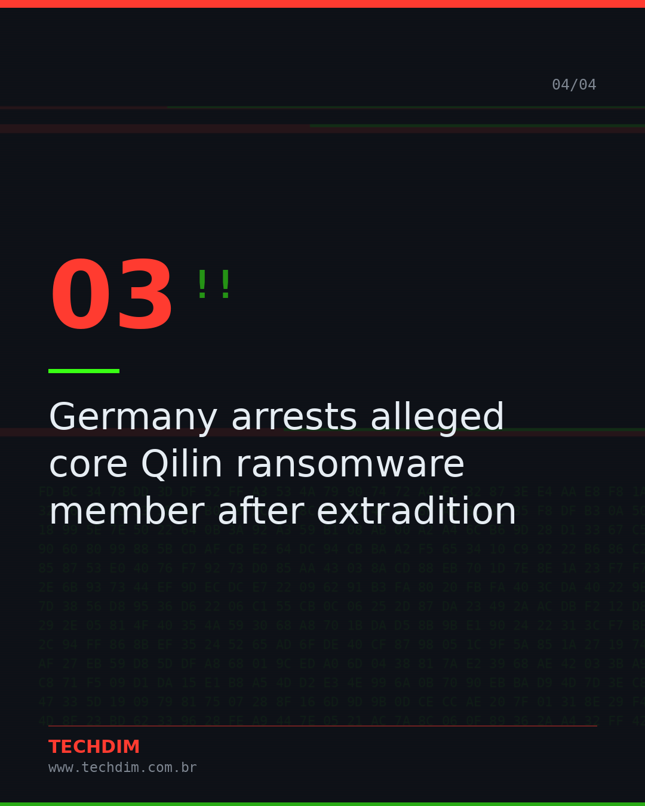
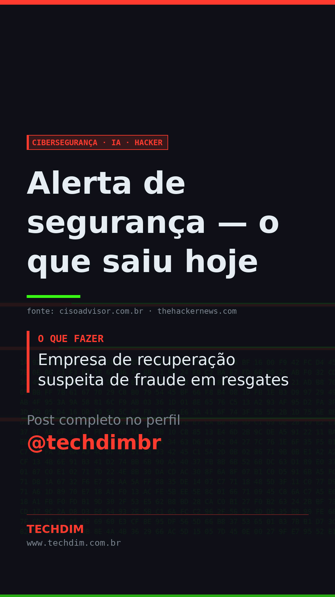

# Cibersegurança · IA · Hacker — Alerta de segurança — o que saiu hoje

- **Data:** 2026-10-09, 16:28 (horário de Brasília)
- **Curadoria:** filtro por palavra-chave
- **Execução no Actions:** https://github.com/Techdimbr/Publi-midia-Techdim/actions/runs/37980296524

## Resultado

| Rede | Status | Link | 1º comentário |
|---|---|---|---|
| linkedin | ✅ publicado | https://www.linkedin.com/feed/update/urn:li:share:7514406195189907459/ | — |
| facebook | ✅ publicado | https://www.facebook.com/122132402349390486/posts/122134761573390486 | ✅ |
| instagram | ✅ publicado | https://www.instagram.com/p/DeSQoWqDrqc/ | ✅ |
| Stories | ✅ publicado | https://www.instagram.com/stories/techdimbr/4004336260068370384 | — |

## Fontes

- [cisoadvisor.com.br](https://www.cisoadvisor.com.br/brasil-malware-de-ddos-em-celulares-baratos/)
- [thehackernews.com](https://thehackernews.com/2026/10/p7-darksword-ios-exploit-kit-adds.html)

## Linkedin

```text
Alerta de segurança — o que saiu hoje

01. Brasil: malware de DDoS em celulares baratos
02. P7 DarkSword iOS Exploit Kit Adds Crypto Wallet Data Theft and Remote Commands
03. Germany arrests alleged core Qilin ransomware member after extradition
04. Empresa de recuperação suspeita de fraude em resgates

Precisa avaliar se sua empresa está exposta? Fale com a TECHDIM.

Fontes: https://www.cisoadvisor.com.br/brasil-malware-de-ddos-em-celulares-baratos/ · https://thehackernews.com/2026/10/p7-darksword-ios-exploit-kit-adds.html

TECHDIM — Infraestrutura · Segurança · IA
https://www.techdim.com.br

#CiberSeguranca #SegurancaDaInformacao #InfraestruturaDeTI #TECHDIM
```



## Facebook

```text
Alerta de segurança — o que saiu hoje

• Brasil: malware de DDoS em celulares baratos
• P7 DarkSword iOS Exploit Kit Adds Crypto Wallet Data Theft and Remote Commands
• Germany arrests alleged core Qilin ransomware member after extradition
• Empresa de recuperação suspeita de fraude em resgates

Precisa avaliar se sua empresa está exposta? Fale com a TECHDIM.

Fale com a TECHDIM — fontes e site no primeiro comentário 👇

#TECHDIM #Seguranca #TI #Campinas
```

Primeiro comentário:

```text
📎 Fontes:
• cisoadvisor.com.br: https://www.cisoadvisor.com.br/brasil-malware-de-ddos-em-celulares-baratos/
• thehackernews.com: https://thehackernews.com/2026/10/p7-darksword-ios-exploit-kit-adds.html

🌐 TECHDIM — Infraestrutura · Segurança · IA: https://www.techdim.com.br
```






## Instagram

```text
Alerta de segurança — o que saiu hoje

Arraste para o lado →

1️⃣ Brasil: malware de DDoS em celulares baratos
2️⃣ P7 DarkSword iOS Exploit Kit Adds Crypto Wallet Data Theft and Remote Commands
3️⃣ Germany arrests alleged core Qilin ransomware member after extradition
4️⃣ Empresa de recuperação suspeita de fraude em resgates

Precisa avaliar se sua empresa está exposta? Fale com a TECHDIM.

Saiba mais: www.techdim.com.br
Fontes no primeiro comentário 👇

#ciberseguranca #seguranca #hacker #ti #infraestrutura #techdim #campinas
```

Primeiro comentário:

```text
📎 Fontes: cisoadvisor.com.br · thehackernews.com
```






## Stories


