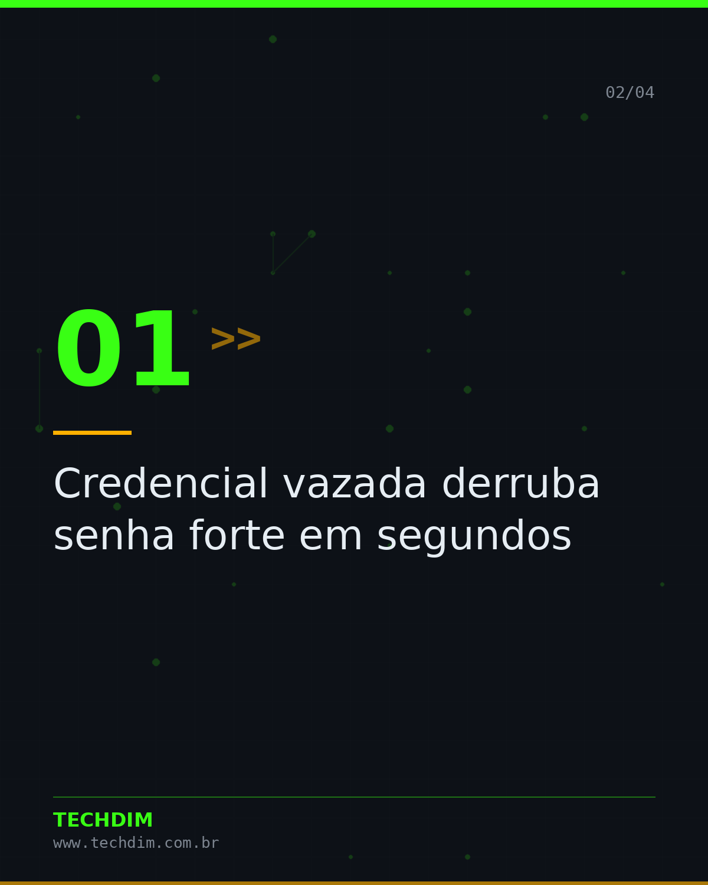
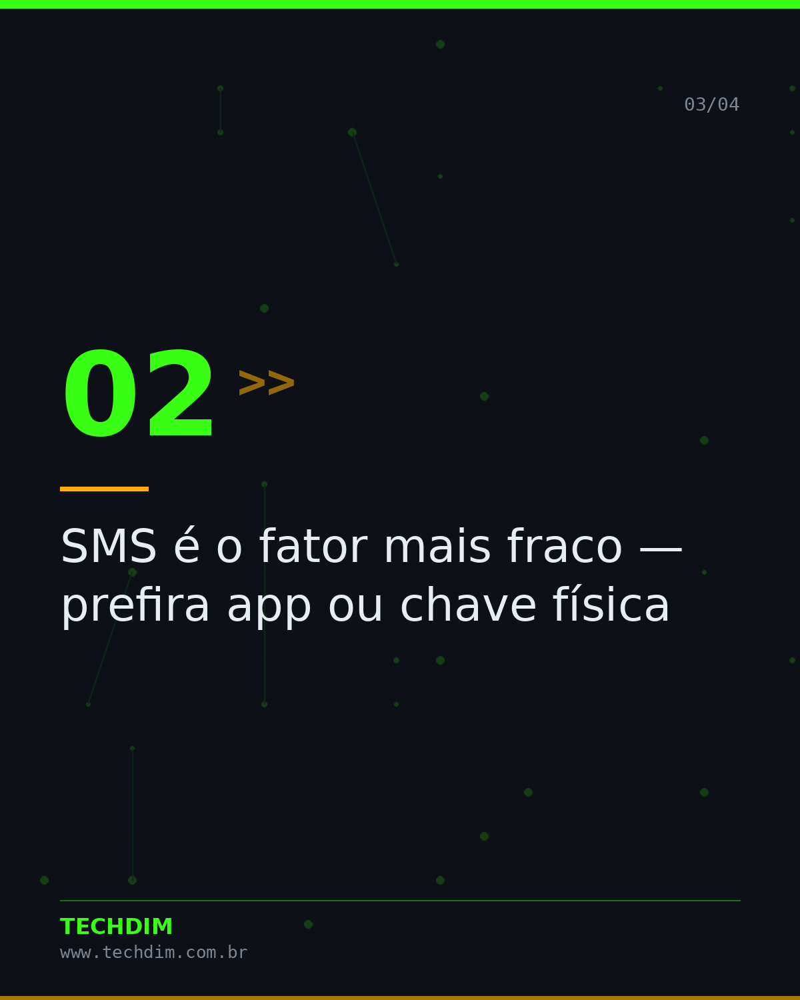
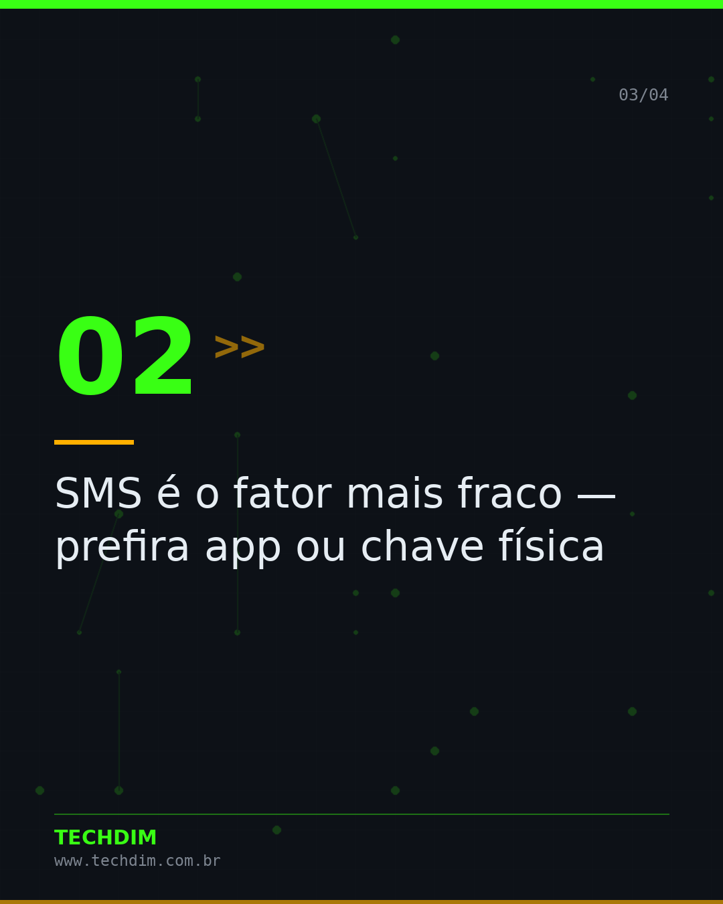
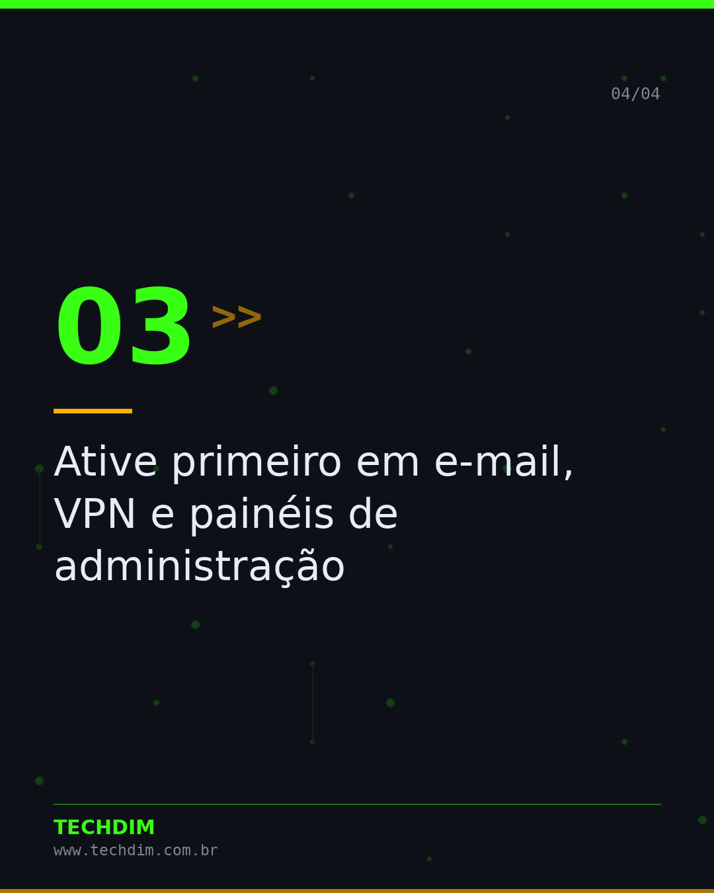

# Conhecimento — MFA: por que senha forte já não basta

- **Data:** 2026-10-09, 18:46 (horário de Brasília)
- **Curadoria:** acervo autoral
- **Execução no Actions:** https://github.com/Techdimbr/Publi-midia-Techdim/actions/runs/37995323579

## Resultado

| Rede | Status | Link | 1º comentário |
|---|---|---|---|
| linkedin | ✅ publicado | https://www.linkedin.com/feed/update/urn:li:share:7514440965210681344/ | — |
| facebook | ✅ publicado | https://www.facebook.com/122132402349390486/posts/122134782951390486 | ✅ |
| instagram | ✅ publicado | https://www.instagram.com/p/DeSgcjUAOY-/ | — |

## Linkedin

```text
MFA: por que senha forte já não basta

01. Credencial vazada derruba senha forte em segundos
02. SMS é o fator mais fraco — prefira app ou chave física
03. Ative primeiro em e-mail, VPN e painéis de administração
04. Conta de serviço sem MFA é a porta dos fundos esquecida

MFA bem aplicado barra a maioria dos ataques de credencial.

TECHDIM — Infraestrutura · Segurança · IA
https://www.techdim.com.br

#Conhecimento #TI #CiberSeguranca #GestaoDeTI #TECHDIM
```


## Facebook

```text
MFA: por que senha forte já não basta

• Credencial vazada derruba senha forte em segundos
• SMS é o fator mais fraco — prefira app ou chave física
• Ative primeiro em e-mail, VPN e painéis de administração
• Conta de serviço sem MFA é a porta dos fundos esquecida

MFA bem aplicado barra a maioria dos ataques de credencial.

Fale com a TECHDIM — link no primeiro comentário 👇

#TECHDIM #AprendaTI #Tecnologia #Campinas
```

Primeiro comentário:

```text
🌐 TECHDIM — Infraestrutura · Segurança · IA: https://www.techdim.com.br
```






## Instagram

```text
MFA: por que senha forte já não basta

Arraste para o lado →

1️⃣ Credencial vazada derruba senha forte em segundos
2️⃣ SMS é o fator mais fraco — prefira app ou chave física
3️⃣ Ative primeiro em e-mail, VPN e painéis de administração
4️⃣ Conta de serviço sem MFA é a porta dos fundos esquecida

MFA bem aplicado barra a maioria dos ataques de credencial.

Saiba mais: www.techdim.com.br

#conhecimento #aprendati #tecnologia #ti #ciberseguranca #techdim #campinas
```




