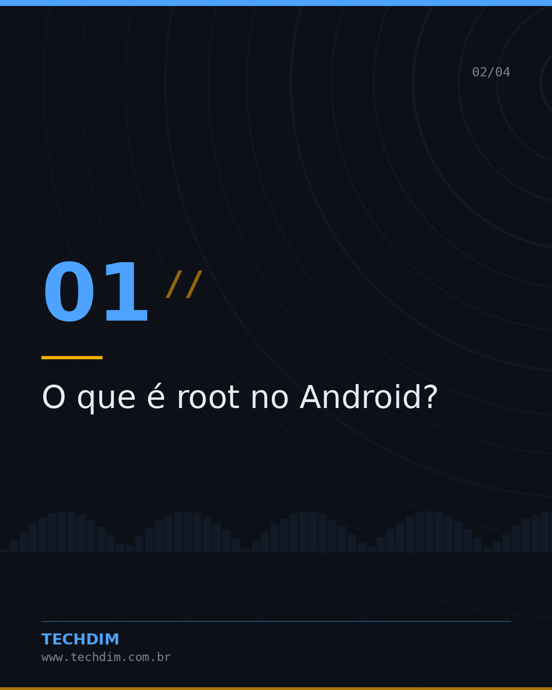
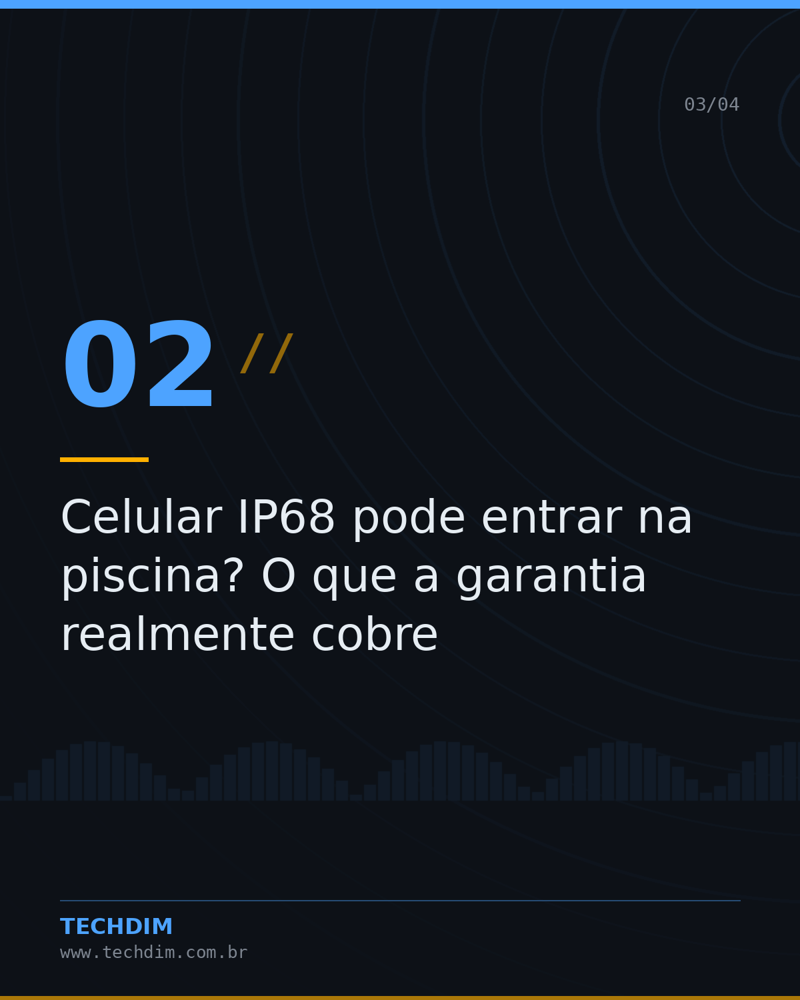
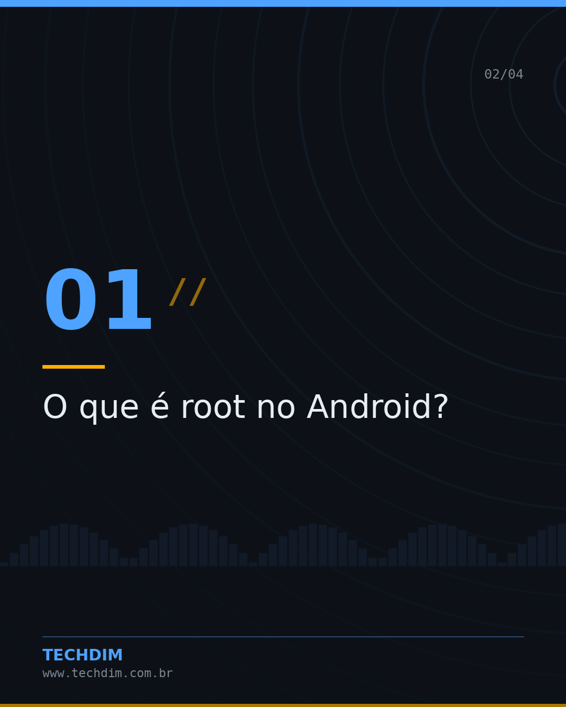
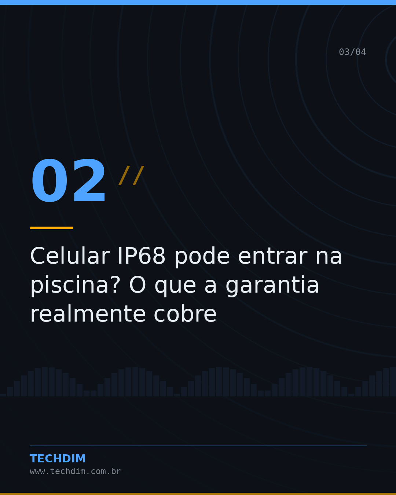
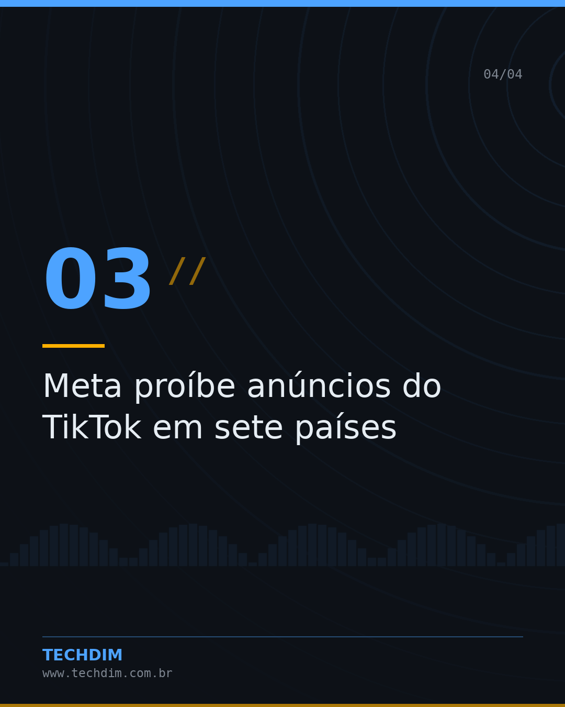

# Notícias de Tecnologia — Resumo do dia — Tecnologia & IA

- **Data:** 2026-10-10, 13:14 (horário de Brasília)
- **Curadoria:** filtro por palavra-chave
- **Execução no Actions:** https://github.com/Techdimbr/Publi-midia-Techdim/actions/runs/38066742717

## Resultado

| Rede | Status | Link | 1º comentário |
|---|---|---|---|
| linkedin | ✅ publicado | https://www.linkedin.com/feed/update/urn:li:share:7514719737571008514/ | — |
| facebook | ✅ publicado | https://www.facebook.com/122132402349390486/posts/122134977813390486 | ✅ |
| instagram | ✅ publicado | https://www.instagram.com/p/DeUfNewl-Ox/ | ✅ |
| Stories | ✅ publicado | https://www.instagram.com/stories/techdimbr/4004963365080731918 | — |

## Fontes

- [canaltech.com.br](https://canaltech.com.br/apps/o-que-e-root-no-android/)
- [canaltech.com.br](https://canaltech.com.br/smartphone/celular-ip68-pode-entrar-na-piscina-o-que-a-garantia-realmente-cobre/)

## Linkedin

```text
Resumo do dia — Tecnologia & IA

01. O que é root no Android?
02. Celular IP68 pode entrar na piscina? O que a garantia realmente cobre
03. Meta proíbe anúncios do TikTok em sete países
04. Como descobrir novos lugares com ajuda do ChatGPT?

A TECHDIM acompanha o mercado para manter sua infraestrutura à frente.

Fontes: https://canaltech.com.br/apps/o-que-e-root-no-android/ · https://canaltech.com.br/smartphone/celular-ip68-pode-entrar-na-piscina-o-que-a-garantia-realmente-cobre/

TECHDIM — Infraestrutura · Segurança · IA
https://www.techdim.com.br

#Tecnologia #InteligenciaArtificial #InovacaoDigital #TECHDIM
```


## Facebook

```text
Resumo do dia — Tecnologia & IA

• O que é root no Android?
• Celular IP68 pode entrar na piscina? O que a garantia realmente cobre
• Meta proíbe anúncios do TikTok em sete países
• Como descobrir novos lugares com ajuda do ChatGPT?

A TECHDIM acompanha o mercado para manter sua infraestrutura à frente.

Fale com a TECHDIM — fontes e site no primeiro comentário 👇

#TECHDIM #Tecnologia #IA #Campinas
```

Primeiro comentário:

```text
📎 Fontes:
• canaltech.com.br: https://canaltech.com.br/apps/o-que-e-root-no-android/
• canaltech.com.br: https://canaltech.com.br/smartphone/celular-ip68-pode-entrar-na-piscina-o-que-a-garantia-realmente-cobre/

🌐 TECHDIM — Infraestrutura · Segurança · IA: https://www.techdim.com.br
```






## Instagram

```text
Resumo do dia — Tecnologia & IA

Arraste para o lado →

1️⃣ O que é root no Android?
2️⃣ Celular IP68 pode entrar na piscina? O que a garantia realmente cobre
3️⃣ Meta proíbe anúncios do TikTok em sete países
4️⃣ Como descobrir novos lugares com ajuda do ChatGPT?

A TECHDIM acompanha o mercado para manter sua infraestrutura à frente.

Saiba mais: www.techdim.com.br
Fontes no primeiro comentário 👇

#tecnologia #inteligenciaartificial #ia #inovacao #techdim #campinas #ti
```

Primeiro comentário:

```text
📎 Fontes: canaltech.com.br · canaltech.com.br
```






## Stories


